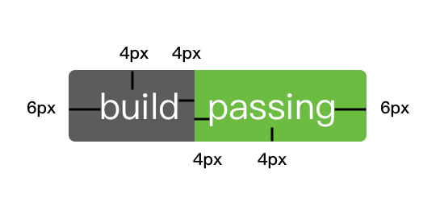
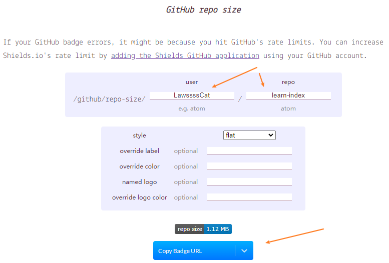
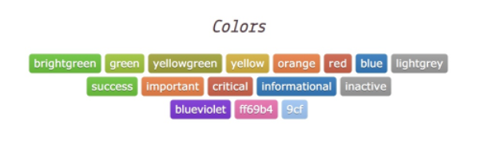
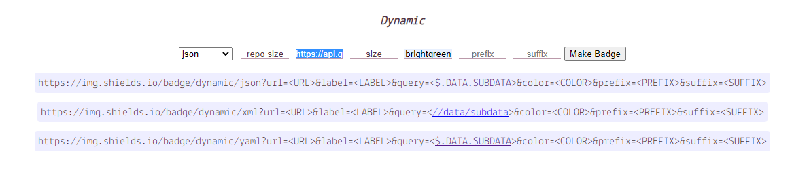

## 仓库（repository）

>:star:官方文档：<https://docs.github.com/cn/rest/repos>

查看仓库所有信息：https://api.github.com/repos/user/repo

e.g.

<https://api.github.com/repos/LawssssCat/learn-index>

```bash
// 20220520111458
// https://api.github.com/repos/LawssssCat/learn-index

{
  "id": 493996060,
  "node_id": "R_kgDOHXHIHA",
  "name": "learn-index",
  "full_name": "LawssssCat/learn-index",
  "private": false,
  "owner": {
    "login": "LawssssCat",
    "id": 18041500,
    "node_id": "MDQ6VXNlcjE4MDQxNTAw",
    "avatar_url": "https://avatars.githubusercontent.com/u/18041500?v=4",
    "gravatar_id": "",
    "url": "https://api.github.com/users/LawssssCat",
    "html_url": "https://github.com/LawssssCat",
    "followers_url": "https://api.github.com/users/LawssssCat/followers",
    "following_url": "https://api.github.com/users/LawssssCat/following{/other_user}",
    "gists_url": "https://api.github.com/users/LawssssCat/gists{/gist_id}",
    "starred_url": "https://api.github.com/users/LawssssCat/starred{/owner}{/repo}",
    "subscriptions_url": "https://api.github.com/users/LawssssCat/subscriptions",
    "organizations_url": "https://api.github.com/users/LawssssCat/orgs",
    "repos_url": "https://api.github.com/users/LawssssCat/repos",
    "events_url": "https://api.github.com/users/LawssssCat/events{/privacy}",
    "received_events_url": "https://api.github.com/users/LawssssCat/received_events",
    "type": "User",
    "site_admin": false
  },
  "html_url": "https://github.com/LawssssCat/learn-index",
  "description": "学习笔记",
  "fork": false,
  "url": "https://api.github.com/repos/LawssssCat/learn-index",
  "forks_url": "https://api.github.com/repos/LawssssCat/learn-index/forks",
  "keys_url": "https://api.github.com/repos/LawssssCat/learn-index/keys{/key_id}",
  "collaborators_url": "https://api.github.com/repos/LawssssCat/learn-index/collaborators{/collaborator}",
  "teams_url": "https://api.github.com/repos/LawssssCat/learn-index/teams",
  "hooks_url": "https://api.github.com/repos/LawssssCat/learn-index/hooks",
  "issue_events_url": "https://api.github.com/repos/LawssssCat/learn-index/issues/events{/number}",
  "events_url": "https://api.github.com/repos/LawssssCat/learn-index/events",
  "assignees_url": "https://api.github.com/repos/LawssssCat/learn-index/assignees{/user}",
  "branches_url": "https://api.github.com/repos/LawssssCat/learn-index/branches{/branch}",
  "tags_url": "https://api.github.com/repos/LawssssCat/learn-index/tags",
  "blobs_url": "https://api.github.com/repos/LawssssCat/learn-index/git/blobs{/sha}",
  "git_tags_url": "https://api.github.com/repos/LawssssCat/learn-index/git/tags{/sha}",
  "git_refs_url": "https://api.github.com/repos/LawssssCat/learn-index/git/refs{/sha}",
  "trees_url": "https://api.github.com/repos/LawssssCat/learn-index/git/trees{/sha}",
  "statuses_url": "https://api.github.com/repos/LawssssCat/learn-index/statuses/{sha}",
  "languages_url": "https://api.github.com/repos/LawssssCat/learn-index/languages",
  "stargazers_url": "https://api.github.com/repos/LawssssCat/learn-index/stargazers",
  "contributors_url": "https://api.github.com/repos/LawssssCat/learn-index/contributors",
  "subscribers_url": "https://api.github.com/repos/LawssssCat/learn-index/subscribers",
  "subscription_url": "https://api.github.com/repos/LawssssCat/learn-index/subscription",
  "commits_url": "https://api.github.com/repos/LawssssCat/learn-index/commits{/sha}",
  "git_commits_url": "https://api.github.com/repos/LawssssCat/learn-index/git/commits{/sha}",
  "comments_url": "https://api.github.com/repos/LawssssCat/learn-index/comments{/number}",
  "issue_comment_url": "https://api.github.com/repos/LawssssCat/learn-index/issues/comments{/number}",
  "contents_url": "https://api.github.com/repos/LawssssCat/learn-index/contents/{+path}",
  "compare_url": "https://api.github.com/repos/LawssssCat/learn-index/compare/{base}...{head}",
  "merges_url": "https://api.github.com/repos/LawssssCat/learn-index/merges",
  "archive_url": "https://api.github.com/repos/LawssssCat/learn-index/{archive_format}{/ref}",
  "downloads_url": "https://api.github.com/repos/LawssssCat/learn-index/downloads",
  "issues_url": "https://api.github.com/repos/LawssssCat/learn-index/issues{/number}",
  "pulls_url": "https://api.github.com/repos/LawssssCat/learn-index/pulls{/number}",
  "milestones_url": "https://api.github.com/repos/LawssssCat/learn-index/milestones{/number}",
  "notifications_url": "https://api.github.com/repos/LawssssCat/learn-index/notifications{?since,all,participating}",
  "labels_url": "https://api.github.com/repos/LawssssCat/learn-index/labels{/name}",
  "releases_url": "https://api.github.com/repos/LawssssCat/learn-index/releases{/id}",
  "deployments_url": "https://api.github.com/repos/LawssssCat/learn-index/deployments",
  "created_at": "2022-05-19T09:01:52Z",
  "updated_at": "2022-05-19T12:01:10Z",
  "pushed_at": "2022-05-19T16:56:59Z",
  "git_url": "git://github.com/LawssssCat/learn-index.git",
  "ssh_url": "git@github.com:LawssssCat/learn-index.git",
  "clone_url": "https://github.com/LawssssCat/learn-index.git",
  "svn_url": "https://github.com/LawssssCat/learn-index",
  "homepage": "https://lawsssscat.github.io/learn-index/",
  "size": 1097,
  "stargazers_count": 1,
  "watchers_count": 1,
  "language": null,
  "has_issues": true,
  "has_projects": true,
  "has_downloads": true,
  "has_wiki": true,
  "has_pages": true,
  "forks_count": 0,
  "mirror_url": null,
  "archived": false,
  "disabled": false,
  "open_issues_count": 0,
  "license": null,
  "allow_forking": true,
  "is_template": false,
  "topics": [
    "learn"
  ],
  "visibility": "public",
  "forks": 0,
  "open_issues": 0,
  "watchers": 1,
  "default_branch": "main",
  "temp_clone_token": null,
  "network_count": 0,
  "subscribers_count": 1
}
```


## 徽标（shields）

>:star: shields 官网：<https://shields.io/>
>
> 其他
>+ :star: <https://shields-staging.herokuapp.com/category/size> - shields.io 有的 api 不生效时，试试这个
>   >问题：<https://github.com/badges/shields/issues/5967>
>+ forthebadge 官网：<https://forthebadge.com/>

GitHub徽标，GitHub Badge，你也可以叫它徽章。就是在项目README中经常看到的那些表明构建状态或者版本等信息的小图标。

徽标图片分左右两部分，左边是标题，右边是内容，就像是键值对。



### 动态徽标

动态徽标是指如果项目状态发生变化，会自动更新状态的徽标，它能保证用户看到的信息就是项目当前的真实状态。

常用的动态徽标有：

+ 持续集成状态
+ 项目版本信息
+ 代码测试覆盖率
+ 项目下载量
+ 贡献者统计
+ 等等

这里以 <https://shields.io/category/size> 为例标识本项目大小

找到 `/github/repo-size/:user/:repo`



填号信息就能得到微标

``


### 自定义徽标

shields.io 提供了自定义徽标的功能。

自定义徽标图标（静态）

`https://img.shields.io/badge/<LABEL>-<MESSAGE>-<COLOR>`

变量说明

+ 徽标标题：徽标左边的文字
+ 徽标内容：徽标右边的文字
+ 徽标颜色：徽标右边的背景颜色，可以是颜色的16进制值，也可以是颜色英文。支持的颜色英文如下：
    

e.g.

`https://img.shields.io/badge/a__b-c%20d-green`


自定义徽标图标（动态）

通过github提供的api可以得到仓库的所有数据

`https://api.github.com/repos/LawssssCat/learn-index`

我们取其中的size部分，整理出下面链接

`https://img.shields.io/badge/dynamic/json?color=brightgreen&label=repo%20size&query=size&url=https%3A%2F%2Fapi.github.com%2Frepos%2FLawssssCat%2Flearn-index`

> shields.io 官网上提供了生成上面链接的工具
>

> 其中的 query 需要我们填写 jsonpath
> 
> jsonpath 的编写格式参考：https://jsonpath.com/
> 
> 

结果：

``


### 链接转跳

markdown允许嵌套

e.g.

`[](https://github.com/LawssssCat/learn-index)`

[](https://github.com/LawssssCat/learn-index)

点击即可跳到我的仓库页面

### 更多参数

除了上面所说的3个参数，shields.io 还提供了一些 query string 来控制徽标样式。使用方式跟浏览器 URL 的 query string 一致：`徽标图标地址?{参数名}={参数值}`，多个参数用 `&` 连接：

`https://img.shields.io/badge/{徽标标题}-{徽标内容}-{徽标颜色}.svg?{参数名1}={参数值1}&{参数名2}={参数值2}`

常用的 query string 参数有：

+ `style`：控制徽标主题样式，style的值可以是： `plastic | flat | flat-square | social` 。
+ `label`：用来强制覆盖原有徽标的标题文字。
+ `colorA`：控制左半部分背景颜色，只能用16进制颜色值作为参数，不能使用颜色英文。
+ `colorB`：控制右半部分背景颜色。

> 参考：
> + github项目徽标 <https://champyin.com/2019/10/05/github%E9%A1%B9%E7%9B%AE%E5%BE%BD%E6%A0%87/>


###  模板 for badge

+ <https://github.com/alexandresanlim/Badges4-README.md-Profile>
+ <https://github.com/Ileriayo/markdown-badges>