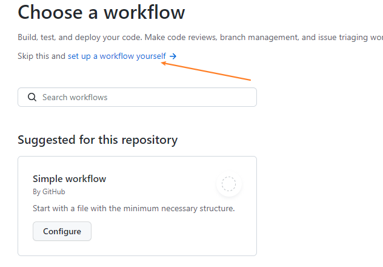
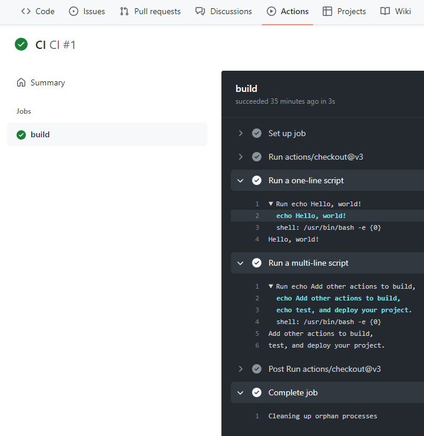

> 官方文档：
> + index <https://docs.github.com/cn/actions/using-workflows>
> + :star: contexts - <https://docs.github.com/en/actions/learn-github-actions/contexts>
> + :star: environment-variables - <https://docs.github.com/cn/actions/learn-github-actions/environment-variables>
> + secrets encrypted-secrets - <https://docs.github.com/cn/actions/security-guides/encrypted-secrets>
> + :star: expressions - <https://docs.github.com/cn/actions/learn-github-actions/expressions>
>
> 参考：
> + 视频：《github新功能actions全方位讲解》 - <https://www.bilibili.com/video/av69442934/>
> + 知乎：《GitHub Actions 自动发布 React 应用到 GitHub Pages》 - <https://zhuanlan.zhihu.com/p/371824341>
> + 《GitHub Actions Advent Calendar》 - <https://www.edwardthomson.com/blog/github_actions_advent_calendar.html>
> + 翻译：《GitHub Actions Advent Calendar》 - <https://qiwihui.com/qiwihui-blog-83/>

GitHub Action 是 GitHub 于 2018 年 10 月推出的一个 CI\CD 服务（持续集成和持续部署）。简单明了的说 就是你可以给你的代码仓库部署一系列自动化脚本，在你进行了提交/合并分支等操作后，自动执行脚本。

### 关于 Actions 的初体验

repo 》 Actions 》 New workflow

但是我们这里选择自定义的流程（这里会提供一些推荐的流程，如：nodejs）



设置好后创建 `{repo}/.github/workflows/main.yml` 文件

（默认内容如下）

```bash
# 当main分支接收到代码提交后，会执行jobs列中的任务。
# This is a basic workflow to help you get started with Actions

name: CI

# Controls when the workflow will run
on:
  # Triggers the workflow on push or pull request events but only for the main branch
  push:
    branches: [ main ]
  pull_request:
    branches: [ main ]

  # Allows you to run this workflow manually from the Actions tab
  workflow_dispatch:

# A workflow run is made up of one or more jobs that can run sequentially or in parallel
jobs:
  # This workflow contains a single job called "build"
  build:
    # 下面 steps 的运行环境
    # The type of runner that the job will run on
    runs-on: ubuntu-latest

    # Steps represent a sequence of tasks that will be executed as part of the job
    steps:
      # 把代码下载下载
      # Checks-out your repository under $GITHUB_WORKSPACE, so your job can access it
      - uses: actions/checkout@v3

      # Runs a single command using the runners shell
      - name: Run a one-line script
        run: echo Hello, world!

      # Runs a set of commands using the runners shell
      - name: Run a multi-line script
        run: |
          echo Add other actions to build,
          echo test, and deploy your project.
```


提交代码后，action就已经在运行了



### 工作流程语法

Workflow syntax for GitHub Actions - <https://docs.github.com/en/actions/using-workflows/workflow-syntax-for-github-actions#jobsjob_idif>

### more 

official guide for github actios. see <https://docs.github.com/en/actions>


+ Environment variables - <https://docs.github.com/en/actions/learn-github-actions/environment-variables> <br>
所谓环境变量就是执行workflow的系统的环境变量，这里提供了自定义的功能

+ Contexts - <https://docs.github.com/en/actions/learn-github-actions/contexts><br>
syntax like `${{ <context> }}`
+ Expressions - <https://docs.github.com/en/actions/learn-github-actions/expressions><br>
An expression can be any combination of literal values, references to a context, or functions. <br>
syntax like `${{ <expression> }}`
  + if -  <https://docs.github.com/en/actions/learn-github-actions/expressions#example-expression-in-an-if-conditional>
    + Status check functions - <https://docs.github.com/en/actions/learn-github-actions/expressions#status-check-functions>
  + operators 运算符 - <https://docs.github.com/en/actions/learn-github-actions/expressions#operators>
  + functions - <https://docs.github.com/en/actions/learn-github-actions/expressions#functions>

example

```bash
```


+ persisting workflow data using artifacts. <br>
<https://docs.github.com/en/actions/learn-github-actions/essential-features-of-github-actions#sharing-data-between-jobs><br>
<https://docs.github.com/en/actions/using-workflows/storing-workflow-data-as-artifacts>