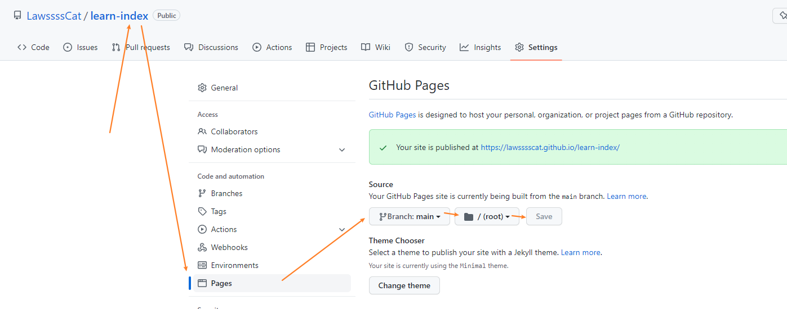

>GitHub Pages 官网：<https://docs.github.com/cn/pages>
>

## GitHub Pages

1. 开启 Github Pages

    repositories 》 选着要开启的仓库 》 settings 》 Pages 

    选择发布分支和目录

    

    + gh-pages branch 是项目新建一个分支命名为这个，使用这个分支来做站点内容。
    + master branch 是使用主分支也是默认的，来作为站点内容。
    + master branch/docs folder 是使用主分支的docs文件夹来作为站点内容。
    + None 就是禁用Github Pages。

2. 选择主题

    选择好主题后，在发布目录下会多出一个文件 `_config.yml`，它是jekyll的全局配置文件，现在里面只有一句话 `theme: jekyll-theme-modernist`。
    
    （我们可以手动修改这个theme主题配置，网站就会应用不同的主题。）

    （Github内置支持的几个主题：<https://pages.github.com/themes/>，每个README.md里都有介绍如何设置）

    （更多更漂亮的主题：<http://jekyllthemes.org/>、<https://github.com/jekyll/jekyll/wiki/sites>（不要挑花眼了））

    > 2022年5月20日
    > 
    >选中
    >+ <https://jekyll-lin-theme.netlify.app/> - 框架
    >+ <https://soyaine.github.io/jekyll-theme-diary/> - 日历
    >+ <https://longpdo.github.io/> - 特效

## Jekyll

>jekyll 官网：<https://www.jekyll.com.cn/>
>

### 关于 GitHub Pages 和 Jekyll

官方文档：<https://docs.github.com/cn/pages/setting-up-a-github-pages-site-with-jekyll/about-github-pages-and-jekyll>

Jekyll 是一个静态站点生成器，内置 GitHub Pages 支持。
Jekyll 使用 Markdown 和 HTML 文件，并根据您选择的布局创建完整静态网站。 
Jekyll 支持 Markdown 和 Lick，这是一种可在网站上加载动态内容的模板语言。 

> Windows 并未正式支持 Jekyll。 更多信息请参阅 Jekyll 文档中的“[Windows 上的 Jekyll](http://jekyllrb.com/docs/windows/#installation)”。

>实用文档：
> + jekyll 官方文档 configuration：<https://jekyllrb.com/docs/configuration/>
>
> + [《jekyll 的基本用法》](../Jekyll/Jekyll_simple_use.md)

### Static site generators

如果您喜欢，可以使用其他静态站点生成器或者在本地或其他服务器上自定义构建过程。 

官方文档：<https://docs.github.com/cn/pages/getting-started-with-github-pages/about-github-pages#static-site-generators>

GitHub Pages publishes any static files that you push to your repository. You can create your own static files or use a static site generator to build your site for you. You can also customize your own build process locally or on another server. We recommend Jekyll, a static site generator with built-in support for GitHub Pages and a simplified build process. For more information, see "About GitHub Pages and Jekyll."

GitHub Pages will use Jekyll to build your site by default. If you want to use a static site generator other than Jekyll, disable the Jekyll build process by creating an empty file called .nojekyll in the root of your publishing source, then follow your static site generator's instructions to build your site locally.

GitHub Pages does not support server-side languages such as PHP, Ruby, or Python.

