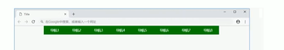
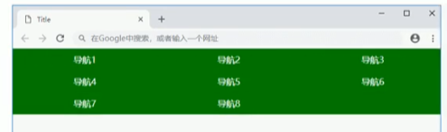
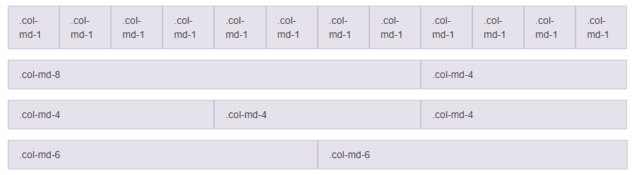

响应式布局
+ 优点：不需要单独写移动页面（布局随页面变化变化）
+ 关键：媒体查询、栅格系统

## 响应式原理

媒体查询（`@media`）：针对不同宽度的设备进行布局和样式的设置，从而适配不同设备

设备划分 | 尺寸区间 | 响应式划分（参考）
---     | ---      | ---
超小屏幕（手机）       |  `<768px`             | `width: 100%`
小屏设备（平板）       |  `>=768px ~ <992px`   | `width: 750px`
中等屏幕（桌面显示器）  |  `>=992px ~ <1200px`  | `width: 970px`
宽屏设备（大桌面显示器）|  `>=1200px`           | `width: 1170px`

响应式布局容器<br>
响应式需要一个父级作为布局容器，来配合子级元素来实现变化效果。

e.g.<br>
桌面<br>
<br>
手机<br>


e.g.
```html
<style>
  .container {
    height: 150px;
    background-color: pink;
    margin: 0 auto;
  }
  /* 超小屏幕 */
  @media screen and (max-width: 767px) {
    .container {
      width: 100%
    }
  }
  /* 小屏设备 */
  @media screen and (min-width: 768px) {
    .container {
      width: 750px
    }
  }
  /* 中等屏幕 */
  @media screen and (min-width: 992px) {
    .container {
      width: 970px
    }
  }
  /* 宽屏设备 */
  @media screen and (min-width: 1200px) {
    .container {
      width: 1170px
    }
  }
</style>
<!-- 响应式，需要一个布局容器 -->
<div class='container'></div>
```

### 案例：响应式导航

pc<br>
<br>
phone<br>


```html
<style>
  * {
    margin: 0;
    padding: 0;
  }
  ul {
    list-style: none;
  }
  .container {
    width: 750px;
    margin: 0 auto;
  }
  .container ul li {
    float: left;
    width: 93.75px;
    height: 90px;
    background-color: green;
  }
  @media screen and (max-width: 767px) {
    .container {
      width: 100%;
    }
    .container ul li {
      width: 33.33%
    }
  }
</style>
<div class='container'>
  <ul>
    <li>导航栏</li>
    <li>导航栏</li>
    <li>导航栏</li>
    <li>导航栏</li>
    <li>导航栏</li>
    <li>导航栏</li>
    <li>导航栏</li>
    <li>导航栏</li>
  </ul>
</div>
```

## Bootstrap 

+ 中文网：<https://www.bootcss.com/>
+ 官网：<https://getbootstrap.com/>

版本
+ 2.x.x：停止维护、兼容性好、代码不够简洁、功能不够完善。
+ 3.x.x：使用最多（2020）、稳定、但是放弃了IE6~7的维护
+ 4.x.x：...

><https://v3.bootcss.com/css/#overview-normalize>
> <br>
> 为了增强跨浏览器渲染的一致性，我们使用了 Normalize.css，这是由 Nicolas Gallagher 和 Jonathan Neal 维护的一个CSS 重置样式库。

### 开始

基本模板：<https://v3.bootcss.com/getting-started/#template>

```html
<!-- 使用IE最高版本内核渲染 -->
<meta http-equiv="X-UA-Compatible" content="IE=edge">
<!-- 试图的宽度和设备一致，默认的缩放比例和PC端一致，用户不能自行缩放 -->
<meta name="viewport" content="width=device-width, initial-scale=1">
<!-- 👆 meta标签*必须*放在最前面，任何其他内容都*必须*跟随其后！ -->
<title>Bootstrap 101 Template</title>

<!-- Bootstrap -->
<link rel="stylesheet" href="https://stackpath.bootstrapcdn.com/bootstrap/3.4.1/css/bootstrap.min.css" integrity="sha384-HSMxcRTRxnN+Bdg0JdbxYKrThecOKuH5zCYotlSAcp1+c8xmyTe9GYg1l9a69psu" crossorigin="anonymous">

<!-- HTML5 shim 和 Respond.js 是为了让 IE8 支持 HTML5 元素和媒体查询（media queries）功能 -->
<!-- 警告：通过 file:// 协议（就是直接将 html 页面拖拽到浏览器中）访问页面时 Respond.js 不起作用 -->
<!--[if lt IE 9]>
  <script src="https://fastly.jsdelivr.net/npm/html5shiv@3.7.3/dist/html5shiv.min.js"></script>
  <script src="https://fastly.jsdelivr.net/npm/respond.js@1.4.2/dest/respond.min.js"></script>
<![endif]-->

...

<body>
  <h1>你好，世界！</h1>

  <!-- jQuery (Bootstrap 的所有 JavaScript 插件都依赖 jQuery，所以必须放在前边) -->
  <script src="https://fastly.jsdelivr.net/npm/jquery@1.12.4/dist/jquery.min.js" integrity="sha384-nvAa0+6Qg9clwYCGGPpDQLVpLNn0fRaROjHqs13t4Ggj3Ez50XnGQqc/r8MhnRDZ" crossorigin="anonymous"></script>
  <!-- 加载 Bootstrap 的所有 JavaScript 插件。你也可以根据需要只加载单个插件。 -->
  <script src="https://stackpath.bootstrapcdn.com/bootstrap/3.4.1/js/bootstrap.min.js" integrity="sha384-aJ21OjlMXNL5UyIl/XNwTMqvzeRMZH2w8c5cRVpzpU8Y5bApTppSuUkhZXN0VxHd" crossorigin="anonymous"></script>
</body>
```

### 布局容器

Bootstrap 为容器和栅格系统包裹了一个 `.container` 容器（其中一个预定义类）

> `.container` 宽度单位的划分规则与上面一样。
> 还有其他划分规则的预定义类，如 `.container-fluid` 类
> + 流动式布局 `%`
> + 占据全部视点（`viewport`）的容器
> + 适合移动端开发

### 栅格系统

<https://v3.bootcss.com/css/#grid>

**栅格系统**（"grid systems"）是指将页面布局划分为等宽的列，然后通过列数的定义来模块化页面布局。

Bootstrap 提供了一套响应式、移动设备优先的流式栅格系统，随着屏幕或视口（viewpoint）尺寸的增加，系统会自动分为最多<font color='red'>12列</font>


> Bootstrap 里面 container 宽度是固定的，但是不同屏幕下，container 的宽度不同



#### 栅格系统选项参数

<https://v3.bootcss.com/css/#grid-options>

通过下表可以详细查看 Bootstrap 的栅格系统是如何在多种屏幕设备上工作的。

<table>
<tr>
  <th></th>
  <th>超小屏幕 手机 (<768px)</th>
  <th>小屏幕 平板 (≥768px)</th>
  <th>中等屏幕 桌面显示器 (≥992px)</th>
  <th>大屏幕 大桌面显示器 (≥1200px)
</th>
</tr>
<tr>
  <td>栅格系统行为</td>
  <td>总是水平排列</td>
  <td colspan='3'>开始是堆叠在一起的，当大于这些阈值时将变为水平排列C
</td>
</tr>
<tr>
  <td> .container 最大宽度	</td>
  <td>None （自动）	</td>
  <td>750px		</td>
  <td>970px	</td>
  <td>1170px	</td>
</tr>
<tr>
  <td> 类前缀		</td>
  <td>.col-xs-	<br> （extra small）	</td>
  <td>.col-sm-	<br> （small）	</td>
  <td>.col-md-	<br> （medium）</td>
  <td>.col-lg-	<br> （large） </td>
</tr>
<tr>
  <td > 列（column）数	</td>
  <td colspan='3'>12 	</td>
</tr>
<tr>
  <td> 最大列（column）宽	</td>
  <td>自动		</td>
  <td>~62px		</td>
  <td>~81px		</td>
  <td>~97px	</td>
</tr>
<tr>
  <td > 槽（gutter）宽		</td>
  <td colspan='3'>30px （每列左右均有 15px）	</td>
</tr>
<tr>
  <td > 可嵌套	</td>
  <td colspan='3'>是	</td>
</tr>
<tr>
  <td > 偏移（Offsets）		</td>
  <td colspan='3'>是	</td>
</tr>
<tr>
  <td > 列排序		</td>
  <td colspan='3'>是	</td>
</tr>
</table>

>技巧
>列嵌套中间加row可以消除margin
>```html
><div class='col-md-3'>
>  <div class='row'>
>    <div class='col-md-6'></div>
>    <div class='col-md-6'></div>
>  </div>
></div>
>```

#### 列偏移


`.col-md-offset-*`

```html
<style>

</style>
<div class='container'>
    <div class='row'>
      <div class='col-md-4'>左侧</div>
      <div class='col-md-4 col-md-offset-4'>右侧</div>
    </div>
</div>
```

### 列排序

```html
<div class='container'>
  <div class='row'>
      <div class='col-md-4 col-lg-push-8'>左侧</div>
      <div class='col-md-8 col-lg-pull-4'>右侧</div>
  </div>
</div>
```

### 响应式工具


类名         | 超小 | 小屏 | 中屏 | 大屏
--           |  -- | -- | -- | --
`hidden-xs`  | 隐藏 | 显示 | 显示 | 显示 
`hidden-xm`  | 显示 | 隐藏 | 显示 | 显示
`hidden-md`  | 显示 | 显示 | 隐藏 | 显示
`hidden-lg`  | 显示 | 显示 | 显示 | 隐藏

相反， `visible-*`

### 组件

#### 按钮

<https://v3.bootcss.com/css/#buttons>


视频
+ <https://www.bilibili.com/video/BV1R7411s72K>
