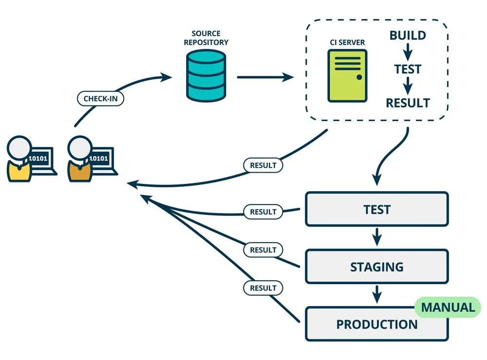
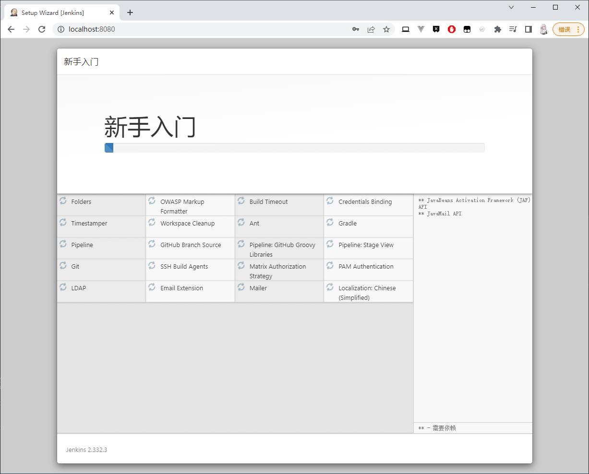
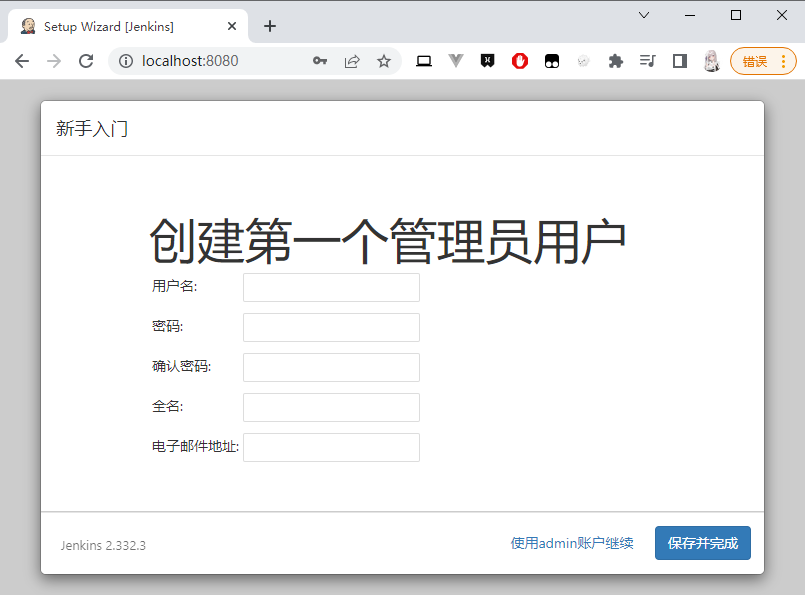
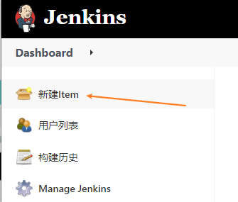
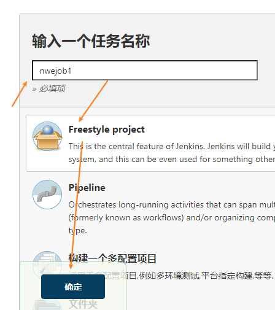
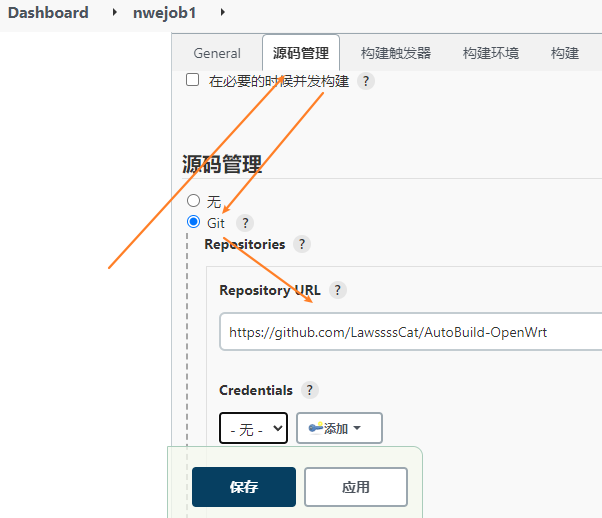
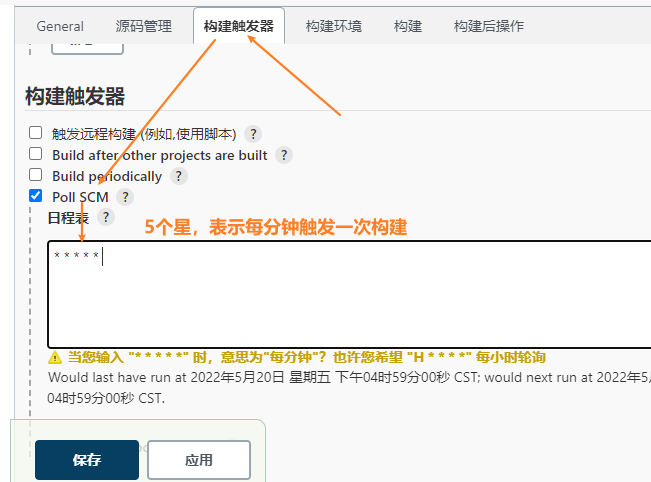
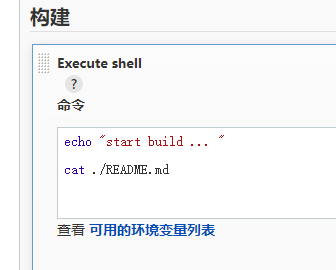

>视频：
>1. 【CI/CD工具】1 Jenkins原理和使用介绍
><https://www.bilibili.com/video/av58997708>
>2. 【CI/CD工具】2 github的好基友Travis
><https://www.bilibili.com/video/av59635745>
>3. 【CI/CD工具】3 这可能是最全面的CICD流程讲解视频了，daocloud法力无边
><https://www.bilibili.com/video/av60120198>
>4. 【CICD】github新功能actions全方位讲解！！
><https://www.bilibili.com/video/av69442934/>

devops 

CI/CD（持续集成/持续交付）

code -> github -> 构建/测试/部署



CI/CD 工具

1. jenkins - 使用最早、最广
2. travis.ci - github 自动集成的一个轻量级的通过云主机构建的工具

    （后面 github 提供了 github actions 功能）
3. circle.ci ...


## Jenkins

### Jenkins 初始化

下载地址：<https://www.jenkins.io/download/>

下载 war 包 （java 环境）

运行

```bash
java -jar jenkins.war
```

```bash
C:\Users\lawsssscat\Downloads\learn>java -jar jenkins.war
Running from: C:\Users\lawsssscat\Downloads\learn\jenkins.war
webroot: $user.home/.jenkins
2022-05-20 08:28:52.010+0000 [id=1]     INFO    org.eclipse.jetty.util.log.Log#initialized: Logging initialized @428ms to org.eclipse.jetty.util.log.JavaUtilLog
2022-05-20 08:28:52.059+0000 [id=1]     INFO    winstone.Logger#logInternal: Beginning extraction from war file
2022-05-20 08:28:53.439+0000 [id=1]     WARNING o.e.j.s.handler.ContextHandler#setContextPath: Empty contextPath
2022-05-20 08:28:53.475+0000 [id=1]     INFO    org.eclipse.jetty.server.Server#doStart: jetty-9.4.43.v20210629; built: 2021-06-30T11:07:22.254Z; git: 526006ecfa3af7f1a27ef3a288e2bef7ea9dd7e8; jvm 1.8.0_301-b09
2022-05-20 08:28:53.871+0000 [id=1]     INFO    o.e.j.w.StandardDescriptorProcessor#visitServlet: NO JSP Support for /, did not find org.eclipse.jetty.jsp.JettyJspServlet
2022-05-20 08:28:53.905+0000 [id=1]     INFO    o.e.j.s.s.DefaultSessionIdManager#doStart: DefaultSessionIdManager workerName=node0
2022-05-20 08:28:53.905+0000 [id=1]     INFO    o.e.j.s.s.DefaultSessionIdManager#doStart: No SessionScavenger set, using defaults
2022-05-20 08:28:53.906+0000 [id=1]     INFO    o.e.j.server.session.HouseKeeper#startScavenging: node0 Scavenging every 660000ms
2022-05-20 08:28:54.344+0000 [id=1]     INFO    hudson.WebAppMain#contextInitialized: Jenkins home directory: C:\Users\lawsssscat\.jenkins found at: $user.home/.jenkins
2022-05-20 08:28:54.436+0000 [id=1]     INFO    o.e.j.s.handler.ContextHandler#doStart: Started w.@19868320{Jenkins v2.332.3,/,file:///C:/Users/lawsssscat/.jenkins/war/,AVAILABLE}{C:\Users\lawsssscat\.jenkins\war}
2022-05-20 08:28:54.473+0000 [id=1]     INFO    o.e.j.server.AbstractConnector#doStart: Started ServerConnector@a8ef162{HTTP/1.1, (http/1.1)}{0.0.0.0:8080}
2022-05-20 08:28:54.474+0000 [id=1]     INFO    org.eclipse.jetty.server.Server#doStart: Started @2892ms
2022-05-20 08:28:54.474+0000 [id=39]    INFO    winstone.Logger#logInternal: Winstone Servlet Engine running: controlPort=disabled
2022-05-20 08:28:55.197+0000 [id=46]    INFO    jenkins.InitReactorRunner$1#onAttained: Started initialization
2022-05-20 08:28:55.203+0000 [id=66]    INFO    jenkins.InitReactorRunner$1#onAttained: Listed all plugins
2022-05-20 08:28:55.716+0000 [id=74]    INFO    jenkins.InitReactorRunner$1#onAttained: Prepared all plugins
2022-05-20 08:28:55.721+0000 [id=83]    INFO    jenkins.InitReactorRunner$1#onAttained: Started all plugins
2022-05-20 08:28:55.727+0000 [id=91]    INFO    jenkins.InitReactorRunner$1#onAttained: Augmented all extensions
2022-05-20 08:28:56.209+0000 [id=45]    INFO    jenkins.InitReactorRunner$1#onAttained: System config loaded
2022-05-20 08:28:56.210+0000 [id=45]    INFO    jenkins.InitReactorRunner$1#onAttained: System config adapted
2022-05-20 08:28:56.211+0000 [id=45]    INFO    jenkins.InitReactorRunner$1#onAttained: Loaded all jobs
2022-05-20 08:28:56.212+0000 [id=71]    INFO    jenkins.InitReactorRunner$1#onAttained: Configuration for all jobs updated
2022-05-20 08:28:56.219+0000 [id=104]   INFO    hudson.model.AsyncPeriodicWork#lambda$doRun$1: Started Download metadata
2022-05-20 08:28:56.224+0000 [id=104]   INFO    hudson.util.Retrier#start: Attempt #1 to do the action check updates server
2022-05-20 08:28:56.478+0000 [id=67]    INFO    jenkins.install.SetupWizard#init:

*************************************************************
*************************************************************
*************************************************************

Jenkins initial setup is required. An admin user has been created and a password generated.
Please use the following password to proceed to installation:

229efff4492f45258a56766b2168bae7

This may also be found at: C:\Users\lawsssscat\.jenkins\secrets\initialAdminPassword

*************************************************************
*************************************************************
*************************************************************

2022-05-20 08:29:09.184+0000 [id=89]    INFO    jenkins.InitReactorRunner$1#onAttained: Completed initialization
2022-05-20 08:29:09.204+0000 [id=31]    INFO    hudson.lifecycle.Lifecycle#onReady: Jenkins is fully up and running
2022-05-20 08:29:09.702+0000 [id=104]   INFO    h.m.DownloadService$Downloadable#load: Obtained the updated data file for hudson.tasks.Maven.MavenInstaller
2022-05-20 08:29:09.702+0000 [id=104]   INFO    hudson.util.Retrier#start: Performed the action check updates server successfully at the attempt #1
2022-05-20 08:29:09.704+0000 [id=104]   INFO    hudson.model.AsyncPeriodicWork#lambda$doRun$1: Finished Download metadata. 13,485 ms
```

访问：<http://localhost:8080>

（默认是 8080 端口）

粘贴日志中给出的密钥：229efff4492f45258a56766b2168bae7

然后是安装插件（大概10min）



然后是创建管理员账户



然后一直下一步就算初始化完成了

### Jenkins 创建任务

新建一个任务





选择源码位置



选择触发构建的方式

（因为jenkins运行在内网，无法使用接收远程请求的方式触发，因此只能选择定时触发）



设置开始构建后打印一个日志

（`./` 为源码git初始化目录）



设置好之后就可以保存

创建好这个“任务”后，jenkins会每分钟执行一次任务：从代码源（github）拉取代码、执行构建命令（echo ...）

### Jenkins 目录结构

Jenkins 的所有重要数据都存放在它的主目录中，即 `JENKINS_HOME`。

`JENKINS_HOME` 默认位于当前用户主目录下的 `.jenkins` 隐藏目录中，即 `~/.jenkins`。

> 这个目录将会占用大量的磁盘空间。
>
> 其中存储了关于构建服务器的配置信息、构建作业、构建产物、插件和其它有用的信息。
>
> 可通过修改环境变量 JENKINS_HOME 的值，来更改 jenkins 主目录。

**JENKINS_HOME 目录结构**

（此处只对 JENKINS_HOME 中的重要目录进行说明，并未完全列出。）

+ `config.xml`：jenkins 的核心配置文件
+ `hudson.tasks.Maven.xml`： Maven 的安装细节
+ `....xml`： 其它各种工具的配置信息
+ `fingerprints`： 跟踪人工操作的痕迹
+ `jobs`：构建作业的配置细节，及构建产物和数据
    + `workspace`：jenkins 对当前作业进行构建的地方
        >包含 jenkins 检验过的源码、构建本身生成的所有文件
    + `builds`：包含当前作业的构建历史
    + `config.xml`：存放当前作业的所有配置细节
    + `nextBuildNumber`：下一次构建的 number
    + `lastStable`：最后一个稳定构建的链接（成功的构建）
    + `lastSuccessful`：最近成功的构建链接（没有任何编译错误）
+ `plugins`：存放所有已安装的插件
    > 更新 jenkins 不需要重新安装插件
+ `users`：当使用 jenkins 本地用户数据库时，用户信息会存放在这个目录下
+ `updates`：存放可用的插件更新
+ `userContent`：存放用户自己为 jenkins 服务器定制化的一些内容
+ `war`：存放扩展的 web 应用程序，当以单机应用程序的形式运行 jenkins 时，会把 web 应用程序解压到这个目录。
