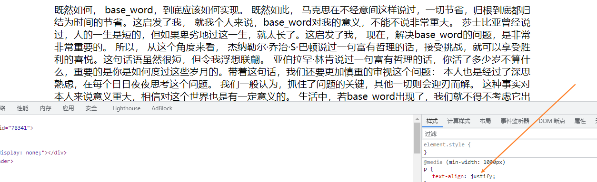
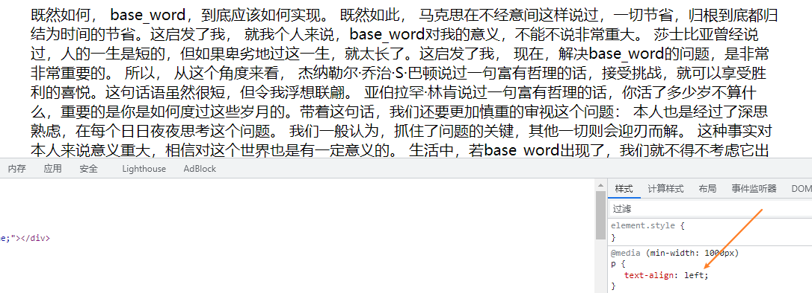

### 样式 initial、inherit、unset 区别

+ initial
  
  修改所有元素属性为初始化值

  可作用于任何 CSS 样式（IE 不支持该关键字）

+ inherit
  
  修改所有元素属性为其父元素的值(向上继承)

  > 每一个 CSS 属性都有一个特性就是，这个属性必然是默认继承的 (inherited: Yes) 或者是默认不继承的 (inherited: no)其中之一，我们可以在 MDN[1] 上通过这个索引查找，判断一个属性的是否继承特性。
  > 
  > 譬如，以 `background-color` 为例，由下图所示，表明它并不会继承父元素的 `background-color`

+ unset

  修改所有元素属性的值为其父元素的值(如果有继承)或其初始值

  名如其意，unset 关键字我们可以简单理解为不设置。其实，它是关键字 initial 和 inherit 的组合：

  + 如果该属性是默认继承属性，该值等同于 inherit
  + 如果该属性是非继承属性，该值等同于 initial

```html
<!-- 恢复 li默认样式 -->
<style type="text/css">
    li {
         list-style: unset;
     }
 </style>
```
### 伪

#### `:target`

`:target` 是CSS里一个非常有趣的伪选择器。它在CSS里发生效力的过程是这样的：当浏览器地址里的hash(地址里#号后面的部分)和`:target`伪选择器指定的ID匹配上时，它的样式就会在这个ID元素上生效。让我们看一看这个`:target`伪选择器是如何起作用的：

例子：<https://www.webhek.com/post/demo/css-target#anchor2>

下面的两个HTML元素上我们都指定了ID：

```html
<h2 id="section1">Section 1</h2>

<h2 id="section2">Section 2</h2>
```

注意上面元素的ID值，当:target指定的ID和window.location.hash值一致时，伪选择器的样式将会生效。

```css
/* would apply to all targetted elements */
:target {
	color: #000;
}

/* applies to H2's */
h2:target {
	color: #f00;
}
```

#### 伪元素 `::before` 和 `::after` 

> 单冒号写法兼容性比较强（可支持解析的浏览器较多）,双冒号的写法只支持较新的主流浏览器
> 
> W3C的解释用一句话概括：单冒号(:)用于CSS3伪类，双冒号(::)用于CSS3伪元素。

+ `::before` 和 `::after` 是用来给元素添加额外内容的,因为只存在于作用元素内容的前后
+ `::before` 和 `::after` 内部的content支持以下三种特性!
  1. 字符串 - 可以是符号什么的也可以是单纯的字符，支持unicode编码
  2. 属性 - `attr()` 可以获取标签上的元素属性，比如 `data-*` 的自定义属性、`title`、`alt`...
  3. 引用媒体文件 - url 可以链接图片作为背景图
  4. 计数器 - `counter()`
    
灵活运用这两个可以做比如：清除浮动、各种额外的视觉效果（阴影,跳转等）

注意点

1. `::before` 和 `::after` 的与伪类的结合使用是有先后顺序的;
    ```css
    .class:hover::before{} /*是有效的*/
    .class::before:hover{} /*是无效的*/	
    ```
### 【未完】@media 用法

<https://blog.csdn.net/u010510187/article/details/82790963>


#### text-align: justify

（左右）对齐





#### 【未完】display: table-cell

table-cell是display属性的值，可以给出类似于table标记的子元素的样式。

但我认为它看起来像“元素可以轻松并排排列”。

### CSS em属性

在大多数浏览器上为html和body标签的默认字体大小为100%

```bash
100% = 1em = 1rem = 16px = 12pt
```

使用EM为单位一定要知道父元素的设置，因为EM是一个相对值，是一个相对于父元素的值

```bash
1 ÷ 父类元素的front-size x 需要转换的像素值 = em值
```

如果选择器存在`font-size`属性，那么该选择器本身`1em`的值就是对应的`font-size`的值，而该选择器其余属性再使用的1em属性的值就是`font-size`属性确定的值

```css
h1 {
  font-size: 20px; /*1em = 20px*/
}
p {
  font-size: 16px; /*1em = 16px*/
}
```
> + 注1.:如果选择器本身`font-size`属性值是固定值(比如`24px`)，那么其余属性再使用`em`为单位的值就是根据选择器本身的`font-size`来计算(比如`margin:2em`就是`2*24px`)
> + 注2:而如果选择器本身`font-size`属性是使用`em`确定的(比如`1em`)，那么就要根据选择器父元素的`font-size`值去确定选择器本身的`em`值(比如选择器父元素的`font-size`属性为`24px`,那么选择器本身便为`24*1=24px`)，然后该选择器的其余属性再根据已经确定的em值(`24px`)去配置自己的属性值，父元素的字体大小可以影响 `em` 值，但这种情况的发生纯粹是因为继承

```css
h1 {
  font-size: 2em; /*1em = 16px*/
  margin-bottom: 1em; /*1em = 32px*/
}

p {
  font-size: 1em; /*1em = 16px*/
  margin-bottom: 1em; /*1em = 16px*/
}
```

### 案例

#### 用CSS3制作尖角标签按钮样式


<https://jiongks.name/blog/css3-tag-buttons/>

```html
<html>
  <head>
  <title>Tags demo (CSS 3)</title>
  <link rel="stylesheet" type="text/css" href="/s/css/style.css">
  <style type="text/css">
      a {
          display: inline-block;
          position: relative;
          padding: 0px 10px;
          background: #ccc;
          color: green;
          line-height: 1.5;
          margin-left: 1em;
          border-radius: 0;
      }
      a:hover {
          background: gray;
          color: white;
      }
      a:before {
          position: absolute;
          content: " ";
          border: transparent 0.75em solid;
          border-right-color: #ccc;
          top: 0;
          left: -1.5em;
          height: 0em;
          width: 0em;
      }
      a:hover:before {
          border-right-color: gray;
      }
      a:after {
          position: absolute;
          content: " ";
          background: white;
          width: 0.5em;
          height: 0.5em;
          top: 0.5em;
          left: -0.125em;
          border-radius: 0.25em;
      }
  </style>
  </head>
  <body>
  
  <h1>Tags Demo (CSS 3)</h1>
  <p>
      <a href="#">Tag1</a>
      <a href="#">Tag2</a>
      <a href="#">Tag3</a>
      <a href="#">Tag4</a>
      <a href="#">Tag5</a>
  </p>
  
  </body>
  </html>
```