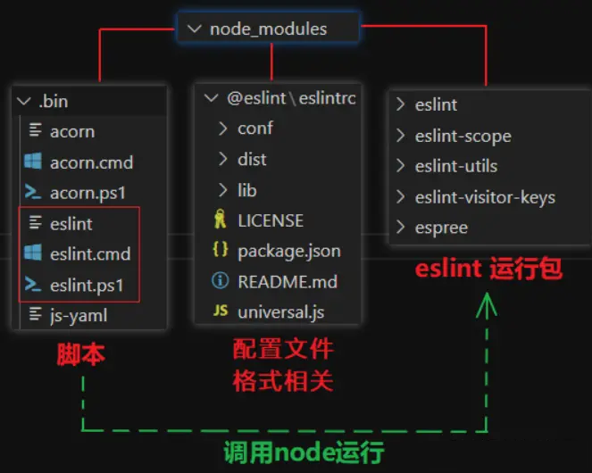
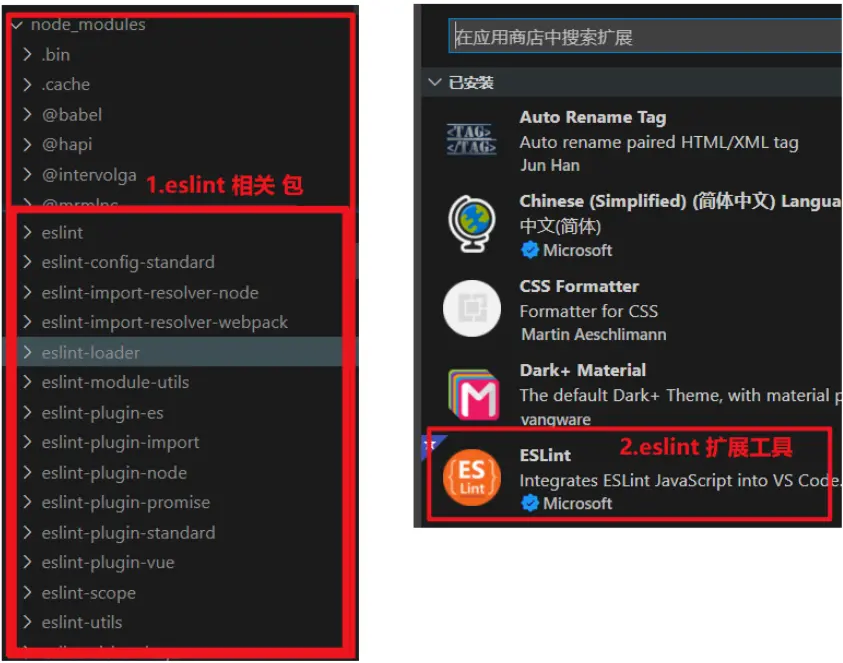

>官方教程：<https://eslint.bootcss.com/docs/user-guide/getting-started>

# ESLint 学习笔记

> 需要注意的是：ESLint 有两个工具，一个是 模块包 ，一个是 VSCode 的扩展工具

## ESLint 模块包

>官网：<https://eslint.bootcss.com/>
>
>“ESLint最初是由Nicholas C. Zakas 于2013年6月创建的开源项目。它的目标是提供一个插件化的javascript代码检测工具。”
>
>ESLint 是在 ECMAScript/JavaScript 代码中识别和报告模式匹配的工具，它的目标是保证代码的一致性和避免错误。在许多方面，它和 JSLint、JSHint 相似，除了少数的例外：
>
>+ ESLint 使用 Espree 解析 JavaScript。
>+ ESLint 使用 AST 去分析代码中的模式
>+ ESLint 是完全插件化的。每一个规则都是一个插件并且你可以在运行时添加更多的规则。

### 初始化

```bash
npm init -y
npm i eslint -D
```

>注意安装结果：node_moduels 中下载了很多包
>
>+ `.bin/eslint.cmd` 内部通过 nodejs 执行 eslint运行包 的代码
>
>+ `@eslint` 用来规范 eslint配置文件
>
>+ `eslint开头的包` 是 eslint运行包，包含eslint代码



### 生成ESLint配置文件

> ESLint 可以创建独立的配置文件 `.eslintrc.js`，也可以 直接在 `package.json` 中配置

执行 node_modules/.bin 文件夹里的 eslint脚本 来创建配置文件

```bash
# 包含完整脚本路径的命令
./node_modules/.bin/eslint --init
# 也可以用 npx 来执行 (推荐)
# （npx是随node一起安装的，能去 .bin 目录 里找 目标脚本文件，简化执行脚本的语法）
npx eslint --init
```

创建配置文件过程中，需要选择配置：
```bash
C:\Users\lawsssscat\Downloads\learn\learn-index\docs\ESLint\test>npx eslint --init
You can also run this command directly using 'npm init @eslint/config'.
Need to install the following packages:
  @eslint/create-config
Ok to proceed? (y) y
# 如何使用？ 检察样式、发现问题、强制样式
√ How would you like to use ESLint? · style
# 模块使用机制？ commonJs
√ What type of modules does your project use? · commonjs
# 使用的框架？ none
√ Which framework does your project use? · none
# 是否使用TS？ no
√ Does your project use TypeScript? · No / Yes
# 如何浏览？ 浏览器
√ Where does your code run? · browser
# 选择样式规则？ popular
√ How would you like to define a style for your project? · guide
# 具体的样式规则？ standard
√ Which style guide do you want to follow? · standard
# 配置的文件格式？ js
√ What format do you want your config file to be in? · JavaScript
Checking peerDependencies of eslint-config-standard@latest
The config that you've selected requires the following dependencies:

eslint-config-standard@latest eslint@^8.0.1 eslint-plugin-import@^2.25.2 eslint-plugin-n@^15.0.0 eslint-plugin-promise@^6.0.0
# 是否马上下载插件？ yes
√ Would you like to install them now? · No / Yes
√ Which package manager do you want to use? · npm
Installing eslint-config-standard@latest, eslint@^8.0.1, eslint-plugin-import@^2.25.2, eslint-plugin-n@^15.0.0, eslint-plugin-promise@^6.0.0

added 73 packages in 4s
Successfully created .eslintrc.js file in C:\Users\lawsssscat\Downloads\learn\learn-index\docs\ESLint\test
```

执行结果：

1. `package.json` 多出几个依赖

    ```json
    "devDependencies": {
        "eslint": "^8.15.0",
        "eslint-config-standard": "^17.0.0",
        "eslint-plugin-import": "^2.26.0",
        "eslint-plugin-n": "^15.2.0",
        "eslint-plugin-promise": "^6.0.0"
    }
    ```
2. `.eslintrc.js` 被创建
    ```js
    module.exports = {
        env: {
            browser: true,
            commonjs: true,
            es2021: true
        },
        extends: [
            'standard'
        ],
        parserOptions: {
            ecmaVersion: 'latest'
        },
        rules: {
        }
    }
    ```

### 运行

如果违法规范，会将错误提示到终端，说明 eslint 工作正常

命令

```bash
npx eslint ./需要检查语法的文件路径
```

实验

```bash
C:\Users\lawsssscat\Downloads\learn\learn-index\docs\ESLint\test>type src\index.js
function showA(a,b) {
    console.log("haha", 'baba', a,b);
}

showA()
C:\Users\lawsssscat\Downloads\learn\learn-index\docs\ESLint\test>npx eslint ./src/index.js
C:\Users\lawsssscat\Downloads\learn\learn-index\docs\ESLint\test\src\index.js
# function 名字后加空格
  1:15  error  Missing space before function parentheses      space-before-function-paren
# 逗号后需要一个空格
  1:17  error  A space is required after ','                  comma-spacing
# 缩进使用2个空格
  2:1   error  Expected indentation of 2 spaces but found 4   indent
# 声明字符串需要用 ' 而不是 "
  2:17  error  Strings must use singlequote                   quotes
  2:34  error  A space is required after ','                  comma-spacing
# 结尾不需要 ';'
  2:37  error  Extra semicolon                                semi
# 必须空出最后一行
  5:8   error  Newline required at end of file but not found  eol-last

✖ 7 problems (7 errors, 0 warnings)
  7 errors and 0 warnings potentially fixable with the `--fix` option.
```

需要把 index.js 修改成
```js
function showA (a, b) {
  console.log('haha', 'baba', a, b)
}

showA()

```

### 配置文件

> 官方文档：<https://eslint.bootcss.com/docs/user-guide/configuring>

#### # 配置格式

我们通过 `npx eslint --init` 创建配置文件时，有提供配置文件的格式给我们选择：

`.js` / `.yaml` / `.json`

eslint 加载的优先级是 ： js > yaml > json，所以我们最好选择 js格式

#### # JS格式使用模式

我们注意到配置文件内部使用的 `module.exports` 导出配置数据

这是因为 我们在前面 添加配置文件时，选择了 `CommonJS`

如果选择了 `JavaScript modules`，那么就会是使用 `export` 导出配置数据

>推荐：CommonJS
>
>由于我们开发时，一般使用的是 vue脚手架，内部webpack打包默认用的是CommonJS
>
>所以 ESLlint配置文件 应尽可能与它保持一致

#### # env节点

```json
"env": {
    "browser": true,
    "commonjs": true,
    "es2021": true
}
```

由于 ESLint 的各种规范中，一般都不允许使用未在页面内声明的成员

而开发中经常会用到一些运行环境自带的 api，如：

+ 浏览器中的 `window/document` 等
+ nodejs中的 `**__dirname**` 等
+ es2021中的 `WeakRef` 等

所以要告诉eslint，当前代码是运行在哪些环境中，这样检查时就不会报错了

#### # globals节点

当访问当前源文件内未定义的变量时，no-undef 规则将发出警告。如果你想在一个源文件里使用全局变量，推荐你在 ESLint 中定义这些全局变量，这样 ESLint 就不会发出警告了。你可以使用注释或在配置文件中定义全局变量。

```json
 "globals": {
  "_": true  // 可以读取，可以修改
  "$": false // 可以读取，不能修改
 }
```

也可以使用 globals 节点来手动配置全局成员

> 注意：这个节点需要手动添加，默认是没有的

#### # extends 节点

```json
"extends": [
  "standard" // "eslint-config-standard"
 ]
```

ESLint 检查时用哪些规范呢？通过这个节点可以配置使用“内置规范”还是“第三方规范”

这里配置的是使用第三方下载的 `eslint-config-standard` 规范

> 注意：配置 extends时，可以省略 `eslint-config-`，直接写成 `standard`

#### #  parserOptions 节点

```json
 "parserOptions": {
  "ecmaVersion": 12
 }
```

ESLint 解析器解析代码时，可以指定用哪个 js 的版本

> 注意：这里是指定检查时按照哪个js版本语法检查，但这里不包含全局变量
>
> 全局变量需要通过 env 节点配置


#### #  rules 节点

```json
 "rules": {
 }
```

两个用法：

1. 不使用 extend 节点配置整套的规范，而是在 rules节点中直接配置
    
    

2. 使用 extend 节点 配置 整套的规范，在 rules节点中修改部分规范的配置 eg：

### ESLint检查语法的规则

这些报错的起点在哪？ESLint 是按照什么规范来检查代码的呢？

官方文档：<https://eslint.bootcss.com/docs/rules/>

### ESLint语法规范本质

我们可以通过看 ESLint 源码查看：

eslint 内置285个规则，每条规则 都是一个 create函数

在进行语法检查时，会将代码转成另一种


### 语法规范包类型

前面看到，ESLint 安装时自带280多个规范，而开发时，未必都要使用，各个公司根据自己的习惯选择

所以就用了不同的选择组合：

1. ESLint内置规范包 ：`eslint-all` / `eslint-recommended`
2. 标准规范包：`eslint-config-standard`
3. 第三方规范包(`google`/`airbnb`/`facebook`....)


#### #  内置规范包

已经随eslint一起下载：
+ `eslint-all` ：使用全部280多个规则
+ `eslint-recommended`：只使用推荐的60个规则

#### #  标准规范包(需要下载)

包名：eslint-config-standard也使用了200多个规则

下载方式：

1. 可以在前面创建 eslint配置文件时 选择下载

2. 手动下载，官方git地址：<https://github.com/standard/standard>
    1. 下载包：`npm i eslint-config-standard -D`
    2. 降低eslint版本：`npm i eslint@7.32.0` （standard依赖低版本的eslint）
    3. 修改eslint配置文件中的 es版本：
    

#### # 第三方规范包

> 有很多，用拿最流行的 airbnb 来举例

包名：`eslint-config-airbnb-base` ：好多规则，数不过来。。。

官方npm地址：<https://www.npmjs.com/package/eslint-config-airbnb-base>

手动下载：

1. 查看需要下载的包和版本  `npm info "eslint-config-airbnb-base@latest" peerDependencies`
2. 下载 相关包 `npx install-peerdeps --dev eslint-config-airbnb-base`

#### # 各包的对比、配置

检查结果：严格程度 all > airbnb-base > standard > recommended

```json
module.exports = {
    "env": {
        "browser": true,
        "commonjs": true,
        "es2021": true
    },
    // "extends": "eslint:all", // 内置：所有规则
    // "extends": "eslint:recommended", // 内置：推荐规则
    "extends": "eslint-config-standard", // 第三方：标准规则
    // "extends": "eslint-config-airbnb-base", // 第三方：airbnb公司规则
    "parserOptions": {
        "ecmaVersion": 12
    },
    "rules": {
    }
};
```

### vscode配置eslint

开发时，一般使用两个 eslint 工具

1. eslint 模块包

  作用：编译时做语法检查 和 语法修复

2. 安装在 vscode 的扩展 ESLint 工具

  作用：使用vscode 开发保存文件时做语法检查



#### # 配置步骤

首先简单说一下使用流程：

1. 安装ESLlint库(在项目本地或全局安装，看具体项目需要)
2. 创建.eslintrc配置文件(手动创建或者复制其它已有配置文件均可，看具体项目需求)
3. 根据文档设置完，保存文件时即可进行eslint修复

上面介绍了 eslint 包的用法，下面介绍 vscode 中 eslint 工具的配置

#### # vscode 中 eslint 工具的配置

1. `eslint.enable`：启用/禁用ESLint。默认情况下启用。

2. `eslint.debug`：启用ESLint的调试模式（与--debug命令行选项相同）。

    >请参阅ESLint输出通道以获取调试输出。此选项对于跟踪ESLint的配置和安装问题非常有用，因为它提供了有关ESLint如何验证文件的详细信息。

3. `eslint.lintTask.enable`：扩展是否为整个工作区文件夹提供lint任务。

4. `eslint.lintTask.options`：运行任务时应用的命令行选项，用于对整个工作区执行linting操作（ <https://eslint.org/docs/user-guide/command-line-interface> ）。

    指向定制.eslintrc.json文件和定制的示例.eslintignore是：

    ```json
    {
      "eslint.lintTask.options": "-c C:/mydirectory/.eslintrc.json --ignore-path C:/mydirectory/.eslintignore ."
    }
    ```

5. `eslint.packageManager`：控制用于解析ESLint库的包管理器。这只有在全局解析ESLint库时才有影响。有效值为"npm"or "yarn"或"pnpm"。

6. `eslint.options`：用于配置如何使用[ESLint CLI引擎API](https://eslint.org/docs/developer-guide/nodejs-api#cliengine)启动ESLint的选项。

    默认为空选项包。
    
    指向自定义.eslintrc.json文件的示例如下：
    
    ```json
    {
      "eslint.options": { "configFile": "C:/mydirectory/.eslintrc.json" }
    }
    ```

7. `eslint.run`: 运行linter 的时间，onSave(保存后)或onType(输入时)，默认为onType。

8. `eslint.quiet`: 忽略警告。

9. `eslint.runtime`: 使用此设置设置要在其下运行ESLint的节点运行时的路径。

10. `eslint.nodePath`: 如果无法检测到已安装的ESLint包，请使用此设置，例如 `/myGlobalNodePackages/node_modules`

11. `eslint.probe`: 应激活ESLint扩展名并尝试验证文件的语言标识符数组。如果对探测语言的验证失败，扩展将显示silent。

    默认为 `["javascript", "javascriptreact", "typescript", "typescriptreact", "html", "vue"]`

12. `eslint.validate`: 指定要强制验证的文件的语言标识符数组。

    这是一个旧的遗留设置，在正常情况下应该不再需要。
    
    默认为 `["javascript", "javascriptreact"]`

13. `eslint.format.enable`: 启用ESLint作为已验证文件的格式化程序。

    >尽管您也可以使用设置 `editor.formatOnSave` 在保存时使用格式化程序，但建议使用 `editor.codeActionsOnSave` 功能，因为它允许更好的可配置性。

14. `eslint.workingDirectories`: 指定如何计算ESLint使用的工作目录。

    ESLint解析相对于工作目录的配置文件（例如`eslintrc`、`.eslintignore`），因此正确配置该文件非常重要。
    
    如果在终端中执行ESLint需要将终端中的工作目录更改为子文件夹，则通常需要调整此设置。（另请参见[CLIEngine options#cwd](https://eslint.org/docs/developer-guide/nodejs-api#cliengine)）。
    
    还请记住，`.eslintrc*` 文件是在考虑父目录的情况下解析的，而 `.eslintignore` 文件只在当前工作目录中使用。可以使用以下值：

    + `[{ "mode": "location" }](@since 2.0.0)`: 指示ESLint使用工作区文件夹位置或文件位置（如果没有打开工作区文件夹）作为工作目录。这是默认策略，与ESLint扩展的旧版本（1.9.x版本）中使用的策略相同。
    
      >`*[{ "mode": "auto" }] (@since 2.0.0)`: 指示ESLint根据`package.json`、`.eslintignore`和`.eslintrc*`文件的位置推断工作目录。这可能在很多情况下有效，但也可能导致意想不到的结果。

    + `string[]` : 要使用的工作目录数组。请考虑以下目录布局：
      ```bash
      root/
      client/
        .eslintrc.json
        client.js
      server/
        .eslintignore
        .eslintrc.json
        server.js
      ```
      然后使用设置：
      
      `"eslint.workingDirectories": [ "./client", "./server" ]`

      将使用服务器目录作为当前eslint工作目录来验证服务器目录中的文件。
      
      客户端目录中的文件也是如此。ESLint扩展还会将进程的工作目录更改为提供的目录。如果这不是要一个文字与`！`可以使用`!cwd`属性。
      
      （例如 `{ "directory: "./client", "!cwd": true }`）
      
      这将使用客户端目录作为ESLint工作目录，但不会更改进程的工作目录。

+ `{ "pattern": glob pattern }(@since 2.0.0)`: 允许指定检测工作目录的模式。

    这基本上是列出每个目录的捷径。如果您有一个Mono存储库，并且所有项目都位于packages文件夹下，那么可以使用`{ "pattern": "./packages/*/" }`使所有这些文件夹都在目录下工作。
15. `eslint.codeAction.disableRuleComment`: 具有属性的对象：

    + `enable` : 在快速修复菜单中显示禁用lint规则。默认情况下为true。
    + `location` : 选择在 `separateLine` 或 `sameLine` 上添加 `eslint disable` 注释。
    
        默认为 `separateLine`。
        
        例子：`{ "enable": true, "location": "sameLine" }`

16. `eslint.codeAction.showDocumentation`: 具有属性的对象：

    + `enable` : 在“快速修复”菜单中显示“打开lint规则文档”网页。
    
        默认情况下为true。

17. `eslint.codeActionsOnSave.mode (@since 2.0.12)`: 控制在保存时运行代码操作时修复哪些问题

    + `all`: 通过重新验证文件内容修复所有可能的问题。这将执行与在终端中使用`--fix`选项运行eslint相同的代码路径，因此可能需要一些时间。这是默认值。
    + `problems`: 仅修复当前已知的可修复问题，只要它们的文本编辑不重叠即可。此模式要快得多，但很可能只能解决部分问题。

18. `eslint.format.enable（@since 2.0.0起）`: 使用ESlint作为由ESlint验证的文件的格式化程序。

    如果启用，请确保禁用其他格式化程序（如果要将其设为默认值）。
    
    一个好的方法是为 `javascript` 添加以下设置
    
    `"[javascript]": { "editor.defaultFormatter": "dbaeumer.vscode-eslint" }`
    
    对于TypeScript，您需要添加
    
    `"[typescript]": { "editor.defaultFormatter": "dbaeumer.vscode-eslint" }`

19. `eslint.onIgnoredFiles（@since 2.0.10）`:用于控制在尝试清除被忽略的文件时是否应生成警告。

    默认值为off。可以设置为warn。

20. `editor.codeActionsOnSave（@since 2.0.0起）`：此设置现在支持条目`source.fixAll.eslint`。

    如果设置为true，则来自所有插件的所有可自动修复的ESLint错误都将在保存时修复。
    
    您还可以使用VS Code的语言范围设置来有选择地启用和禁用特定语言。要禁用`codeActionsOnSaveHTML`文件，请使用以下设置：
    ```json
    "[html]": {
      "editor.codeActionsOnSave": {
        "source.fixAll.eslint": false
      }
    }
    ```
    旧`eslint.autoFixOnSave`设置现已弃用，可以安全地删除。
    
    > 另请注意，如果将ESLint用作默认格式化程序，则应在打开 `editor.formatOnSave` 时将其关闭 `editor.codeActionsOnSave`。否则，您的文件将被修复两次，这是不必要的。

#### # 命令

该扩展将以下命令添加到“命令”面板。

+ `Create '.eslintrc.json' file`：创建一个新.eslintrc.json文件。
+ `Fix all auto-fixable problems`：将ESLint自动修复解决方案应用于所有可修复的问题。
+ `Disable ESLint for this Workspace`：禁用此工作空间的ESLint扩展。
+ `Enable ESLint for this Workspace`：为此工作空间启用ESLint扩展。


#### # 推荐

```json
{
    //主题设置
    "workbench.colorTheme": "Monokai",
    // 默认编辑器字号
    "editor.fontSize": 14,
    //是否自动换行 
    "editor.wordWrap": "on",
    // tab几个缩进
    "editor.tabSize": 2,
    // 文件自动保存
    "files.autoSave": "afterDelay",
    // 自动格式化粘贴的代码
    "editor.formatOnPaste": true,
    // 在资源管理器删除内容时候是否进行用户提醒
    "explorer.confirmDelete": false,
    // 控制在资源管理器内拖放移动文件或文件夹时是否进行确认
    "explorer.confirmDragAndDrop": false,
    // 在资源管理器拖拽文件是否进行用户提醒
    "workbench.statusBar.visible": true,
    // 工作区缩放级别
    "window.zoomLevel": 0,
    // 重命名或移动文件时，启用或禁用自动更新导入路径
    "javascript.updateImportsOnFileMove.enabled": "always",
    // 启用/禁用导航路径
    "breadcrumbs.enabled": true,
    // 终端cmd字号
    "terminal.integrated.fontSize": 16,
    // 不检查缩进，保存后统一按设置项来设置
    "editor.detectIndentation": false,
    // 编辑器初始界面
    "workbench.startupEditor": "newUntitledFile",
    // 工作台状态栏是否可见
    "workbench.statusBar.feedback.visible":false,
    // 添加多个光标时候需要的快捷键
    "editor.multiCursorModifier": "ctrlCmd",
    // 自定义代码片段显示的位置
    "editor.snippetSuggestions": "top",
    "window.menuBarVisibility": "toggle",
    // 启用后，按下 TAB 键，将展开 Emmet 缩写。
    "emmet.triggerExpansionOnTab": true,
    // 控制编辑器在空白字符上显示符号的方式
    "editor.renderWhitespace": "all",
    // 控制编辑器是否应呈现空白字符
    "editor.renderControlCharacters": false,
    // 在文件和文件夹上显示错误和警告
    "problems.decorations.enabled": false,
    // html文件格式化程序
    "[html]": {
        "editor.defaultFormatter": "vscode.html-language-features",
        // 禁止eslint对html进行校验
        "editor.codeActionsOnSave": {
          "source.fixAll.eslint": false
        }
    },
    // "[javascript]": {
    //     "editor.defaultFormatter": "vscode.typescript-language-features"
    // },

    // vscode-fileheader  -----settings begin-----

    // 文件作者
    "fileheader.Author": "JiaoShouf2e",
    // 文件最后修改者
    "fileheader.LastModifiedBy": "JiaoShouf2e",
    
    // vscode-fileheader  -----settings end-----

    
    //stylelint   -----settings begin-----

    "css.validate": false,
    "less.validate": false,
    "scss.validate": false,
    "stylelint.enable": false,

    //stylelint   -----settings end-----

    // eslint   -----settings begin-----

    // 是否为JavaScript文件开启eslint检测
    "eslint.enable": true,
    // 保存之后进行lint
    "eslint.run": "onSave",
    // 是否启用eslint的调试模式
    "eslint.debug": true,
    // 保存文件时进行eslint修复(MacOS：快捷键是 command + s ),并不能修复所有问题，多数还是需要手动修复
    "editor.codeActionsOnSave":{
      "source.fixAll.eslint": true
    }
    // eslint   -----settings end-----
    
}
```


> 参考：
>1. 《【一听就懂】ESLint机制浅析-整体机制与规范包》 - <https://juejin.cn/post/7037426216671903780>
>2. 《vscode配置eslint》 - <https://juejin.cn/post/7036556241664999455>
>3. :star: 《VSCode-ESLint设置》 - <http://t.zoukankan.com/ingstyle-p-12918525.html>