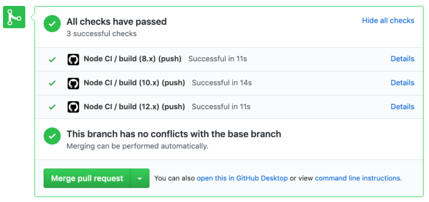

> 官方文档：<https://docs.github.com/en/actions>

GitHub Action 是 GitHub 于 2018 年 10 月推出的一个 CI\CD 服务（持续集成和持续部署）。简单明了的说 就是你可以给你的代码仓库部署一系列自动化脚本，在你进行了提交/合并分支等操作后，自动执行脚本。

### CI/CD 触发器

GitHub Actions 是一个独立的系统：它提供了 CI/CD 构建功能──能够构建和测试 Pull Request 并合并到你的 master 分支中--但它不只限于构建系统。 它已经集成到GitHub中，并且只要[你的项目库中发生任何事件](https://docs.github.com/en/actions/using-workflows/events-that-trigger-workflows)（例如正在创建发行版或正在评论问题），都可以触发并运行工作流。

<font color='green'>GitHub Actions 允许你定义一个触发器来控制工作流程的运行时间。每当你的项目库中发生与该触发器匹配的操作时，工作流运行都会进入排队队列中准备。</font>

对于 CI/CD 工作流，我喜欢使用 [push](https://docs.github.com/en/actions/using-workflows/events-that-trigger-workflows#push-event-push) 和 [pull_request](https://help.github.com/en/actions/automating-your-workflow-with-github-actions/events-that-trigger-workflows#pull-request-event-pull_request) 触发器，并将其范围限定在我感兴趣的分支上。例如：
```bash
on:
  push:
    branches:
    - master
  pull_request:
    branches:
    - master
```

> About YAML syntax for workflows
> 
> <https://docs.github.com/en/actions/using-workflows/workflow-syntax-for-github-actions#onpushpull_requestbranchestag>

这个触发器将在对master分支进行任何更改时运行你的工作流（即使它的名字是 push 触发器，也将在你运行 git push 或将 pull request 合并到 master 分支时运行）。对于针对master分支打开的任何 pull request，工作流也将运行，并且将在 pull request 中向你显示验证。

如果你熟悉YAML语法，就可能会注意到分支采用数组。 因此，你可以轻松地设置工作流在多个分支中运行，这在你维护单独的发布轨道追踪时非常有用。 例如：

```bash
on:
  push:
    branches:
    - master
    - 'releases/**'
  pull_request:
    branches:
    - master
    - 'releases/**'
```

每当对 master 分支或名称 以 `releases/` 开头的分支 打开 pull request 时，将运行你的工作流。



通过 push 和 pull_request 触发器，可以轻松设置 CI/CD 样式的工作流程来验证 pull request，并使用 GitHub Actions 合并到你的 master 分支中。

### 矩阵工作流

```bash
matrix:
  cc: [gcc, clang]
  curl: [openssl, gnutls, nss]
  kerberos: [libkrb5, heimdal]
```
> 参考：
> + 《GitHub Actions Advent Calendar》 - <https://www.edwardthomson.com/blog/github_actions_advent_calendar.html>
> + 翻译：《GitHub Actions Advent Calendar》 - <https://qiwihui.com/qiwihui-blog-83/>
> + GitHub Actions使用学习最全文档
 <https://blog.csdn.net/Ber_Bai/article/details/120303880>