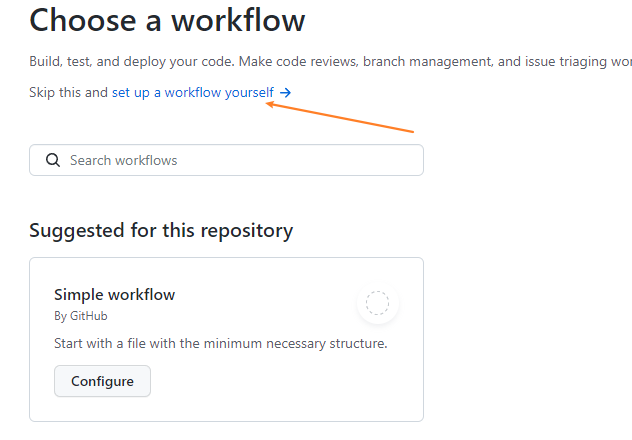
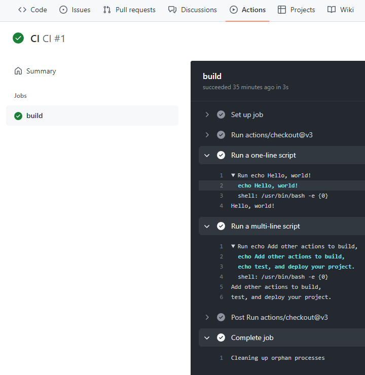

> 官方文档：<https://docs.github.com/cn/actions/using-workflows>
>
> 视频：<https://www.bilibili.com/video/av69442934/>

GitHub Action 是 GitHub 于 2018 年 10 月推出的一个 CI\CD 服务（持续集成和持续部署）。简单明了的说 就是你可以给你的代码仓库部署一系列自动化脚本，在你进行了提交/合并分支等操作后，自动执行脚本。

### 初始化 Actions

repo 》 Actions 》 New workflow

但是我们这里选择自定义的流程（这里会提供一些推荐的流程，如：nodejs）



设置好后创建 `{repo}/.github/workflows/main.yml` 文件

（默认内容如下）

```bash
# 当main分支接收到代码提交后，会执行jobs列中的任务。
# This is a basic workflow to help you get started with Actions

name: CI

# Controls when the workflow will run
on:
  # Triggers the workflow on push or pull request events but only for the main branch
  push:
    branches: [ main ]
  pull_request:
    branches: [ main ]

  # Allows you to run this workflow manually from the Actions tab
  workflow_dispatch:

# A workflow run is made up of one or more jobs that can run sequentially or in parallel
jobs:
  # This workflow contains a single job called "build"
  build:
    # 下面 steps 的运行环境
    # The type of runner that the job will run on
    runs-on: ubuntu-latest

    # Steps represent a sequence of tasks that will be executed as part of the job
    steps:
      # 把代码下载下载
      # Checks-out your repository under $GITHUB_WORKSPACE, so your job can access it
      - uses: actions/checkout@v3

      # Runs a single command using the runners shell
      - name: Run a one-line script
        run: echo Hello, world!

      # Runs a set of commands using the runners shell
      - name: Run a multi-line script
        run: |
          echo Add other actions to build,
          echo test, and deploy your project.
```


提交代码后，action就已经在运行了



### 工作流程语法

官方文档：<https://docs.github.com/cn/actions/using-workflows/workflow-syntax-for-github-actions>

> 参考：
> + 《GitHub Actions Advent Calendar》 - <https://www.edwardthomson.com/blog/github_actions_advent_calendar.html>
> + 翻译：《GitHub Actions Advent Calendar》 - <https://qiwihui.com/qiwihui-blog-83/>