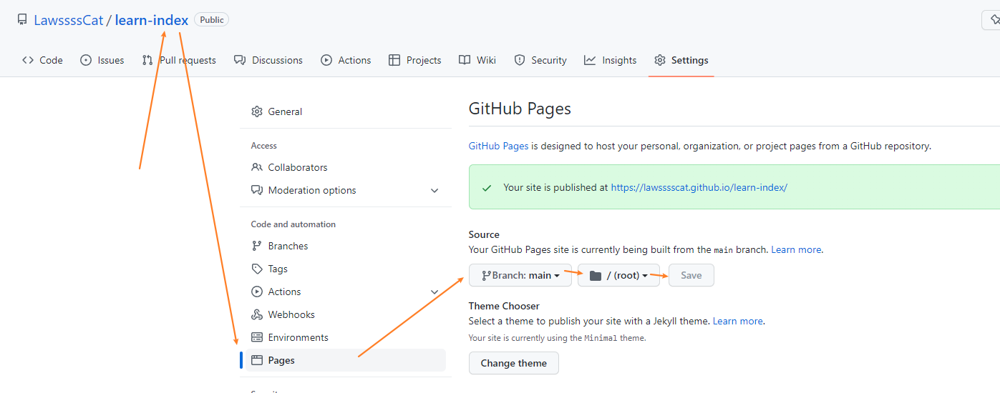

>官网 jekyll：<https://www.jekyll.com.cn/>
>
>参考：[《jekyll 的基本用法》](../Jekyll/Jekyll_simple_use.md)

1. 开启 Github Pages

    repositories 》 选着要开启的仓库 》 settings 》 Pages 

    选择发布分支和目录

    

    + gh-pages branch 是项目新建一个分支命名为这个，使用这个分支来做站点内容。
    + master branch 是使用主分支也是默认的，来作为站点内容。
    + master branch/docs folder 是使用主分支的docs文件夹来作为站点内容。
    + None 就是禁用Github Pages。

2. 选择主题

    选择好主题后，在发布目录下会多出一个文件 `_config.yml`，它是jekyll的全局配置文件，现在里面只有一句话 `theme: jekyll-theme-modernist`。
    
    （我们可以手动修改这个theme主题配置，网站就会应用不同的主题。）

    （Github内置支持的几个主题：<https://pages.github.com/themes/>，每个README.md里都有介绍如何设置）

    （更多更漂亮的主题：<http://jekyllthemes.org/>、<https://github.com/jekyll/jekyll/wiki/sites>（不要挑花眼了））

    > 2022年5月20日
    > 
    >选中
    >+ <https://jekyll-lin-theme.netlify.app/> - 框架
    >+ <https://soyaine.github.io/jekyll-theme-diary/> - 日历
    >+ <https://longpdo.github.io/> - 特效