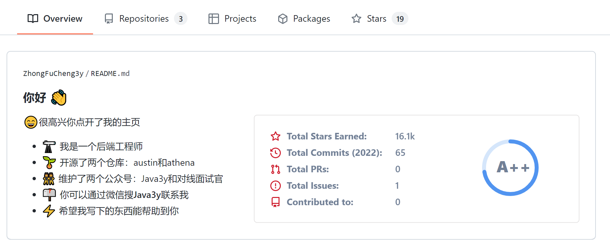
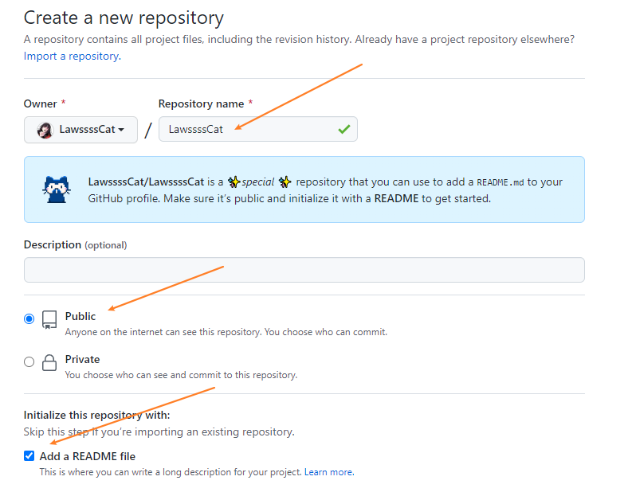
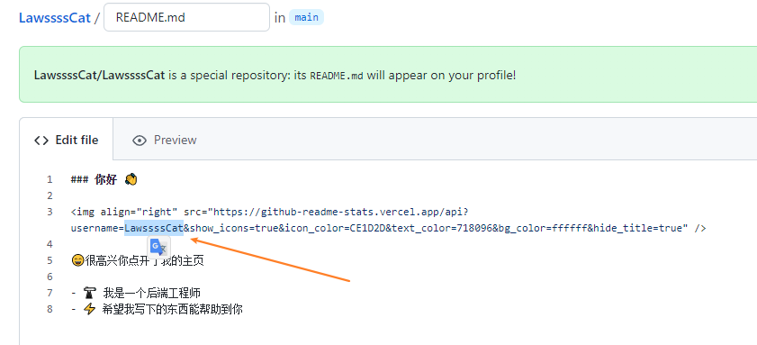

[github官方文档——About your profile](https://docs.github.com/en/account-and-profile/setting-up-and-managing-your-github-profile/customizing-your-profile/about-your-profile)


瞎逛看到了别人的github主页，感觉挺好看的



点开源文件，长这样

```bash
### 你好 👋


😄很高兴你点开了我的主页

- 🔭 我是一个后端工程师
- 🌱 开源了两个仓库：austin和athena
- 👯 维护了两个公众号：Java3y和对线面试官
- 📫 你可以通过微信搜**Java3y**联系我
- ⚡ 希望我写下的东西能帮助到你
```

很明显，右侧那个小动画一样展示自己github统计情况的，就直接是上面的src改成自己的github用户名即可

### 添加步骤

1.  创建一个和你github用户名一样的repository

    （确保这个repo是public的，同时勾选Add a README.md文件）

    

2. 然后编辑 README.md 即可（修改的内容会反映到profile中）

    （记得把链接中的名字改成你自己的，否则显示的是别人的记录）

    