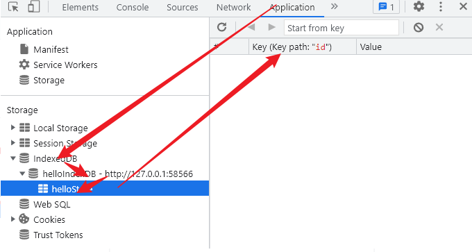
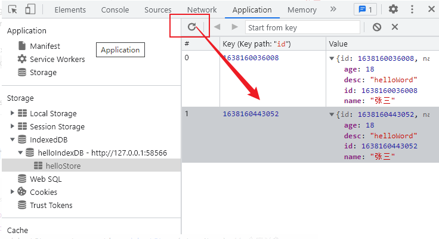

由于开发3D可视化项目经常用到模型，而一个模型通常是几m甚至是几十m的大小对于一般的服务器来讲加载速度真的十分的慢，为了解决这个加载速度的问题，我想到了几个本地存储的。

+ 首先是cookie,cookie肯定是不行的，因为最多以只能存4k
+ 其次localStorage，最多能存5m<br>
（但是当遇到大模型还是不够，实际开发中大部分模型都是10m-30m的）
+ indexDB<br>
3d框架three.js就是使用indexDB去做存储，而且存储大小是250m以上<br>
（受计算机硬件和浏览器厂商的限制）


#### 打开数据库

```js
let dbName = 'helloIndexDB', version = 1, storeName = 'helloStore'

let indexedDB = window.indexedDB
let db
const request = indexedDB.open(dbName, version)
request.onsuccess = function(event) {
  db = event.target.result // 数据库对象
  console.log('数据库打开成功')
}

request.onerror = function(event) {
  console.log('数据库打开报错')
}

request.onupgradeneeded = function(event) {
  // 数据库创建或升级的时候会触发
  console.log('onupgradeneeded')
  db = event.target.result // 数据库对象
  let objectStore
  if (!db.objectStoreNames.contains(storeName)) {
    objectStore = db.createObjectStore(storeName, { keyPath: 'id' }) // 创建表
    // objectStore.createIndex('name', 'name', { unique: true }) // 创建索引 可以让你搜索任意字段
  }
}
```



#### 存入数据

```js
// 添加数据
function addData(db, storeName, data) {
  let request = db.transaction([storeName], 'readwrite') // 事务对象 指定表格名称和操作模式（"只读"或"读写"）
    .objectStore(storeName) // 仓库对象
    .add(data)

  request.onsuccess = function(event) {
    console.log('数据写入成功')
  }

  request.onerror = function(event) {
    console.log('数据写入失败')
    throw new Error(event.target.error)
  }
}

// 由于打开indexDB是异步的加个定时器避免 db对象还没获取到值导致 报错
setTimeout(() => {
  addData(db, storeName, {
    id: new Date().getTime(), // 必须且值唯一
    name: '张三',
    age: 18,
    desc: 'helloWord'
  })
}, 1000)
```



#### 封装：增删查改

```js
 
// 根据id获取数据
function getDataByKey(db, storeName, key) {
    let transaction = db.transaction([storeName]) // 事务
    let objectStore = transaction.objectStore(storeName) // 仓库对象
    let request = objectStore.get(key)

    request.onerror = function(event) {
      console.log('事务失败')
    }

    request.onsuccess = function(event) {
      console.log('主键查询结果: ', request.result)
    }
}

// 根据id修改数
function updateDB(db, storeName, data) {
  let request = db.transaction([storeName], 'readwrite') // 事务对象
    .objectStore(storeName) // 仓库对象
    .put(data)

  request.onsuccess = function() {
    console.log('数据更新成功')
  }

  request.onerror = function() {
    console.log('数据更新失败')
  }
}

// 根据id删除数据
function deleteDB(db, storeName, id) {
  let request = db.transaction([storeName], 'readwrite').objectStore(storeName).delete(id)

  request.onsuccess = function() {
    console.log('数据删除成功')
  }

  request.onerror = function() {
    console.log('数据删除失败')
  }
}


// 由于打开indexDB是异步的加个定时器避免 db对象还没获取到值导致 报错
setTimeout(() => {
  // addData(db, storeName, {
  //   id: new Date().getTime(), // 必须且值唯一
  //   name: '张三',
  //   age: 18,
  //   desc: 'helloWord'
  // })

  getDataByKey(db, storeName, 1638160036008)

  updateDB(db, storeName, {id: 1638164880484, desc: '修改的内容'})

  deleteDB(db, storeName, 1638164870439)
}, 1000)
```

#### 封装案例：自己封装

封装类库

```js
/**
 * 封装的方法以及用法
 * 打开数据库
 */
export function openDB(dbName, storeName, version = 1) {
  return new Promise((resolve, reject) => {
    let indexedDB = window.indexedDB
    let db
    const request = indexedDB.open(dbName, version)
    request.onsuccess = function(event) {
      db = event.target.result // 数据库对象
      resolve(db)
    }
 
    request.onerror = function(event) {
      reject(event)
    }
 
    request.onupgradeneeded = function(event) {
      // 数据库创建或升级的时候会触发
      console.log('onupgradeneeded')
      db = event.target.result // 数据库对象
      let objectStore
      if (!db.objectStoreNames.contains(storeName)) {
        objectStore = db.createObjectStore(storeName, { keyPath: 'id' }) // 创建表
        // objectStore.createIndex('name', 'name', { unique: true }) // 创建索引 可以让你搜索任意字段
      }
    }
  })
}
 
/**
 * 新增数据
 */
export function addData(db, storeName, data) {
  return new Promise((resolve, reject) => {
    let request = db.transaction([storeName], 'readwrite') // 事务对象 指定表格名称和操作模式（"只读"或"读写"）
      .objectStore(storeName) // 仓库对象
      .add(data)
 
    request.onsuccess = function(event) {
      resolve(event)
    }
 
    request.onerror = function(event) {
      throw new Error(event.target.error)
      reject(event)
    }
  })
}
 
/**
 * 通过主键读取数据
 */
export function getDataByKey(db, storeName, key) {
  return new Promise((resolve, reject) => {
    let transaction = db.transaction([storeName]) // 事务
    let objectStore = transaction.objectStore(storeName) // 仓库对象
    let request = objectStore.get(key)
 
    request.onerror = function(event) {
      reject(event)
    }
 
    request.onsuccess = function(event) {
      resolve(request.result)
    }
  })
}
 
/**
 * 通过游标读取数据
 */
export function cursorGetData(db, storeName) {
  let list = []
  let store = db.transaction(storeName, 'readwrite') // 事务
    .objectStore(storeName) // 仓库对象
  let request = store.openCursor() // 指针对象
  return new Promise((resolve, reject) => {
    request.onsuccess = function(e) {
      let cursor = e.target.result
      if (cursor) {
        // 必须要检查
        list.push(cursor.value)
        cursor.continue() // 遍历了存储对象中的所有内容
      } else {
        resolve(list)
      }
    }
    request.onerror = function(e) {
      reject(e)
    }
  })
}
 
/**
 * 通过索引读取数据
 */
export function getDataByIndex(db, storeName, indexName, indexValue) {
  let store = db.transaction(storeName, 'readwrite').objectStore(storeName)
  let request = store.index(indexName).get(indexValue)
  return new Promise((resolve, reject) => {
    request.onerror = function(e) {
      reject(e)
    }
    request.onsuccess = function(e) {
      resolve(e.target.result)
    }
  })
}
 
/**
 * 通过索引和游标查询记录
 */
export function cursorGetDataByIndex(db, storeName, indexName, indexValue) {
  let list = []
  let store = db.transaction(storeName, 'readwrite').objectStore(storeName) // 仓库对象
  let request = store.index(indexName) // 索引对象
    .openCursor(IDBKeyRange.only(indexValue)) // 指针对象
  return new Promise((resolve, reject) => {
    request.onsuccess = function(e) {
      let cursor = e.target.result
      if (cursor) {
        list.push(cursor.value)
        cursor.continue() // 遍历了存储对象中的所有内容
      } else {
        resolve(list)
      }
    }
    request.onerror = function(ev) {
      reject(ev)
    }
  })
}
 
/**
 * 更新数据
 */
export function updateDB(db, storeName, data) {
  let request = db.transaction([storeName], 'readwrite') // 事务对象
    .objectStore(storeName) // 仓库对象
    .put(data)
 
  return new Promise((resolve, reject) => {
    request.onsuccess = function(ev) {
      resolve(ev)
    }
 
    request.onerror = function(ev) {
      resolve(ev)
    }
  })
}
 
/**
 * 删除数据
 */
export function deleteDB(db, storeName, id) {
  let request = db.transaction([storeName], 'readwrite').objectStore(storeName).delete(id)
 
  return new Promise((resolve, reject) => {
    request.onsuccess = function(ev) {
      resolve(ev)
    }
 
    request.onerror = function(ev) {
      resolve(ev)
    }
  })
}
 
/**
 * 删除数据库
 */
export function deleteDBAll(dbName) {
  console.log(dbName)
  let deleteRequest = window.indexedDB.deleteDatabase(dbName)
  return new Promise((resolve, reject) => {
    deleteRequest.onerror = function(event) {
      console.log('删除失败')
    }
    deleteRequest.onsuccess = function(event) {
      console.log('删除成功')
    }
  })
}
 
/**
 * 关闭数据库
 */
export function closeDB(db) {
  db.close()
  console.log('数据库已关闭')
}
 
export default {
  openDB,
  addData,
  getDataByKey,
  cursorGetData,
  getDataByIndex,
  cursorGetDataByIndex,
  updateDB,
  deleteDB,
  deleteDBAll,
  closeDB
}
```

使用类库，该库的使用方法如下

```html
<!DOCTYPE html>
<html lang="en">
<head>
  <meta charset="UTF-8">
  <meta name="viewport" content="width=device-width, initial-scale=1.0, minimum-scale=1.0, maximum-scale=1.0">
  <title>Title</title>
  <link href="./favicon.png">
</head>
<body>
</body>
 
注意要加 type="module"
<script type="module">
-->
<script type="module">
  import IndexDB from './IndexDB.js'
 
  (async function() {
 
    const dbName = 'myDB', storeName = 'db_1'
    const db = await IndexDB.openDB(dbName, storeName, 1)
    var data = await IndexDB.addData(db, storeName, {
      id: 111, // 必须且值唯一
      name: '张三',
      age: 18,
      desc: 'helloWord'
    })
    console.log(data)
 
    var data = await IndexDB.getDataByKey(db, storeName, 111)
    console.log(data)
 
    var data = await IndexDB.updateDB(db, storeName, { id: 111, desc: '修改的内容' })
    console.log(data)
 
    var data = await IndexDB.deleteDB(db, storeName, 111)
    console.log(data)
  })()
</script>
</html>
```

#### 封装案例：第三方库 indexdbwrapper

```js
/* 下载
 cnpm install --save indexdbwrapper
*/
// 引入
import IndexDBWrapper from 'indexdbwrapper'
// 使用
async function dbTest() {
      const dbName = 'dbName', storeName = 'storeName', version = 1
 
      const db = new IndexDBWrapper(dbName, version, {
        onupgradeneeded(event) {
          const db = event.target.result // 数据库对象
          let objectStore
          if (!db.objectStoreNames.contains(storeName)) {
            objectStore = db.createObjectStore(storeName, { keyPath: 'id' }) // 创建表
            // objectStore.createIndex('createTime', 'createTime', { unique: false }) // 创建索引 可以让你搜索任意字段
          }
        }
      })
      await db.open()
      await db.add(storeName, { id: new Date().getTime(), updateTime: new Date().getTime() })
      console.log(await db.get(storeName, 1639015754840))
      console.log(await db.put(storeName, { id: 1639015754840, put: 'put2' }))
      console.log(await db.get(storeName, 1639015754840))
      console.log(await db.delete(storeName, 1639015754840))
      // console.log(await db.clear(storeName))
}
dbTest()
```