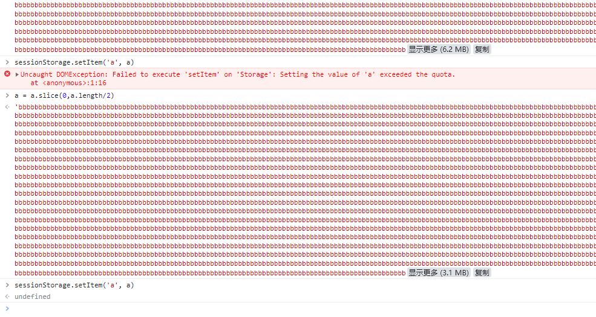
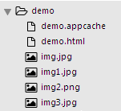
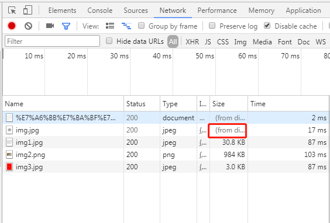
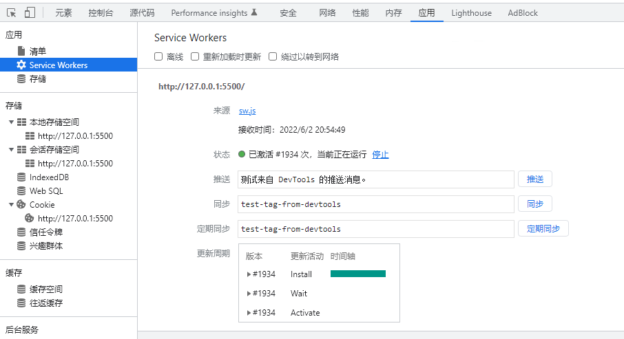
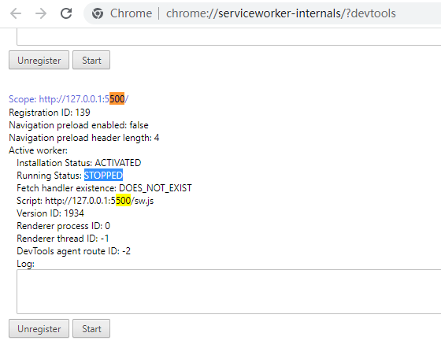
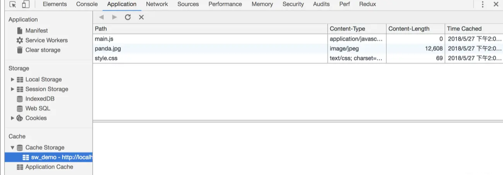

JSONPath Online Evaluator <https://jsonpath.com/>

### chrome 的 session 能绑定数据大小

测试2022年5月26日




### 功能
#### 双向绑定
完整：<https://lawsssscat.blog.csdn.net/article/details/104190288>
```html
<!DOCTYPE html>
<html lang="en">
<head>
    <meta charset="UTF-8">
    <meta name="viewport" content="width=device-width, initial-scale=1.0">
    <meta http-equiv="X-UA-Compatible" content="ie=edge">
    <title>Document</title>
</head>
<body>

<input type="text" v-model='content'>
<input type="text" v-model='title'>
<input type="text" v-model='title'>
<h4 v-bind='title'>这里也会更新</h4>


<script>
function View() {
    let proxy = new Proxy({} , {
        get(obj, property) {} ,
        set(obj,property,value) { // 如果是严格模式，要返回true
            document.querySelectorAll(`[v-model="${property}"]`)
            .forEach(item=> {
                item.value=value;
            });
            document.querySelectorAll(`[v-bind="${property}"]`)
            .forEach(item => {
                item.innerHTML = value ; 
            })
            // return true 能避免  'set' on proxy: trap returned falsish for property 'xxx' 异常
        }
    })
    this.init = function() {
        const els = document.querySelectorAll('[v-model]') ;
        els.forEach(item => {
            item.addEventListener('keyup' ,function() { // this 键入的 input
                proxy[this.getAttribute('v-model')] = this.value ; 
            });
        });
    };
}
new View().init() ;
</script>
</body>
</html>

```

```html
<!DOCTYPE html>
<html lang="en">
<head>
    <meta charset="UTF-8">
    <meta name="viewport" content="width=device-width, initial-scale=1.0">
    <meta http-equiv="X-UA-Compatible" content="ie=edge">
    <title>Document</title>
</head>
<body>

<input type="text" v-model='title'>
<input type="text" v-model='title'>
<h4 v-bind='title'>这里也会更新</h4>


<script>
function View() {
  const els = document.querySelectorAll('[v-model]') ;
  const vbs = document.querySelectorAll('[v-bind]') ;
    let proxy = new Proxy({} , {
        get(obj, property) {} ,
        set(obj,property,value) {
            console.log(value) ; 
            els.forEach((el) => {
              el.value=value;
            })
            vbs.forEach((vb) => {
              vb.innerHTML=value;
            })
        }
    })
    this.init = function() {
        els.forEach(item => {
            item.addEventListener('keyup' ,function() { // this 键入的 input
                proxy[this.getAttribute('v-model')] = this.value ; 
            });
        });
    };
}
new View().init() ;
</script>
</body>
</html>

```
####  表单验证


完整：<https://lawsssscat.blog.csdn.net/article/details/104190288>
```html
<!DOCTYPE html>
<html lang="en">
<head>
    <meta charset="UTF-8">
    <meta name="viewport" content="width=device-width, initial-scale=1.0">
    <meta http-equiv="X-UA-Compatible" content="ie=edge">
    <title>Document</title>
    <style>
        .error{
            border-color: red;
        }
    </style>
</head>
<body>

    <input type="text" validate rule='max:12,min:3'>
    <input type="text" validate rule='max:3,isNumber'>

<script>
'use strict' ; 
class Validate{
    max(value , len){
        return value.length <= len ; 
    }
    min(value,len) {
        return value.length >= len ; 
    }
    isNumber(value) {
        return /^\d+$/.test(value);
    }
}
const validate = new Validate() ;
function ProxyFactory(target) {
    return new Proxy(target , {
        get(target, key) {
            return target[key] ;
        },
        set(target, key, el) { // el 传入的 this
            const rules = el.getAttribute('rule');
            let state = rules.split(',').every(rule => { //都是真 才真
                const info = rule.split(':') ; 
                return validate[info[0]](el.value,info[1] ) ;
            })
            el.classList[state?'remove':'add']('error') ; 
            return true ; // 因为是严格模式，所以要返回 true
        }
    });
}
const proxy = ProxyFactory(document.querySelectorAll('[validate]'))
proxy.forEach((item,i) => {
    item.addEventListener("keyup",function() {
        proxy[i] = this ;  //只是为了触发代理事件
    })
})
</script>
</body>
</html>

```

### cache storage、application cache

前端缓存分为HTTP缓存和浏览器缓存，浏览存储也有很多方法，比如使用`localStorage`、`sessionStorage`、`cookie`、`indexDB`等，本文就`CacheStorage`及`application cache`做简易介绍。

#### cache storage（响应缓存）

<https://developer.mozilla.org/zh-CN/docs/Web/API/CacheStorage>

很多小伙伴都应该了解`localStorage`、`sessionStorage`，但是却很少使用`cacheStorage`。cacheStorage也是浏览器存储的一种方式，它的主要用途是用于对请求的缓存。

<font color='red'>它用来存储 Response 对象的。也就是说用来对 HTTP ，响应做缓存的。虽然 localStorage 也能做，但是它可能更专业</font>。

```js
caches.delete('c1');
caches.delete('c2');
Promise.all([
    caches.open('c1').then(function(cache) {
        return cache.put('/hehe', new Response('aaa', { status: 200 }));
    }),
    caches.open('c2').then(function(cache) {
          return cache.put('/hehe', new Response('bbb', { status: 200 }));
    })
])
.then(function() {
    return caches.match('/hehe');
})
.then(function(response) {
    return response.text();
})
.then(function(body) {
    console.log(body);
});

// 结果：aaa
```


`CacheStorage` 在window使用时直接写成`caches`，其主要调用方法有：

+ `open(cache)`：打开cache，没有的话自动创建该cache，返回一个promise，值为当前（创建）的cache

+ `has(cache)`：匹配当前的cache对象，返回一个promise，有该cache则返回true，否则返回false

+ `keys`：返回一个promise，其值为当前所有caches，合并为一个数组

+ `match(path)`：匹配路由请求（参数一般写成路径形式），对于检查给定的 Request 是否是 CacheStorage 对象跟踪的任何 Cache 对象的键，并返回一个resolve为该匹配的 Promise

+ `put(path, new Response())`：在cache中写入数据，第一个参数一般写成路径形式，第二个参数为Response实例

采用caches的api缓存远程获取的数据，如果本地已经缓存则使用本地缓存的数据

```js
async function testCache{
    var cacheName = 'baidu'  // 定义cache名称
    var path = '/path'  // 定义路径

    var cachesMatch = await caches.match(path) // 匹配当前路径
    var cachesLocal = await caches.has(cacheName)

    //如果当前已有数据则直接获取缓存的数据
    if(cachesMatch && cachesLocal){
        caches.match(path).then(res => {
          return res.text()
        }).then(res => {
          console.log("获取cache数据: ", res)
        })
    }else{
      // 如果没有则获取远程数据
      getBaidu().then(res => {
        // 将请求的数据保存在caches中
        caches.open(cacheName).then(cache => {
          cache.put(path, new Response(JSON.stringify(res), { status: 200 }))          // 采用Json数据格式保存
        })
    })
    }
}
```

#### application cache（离线缓存）

HTML5 引入离线缓存（Application Cache），这意味着 web 应用可进行缓存，并可在没有因特网连接时进行访问。

优势<br>
+ 离线浏览 - 用户可在应用离线时使用它们。
+ 速度 - 已缓存资源加载得更快。
+ 减少服务器负载 - 浏览器将只从服务器下载更新过或更改过的资源。

应用场景<br>
h5游戏及一些页面内容不经常会变动、相对较为固定的内容。

原理<br>
application cache是前端应用级别的缓存，使用方式在html标签中添加mainfest属性<br>
HTML5的离线存储是基于一个manifest文件(缓存清单文件，后缀为.appcache)的缓存机制(不是存储技术)，通过这个文件上的清单解析离线存储资源，这些资源就会像cookie一样被存储了下来。之后当网络在处于离线状态时，浏览器会通过被离线存储的数据进行页面展示。

如何使用
1. 首先在文档的html标签中设置`manifest` 属性，引用manifest文件 。
    ```html
    <html mainfest="myApplication.appcache">
    ```
2. 然后配置`manifest`文件，在manifest文件中编写离线存储的资源。


    属性值是自定义缓存的文件，在html同路径下创建文件`myApplication.appcache`，在其中编写内容：

    ```bash
    CACHE MANIFEST
    CACHE:
    index.html
    favicon.ico
    NETWORK:
    *
    FAILBACK:
    ```

    + `CACHE MANIFEST`： 本文件标识，在此标题下列出的文件将在首次下载后进行缓存
    + `CACHE`： 在此标题下列出的文件将在首次下载后进行缓存，与CACHE MANIFEST功能类似
    + `NETWORK`： 在此标题下列出的文件需要与服务器的连接，且不会被缓存
    + `FALLBACK`： 在此标题下列出的文件规定当页面无法访问时的回退页面（比如 404 页面）


3. 最后操作`window.applicationCache`进行需求实现。

> 此外，必须要在服务器端正确的配置`MIME-type`。

接下来，用具体实例来看一下如何使用离线缓存。

##### 示例

step1 

demo文件夹目录如下：<br>


```html
<!DOCTYPE html>
<html lang="en" manifest="demo.appcache">
<head>
	<meta charset="UTF-8">
	<title>demo</title>
</head>
<body>
	
	其它内容...
</body>
</html>
```

step2

配置manifest文件，在manifest文件中编写离线存储的资源。

```bash
CACHE MANIFEST
#version 1.0
CACHE:
	img.jpg
NETWORK:
	*
FALLBACK:
	/demo/ /404.html
```

>1. 缓存 `img.jpg`
>2. `network *` 表示除CACHE 外的所有其他资源/文件都需要因特网连接。
>3. `FALLBACK`  在此标题下列出的文件规定当页面无法访问时的替代页面。
>
>`demo.html`中的`img`在首次下载后进行缓存；其他文件内容都需要因特网连接；如果无法建立因特网连接，则用 “`404.html`” 替代 `/demo/` 目录中的所有文件。

step3 

操作`window.applicationCache`进行需求实现。

`window.applicationCache` 对象是对浏览器的应用缓存的编程访问方式。其 status 属性可用于查看缓存的当前状态。

status |  含义
-- | --
0（UNCACHED） | 无缓存， 即没有与页面相关的应用缓存。
1（IDLE） | 闲置，即应用缓存未得到更新。
2 （CHECKING） | 检查中，即正在下载描述文件并检查更新。
3 （DOWNLOADING） | 下载中，即应用缓存正在下载描述文件中指定的资源。
4 （UPDATEREADY） | 更新完成，所有资源都已下载完毕。
5 （IDLE） | 废弃，即应用缓存的描述文件已经不存在了，因此页面无法再访问应用缓存。

以下代码使用 status 属性为当前通过网页所加载的文档确定应用程序缓存的状态。


```js
var oAppCache = window.applicationCache; 
var sCacheStatus = "Not supported";
switch (oAppCache.status) { 
    case 0: // UNCACHED == 0 
       sCacheStatus ='（UNCACHED） : 无缓存， 即没有与页面相关的应用缓存'; 
    break; 
    case 1: // IDLE == 1 
        sCacheStatus = '（IDLE） : 闲置，即应用缓存未得到更新'; 
    break; 
    case 2: // CHECKING == 2 
        sCacheStatus = '（CHECKING） : 检查中，即正在下载描述文件并检查更新'; 
    break; 
    case 3: // DOWNLOADING == 3 
        sCacheStatus ='（DOWNLOADING） : 下载中，即应用缓存正在下载描述文件'; 
    break; 
    case 4: // UPDATEREADY == 4 
        sCacheStatus ='（UPDATEREADY） : 更新完成，所有资源都已下载完毕';
    break; 
    case 5: // OBSOLETE == 5 
        sCacheStatus ='（IDLE） : 废弃，即应用缓存的描述文件已经不存在了，因此页面无法再访问应用缓存'); 
    break; 
    default: 
        console.log( 'UKNOWN CACHE STATUS'); 
    break; 
};
```

浏览器会对下载进度、应用缓存更新和错误状态等情况触发相应事件。

APPCACHE | 事件
--- | ---
checking | 每当应用程序载入的时候，都会检查该清单文件,也总会首先触发“checking”事件。
noupdate | 如果没有改动，同时应用程序也已经缓存了“noupdate”事件被触发，整个过程结束 。
downloading | 如果还未缓存应用程序，或者清单文件有改动,那么浏览器会下载并缓存清单中的所有资源 ,触发"downloading"事件，同时意味着下载过程开始。
progress | 在下载过程中会间断性触发“progress”事件，通常是在每个文件下载完毕的时候 。
cached | 下载完成并且首次将应用程序下载到缓存中时，浏览器会触发“cached“事件 。
updateready | 当下载完成并将缓存中的应用程序更新后，浏览器会触发”updaterady”事件。
error | 如果浏览器处于离线状态，检查清单列表失败，则会触发“error“事件，当一个未缓存的应用程序引用一个不存在的清单文件，也会触发此事件
obsolete | 如果一个缓存的应用程序引用一个不存在的清单文件，会触发“obsolete“，同时将应用从缓存中移除之后不会从缓存而是通过网络加载资源

以下代码段为每种缓存事件类型设置了事件监听器：

```js
function handleCacheEvent(e) { 
    对应操作...
} 
function handleCacheError(e) { 
    alert('Error: Cache failed to update!'); 
}; 
//在浏览器为应用缓存查找更新时触发
oAppCache.addEventListener('checking', handleCacheEvent, false); 
//在检查描述文件发现文件无变化时触发
oAppCache.addEventListener('noupdate', handleCacheEvent, false); 
// 在开始下载应用缓存资源时触发
oAppCache.addEventListener('downloading', handleCacheEvent, false); 
//在文件下载应用缓存的过程中持续不断地下载地触发
oAppCache.addEventListener('progress', handleCacheEvent, false); 
//在应用缓存完整可用时触发 
oAppCache.addEventListener('cached', handleCacheEvent, false); 
//在页面新的应用缓存下载完毕触发
oAppCache.addEventListener('updateready', function(){
        oAppCache.swapCache();// 更新本地缓存
        location.reload();    //重新加载页面页面
    }, false); 
//在检查更新或下载资源期间发送错误时触发
oAppCache.addEventListener('error', handleCacheError, false); 
//缓存清单不存在时触发
oAppCache.addEventListener('obsolete', handleCacheEvent, false); 
```


step4 

在服务器端正确的配置`MIME-type`。

若遇到如此报错“`Application Cache Error event: Manifest fetch failed (404)`”,其原因是manifest文件需要正确的配置MIME-type（描述该消息的媒体类型），即“`text/cache-manifest`”，必须在服务器端进行配置。不同服务器配置方式不一样，举在tomcat服务器配置的例子。

在tomcat服务器中的`conf/web.xml`中添加：

```xml
<mime-mapping>
    <extension>manifest</extension>
    <mime-type>text/cache-manifest</mime-type>
</mime-mapping>
```

在开发者工具的Network面板下，可以看到img.jpg的Size为(from disk cache)，意味着是从缓存中读取的。



step 6 

更新缓存

一旦应用被缓存，它就会保持缓存直到发生下列情况：
1. 用户清空浏览器缓存。
2. manifest 文件被修改，浏览器打开页面时都会去加载这个文件，一旦发现这个文件发生了变化下次刷新的时候就会重新加载所有 Cache 的文件。
3. 由程序来更新应用缓存。

```js
window.applicationCache.update();
window.addEventListener('load', function(e) {
	window.applicationCache.addEventListener('updateready', function(e) {
		if (window.applicationCache.status == window.applicationCache.UPDATEREADY) {
		// Browser downloaded a new app cache.
		// Swap it in and reload the page to get the new hotness.
			window.applicationCache.swapCache();
			if (confirm('A new version of this site is available. Load it?')) {
				window.location.reload();
			}
		} else {
			// Manifest didn't changed. Nothing new to server.
		}
	}, false);
}, false);
```

##### 注意事项

1. 更新清单中列出的某个文件并不意味着浏览器会重新缓存该资源，清单文件本身必须进行更改。
2. 浏览器对缓存数据的容量限制可能不太一样（某些浏览器设置的限制是每个站点5MB）。
3. 如果manifest文件，或者内部列举的某一个文件不能正常下载，整个更新过程都将失败，浏览器继续全部使用老的缓存。
3. 引用manifest的html必须与manifest文件同源，在同一个域下。FALLBACK中的资源必须和manifest文件同源。
4. 浏览器会自动缓存引用manifest文件的HTML文件，这就导致如果改了HTML内容，也需要更新manifest 文件版本或者由程序来更新应用缓存才能做到更新。
5. manifest文件中CACHE则与NETWORK，FALLBACK的位置顺序没有关系，如果是隐式声明需要在最前面
2. 站点中的其他页面即使没有设置manifest属性，请求的资源如果在缓存中也从缓存中访问
3. 当manifest文件发生改变时，资源请求本身也会触发更新
4. Manifest 文件不能跨域，如果跨域需要支持 CORS
5. Manifest Cache 的资源不能跨域，同样如果跨域该资源需要支持 CORS，一般浏览器会自动处理


##### 与传统浏览器缓存区别

1. 离线缓存是针对整个应用，浏览器缓存是单个文件。
1. 离线缓存断网了还是可以打开页面，浏览器缓存不行。
1. 离线缓存可以主动通知浏览器更新资源。


### navigator 对象

<https://www.jb51.net/shouce/htmldom/jb51.net.htmldom/htmldom/dom_obj_navigator.asp.html> 

Navigator 对象是由 JavaScript runtime engine 自动创建的，包含有关客户机浏览器的信息。

#### serviceWorker

<https://juejin.cn/post/6844903613270081543>

Service Worker 理解为一个介于客户端和服务器之间的一个代理服务器。在 Service Worker 中我们可以做很多事情，比如拦截客户端的请求、向客户端发送消息、向服务器发起请求等等，<font color='red'>其中最重要的作用之一就是离线资源缓存</font>。


> <http://caniuse.com> 可以查看它在不同浏览器的兼容性

对于 Service Worker ，了解过 Web Worker 的同学可能会比较好理解。它和 Web Worker 相比，有相同的点，也有不同的地方。

相同：

+ Service Worker 工作在 worker context 中，是没有访问 DOM 的权限的，所以我们无法在 Service Worker 中获取 DOM 节点，也无法在其中操作 DOM 元素；
+ 我们可以通过 postMessage 接口把数据传递给其他 JS 文件；
+ Service Worker 中运行的代码不会被阻塞，也不会阻塞其他页面的 JS 文件中的代码；

不同

+ Service Worker 是一个浏览器中的进程而不是浏览器内核下的线程，因此它在被注册安装之后，能够被在多个页面中使用，也不会因为页面的关闭而被销毁。因此，Service Worker 很适合被用与多个页面需要使用的复杂数据的计算
+ 另外有一点需要注意的是，出于对安全问题的考虑，Service Worker 只能被使用在 https 或者本地的 localhost 环境下。

##### 注册安装

下面就让我们来使用 Service Worker 

如果当前使用的浏览器支持 Service Worker ，则在 window.navigator 下会存在 serviceWorker 对象，我们可以使用这个对象的 register 方法来注册一个 Service Worker。

> 这里需要注意的一点是，Service Worker 在使用的过程中存在大量的 Promise ，对于 Promise 不是很了解的同学可以先去看一下相关文档。 Service Worker 的注册方法返回的也是一个 Promise 。

```js
// index.js
if ('serviceWorker' in window.navigator) {
  navigator.serviceWorker.register('./sw.js', { scope: './' })
    .then(function (reg) {
      console.log('success', reg);
    })
    .catch(function (err) {
      console.log('fail', err);
    });
}
```
在这段代码中，我们先使用 if 判断下浏览器是否支持 Service Worker ，避免由于浏览器不兼容导致的 bug 。

register 方法接受两个参数<br>
第一个是 service worker 文件的路径，请注意：这个文件路径是相对于 Origin ，而不是当前 JS 文件的目录的；<br>
第二个参数是 Serivce Worker 的配置项，可选填，其中比较重要的是 scope 属性。按照文档上描述，它是 Service Worker 控制的内容的子目录，这个属性所表示的路径不能在 service worker 文件的路径之上，默认是 Serivce Worker 文件所在的目录；

register 方法返回一个 Promise 。如果注册失败，可以通过 catch 来捕获错误信息；如果注册成功，可以使用 then 来获取一个 `ServiceWorkerRegistration` 的实例

注册完 Service Worker 之后，浏览器会为我们自动安装它，因此我们就可以在 service worker 文件中监听它的 install 事件了。

```js
// sw.js
this.addEventListener('install', function (event) {
  console.log('Service Worker install');
});
```

同样的，Service Worker 在安装完成后会被激活，所以我们也可监听 activate 事件。

```js
// sw.js
this.addEventListener('activate', function (event) {
  console.log('Service Worker activate');
});
```

这时，我们可以在 Chorme 的开发者工具中看到我们注册的 Service Worker。




在默认情况下，Service Worker 必定会每24小时被下载一次，如果下载的文件是最新文件，那么它就会被重新注册和安装，但不会被激活，当不再有页面使用旧的 Service Worker 的时候，它就会被激活。



这对于我们开发来说是很不方便的，因此在这里我勾选了一个名为 Update on reload 的单选框，选中它之后，我们每次刷新页面都能够使用最新的 service worker 文件。
在同一个 Origin 下，我们可以注册多个 Service Worker。但是请注意，这些 Service Worker 所使用的 scope 必须是不相同的。

作者：十月七秋
链接：https://juejin.cn/post/6844903613270081543
来源：稀土掘金
著作权归作者所有。商业转载请联系作者获得授权，非商业转载请注明出处。

##### 信息通讯（从页面到 Service Worker）

之前说过，使用 postMessage 方法可以进行 Service Worker 和页面之间的通讯，下面就让我们来试一下。

首先是从页面发送信息到 Serivce Worker 。

```js
// index.js
if ('serviceWorker' in window.navigator) {
  navigator.serviceWorker.register('./sw.js', { scope: './' })
    .then(function (reg) {
      console.log('success', reg);
      navigator.serviceWorker.controller && navigator.serviceWorker.controller.postMessage("this message is from page");
    });
}
```

为了保证 Service Worker 能够接收到信息，我们在它被注册完成之后再发送信息，和普通的 window.postMessage 的使用方法不同，为了向 Service Worker 发送信息，我们要在 ServiceWorker 实例上调用 postMessage 方法，这里我们使用到的是 navigator.serviceWorker.controller 。

```js
// sw.js
this.addEventListener('message', function (event) {
  console.log(event.data); // this message is from page
});
```

在 service worker 文件中我们可以直接在 this 上绑定 message 事件，这样就能够接收到页面发来的信息了。

对于不同 scope 的多个 Service Worker ，我么也可以给指定的 Service Worker 发送信息。

```js
// index.js
if ('serviceWorker' in window.navigator) {
  navigator.serviceWorker.register('./sw.js', { scope: './sw' })
    .then(function (reg) {
      console.log('success', reg);
      reg.active.postMessage("this message is from page, to sw");
    })
  navigator.serviceWorker.register('./sw2.js', { scope: './sw2' })
    .then(function (reg) {
      console.log('success', reg);
      reg.active.postMessage("this message is from page, to sw 2");
    })
}

// sw.js
this.addEventListener('message', function (event) {
  console.log(event.data); // this message is from page, to sw
});

// sw2.js
this.addEventListener('message', function (event) {
  console.log(event.data); // this message is from page, to sw 2
});
```

请注意，当我们在注册 Service Worker 时，如果使用的 scope 不是 Origin ，那么`navigator.serviceWorker.controller` 会为 null。这种情况下，我们可以使用 `reg.active` 这个对象下的 postMessage 方法，reg.active 就是被注册后激活 Serivce Worker 实例。但是，由于 Service Worker 的激活是异步的，因此第一次注册 Service Worker 的时候，Service Worker 不会被立刻激活， reg.active 为 null，系统会报错。我采用的方式是返回一个 Promise ，在 Promise 内部进行轮询，如果 Service Worker 已经被激活，则 resolve 。

```js
// index.js
navigator.serviceWorker.register('./sw/sw.js')
    .then(function (reg) {
      return new Promise((resolve, reject) => {
        const interval = setInterval(function () {
          if (reg.active) {
            clearInterval(interval);
            resolve(reg.active);
          }
        }, 100)
      })
    }).then(sw => {
      sw.postMessage("this message is from page, to sw");
    })

  navigator.serviceWorker.register('./sw2/sw2.js')
    .then(function (reg) {
      return new Promise((resolve, reject) => {
        const interval = setInterval(function () {
          if (reg.active) {
            clearInterval(interval);
            resolve(reg.active);
          }
        }, 100)
      })
    }).then(sw => {
      sw.postMessage("this message is from page, to sw2");
    })
```


##### 信息通讯（从 Service Worker 到页面）

下一步就是从 Service Worker 发送信息到页面了，不同于页面向 Service Worker 发送信息，我们需要在 WindowClient 实例上调用 postMessage 方法才能达到目的。而在页面的JS文件中，监听 navigator.serviceWorker 的 message 事件即可收到信息。

而最简单的方法就是从页面发送过来的消息中获取 WindowClient 实例，使用的是 event.source ，不过这种方法只能向消息的来源页面发送信息。

```js
// sw.js
this.addEventListener('message', function (event) {
  event.source.postMessage('this message is from sw.js, to page');
});

// index.js
navigator.serviceWorker.addEventListener('message', function (e) {
  console.log(e.data); // this message is from sw.js, to page
});
```

如果不想受到这个限制，则可以在 serivce worker 文件中使用 this.clients 来获取其他的页面，并发送消息。

```js
// sw.js
this.clients.matchAll().then(client => {
  client[0].postMessage('this message is from sw.js, to page');
})
```

##### 使用 Message Channel 来通信

另外一种比较好用的通信方式是使用 Message Channel 。

```js
// index.js
navigator.serviceWorker.register('./sw.js', { scope: './' })
    .then(function (reg) {
      const messageChannel = new MessageChannel();
      messageChannel.port1.onmessage = e => {
        console.log(e.data); // this message is from sw.js, to page
      }
      reg.active.postMessage("this message is from page, to sw", [messageChannel.por2]);
    })

// sw.js
this.addEventListener('message', function (event) {
  console.log(event.data); // this message is from page, to sw
  event.ports[0].postMessage('this message is from sw.js, to page');
});
```

使用这种方式能够使得通道两端之间可以相互通信，而不是只能向消息源发送信息。举个例子，两个 Service Worker 之间的通信。

```js
// index.js
const messageChannel = new MessageChannel();
navigator.serviceWorker.register('./sw/sw.js')
.then(function (reg) {
    console.log(reg)
    return new Promise((resolve, reject) => {
    const interval = setInterval(function () {
        if (reg.active) {
        clearInterval(interval);
        resolve(reg.active);
        }
    }, 100)
    })
}).then(sw => {
    sw.postMessage("this message is from page, to sw", [messageChannel.port1]);
})

navigator.serviceWorker.register('./sw2/sw2.js')
.then(function (reg) {
    return new Promise((resolve, reject) => {
    const interval = setInterval(function () {
        if (reg.active) {
        clearInterval(interval);
        resolve(reg.active);
        }
    }, 100)
    })
}).then(sw => {
    sw.postMessage("this message is from page, to sw2", [messageChannel.port2]);
})

// sw.js
this.addEventListener('message', function (event) {
  console.log(event.data); // this message is from page, to sw
  event.ports[0].onmessage = e => {
    console.log('sw:', e.data); // sw: this message is from sw2.js
  }
  event.ports[0].postMessage('this message is from sw.js');
});

// sw2.js
this.addEventListener('message', function (event) {
  console.log(event.data); // this message is from page, to sw2
  event.ports[0].onmessage = e => {
    console.log('sw2:', e.data); // sw2: this message is from sw.js
  }
  event.ports[0].postMessage('this message is from sw2.js');
});
```

首先让页面给两个 Service Worker 发送信息，并且把信息通道的端口发送过去；然后在两个 service worker 文件中使用端口分别设置接受信息的回调函数，之后它们就能够互相发送信息并接收到来自通道对面的消息了。


##### <font color='red'>静态资源缓存</font>

下面要讲的就是重头戏，也是 Service Worker 能够实现的最主要的功能——静态资源缓存。

正常情况下，用户打开网页，浏览器会自动下载网页所需要的 JS 文件、图片等静态资源。我们可以通过 Chrome 开发工具的 Network 选项来查看。

但是如果用户在没有联网的情况下打开网页，浏览器就无法下载这些展示页面效果所必须的资源，页面也就无法正常的展示出来。

我们可以使用 Service Worker 配合 CacheStroage 来实现对静态资源的缓存。

```js
// sw.js
this.addEventListener('install', function (event) {
  console.log('install');
  event.waitUntil(
    caches.open('sw_demo').then(function (cache) {
      return cache.addAll([
        '/style.css',
        '/panda.jpg',
        './main.js'
      ])
    }
    ));
});
```

当 Service Worker 在被安装的时候，我们能够对制定路径的资源进行缓存。`CacheStroage` 在浏览器中的接口名是 `caches` ，我们使用 `caches.open` 方法新建或打开一个已存在的缓存；`cache.addAll` 方法的作用是请求指定链接的资源并把它们存储到之前打开的缓存中。由于资源的下载、缓存是异步行为，所以我们要使用事件对象提供的 `event.waitUntil` 方法，它能够保证资源被缓存完成前 `Service Worker` 不会被安装完成，避免发生错误。

从 `Chrome` 开发工具中的 `Application` 的 `Cache Strogae` 中可以看到我们缓存的资源。



这种方法只能缓存指定的资源，无疑是不实用的，所以我们需要针对用户发起的每一个请求进行缓存。


##### 动态缓存静态资源

```js
// ws.js
this.addEventListener('fetch', function (event) {
  console.log(event.request.url);
  event.respondWith(
    caches.match(event.request).then(res => {
      return res ||
        fetch(event.request)
        .then(responese => {
            const responeseClone = responese.clone();
            caches.open('sw_demo').then(cache => {
                cache.put(event.request, responeseClone);
            })
            return responese;
        })
        .catch(err => {
            console.log(err);
        });
    })
  )
});
```

我们需要监听 `fetch` 事件，每当用户向服务器发起请求的时候这个事件就会被触发。有一点需要注意，页面的路径不能大于 `Service Worker` 的 `scope`，不然 `fetch` 事件是无法被触发的。

在回调函数中我们使用事件对象提供的 `respondWith` 方法，它可以劫持用户发出的 `http` 请求，并把一个 `Promise` 作为响应结果返回给用户。<br>
然后我们使用用户的请求对 `Cache Stroage` 进行匹配，如果匹配成功，则返回存储在缓存中的资源；如果匹配失败，则向服务器请求资源返回给用户，并使用 `cache.put` 方法把这些新的资源存储在缓存中。因为请求和响应流只能被读取一次，所以我们要使用 `clone` 方法复制一份存储到缓存中，而原版则会被返回给用户

在这里有几点需要注意：

1. 当用户第一次访问页面的时候，资源的请求是早于 `Service Worker` 的安装的，所以静态资源是无法缓存的；只有当 `Service Worker` 安装完毕，用户第二次访问页面的时候，这些资源才会被缓存起来；
2. `Cache Stroage` 只能缓存静态资源，所以它只能缓存用户的 `GET` 请求；
3. `Cache Stroage` 中的缓存不会过期，但是浏览器对它的大小是有限制的，所以需要我们定期进行清理；

对于用户发起的 POST 请求，我们也可以在拦截后，通过判断请求中携带的 body 的内容来进行有选择的返回。

```js
if(event.request.method === 'POST') {
      event.respondWith(
        new Promise(resolve => {
          event.request.json().then(body => {
            console.log(body); // 用户请求携带的内容
          })
          resolve(new Response({ a: 2 })); // 返回的响应
        })
      )
    }
}
```

我们可以在 `fetch` 事件的回调函数中对请求的 `method` 、`url` 等各项属性进行判断，选择不同的操作。

对于静态资源的缓存，`Cache Stroage` 是个不错的选择；而对于数据，我们可以使用 `IndexedDB` 来存储，同样是拦截用户请求后，使用缓存在 `IndexDB` 中的数据作为响应返回，详细的内容我就不在这里讲了，有兴趣的同学可以自己去了解下。

##### 更新 Cache Stroage

前面提到过，当有新的 `service worker` 文件存在的时候，他会被注册和安装，等待使用旧版本的页面全部被关闭后，才会被激活。这时候，我们就需要清理下我们的 Cache Stroage 了，删除旧版本的 Cache Stroage 。

```js
// sw.js
this.addEventListener('install', function (event) {
  console.log('install');
  event.waitUntil(
    caches.open('sw_demo_v2').then(function (cache) { // 更换 Cache Stroage
      return cache.addAll([
        '/style.css',
        '/panda.jpg',
        './main.js'
      ])
    }
    ))
});

const cacheNames = ['sw_demo_v2']; // Cahce Stroage 白名单

this.addEventListener('activate', function (event) {
  event.waitUntil(
    caches.keys().then(keys => {
      return Promise.all[keys.map(key => {
        if (!cacheNames.includes(key)) {
          console.log(key);
          return caches.delete(key); // 删除不在白名单中的 Cache Stroage
        }
      })]
    })
  )
});
```

首先在安装 `Service Worker` 的时候，要换一个 `Cache Stroage` 来存储，然后设置一个白名单，当 `Service Worker` 被激活的时候，将不在白名单中的 `Cache Stroage` 删除，释放存储空间。同样使用 `event.waitUntil` ，在 `Service Worker` 被激活前执行完删除操作。

### history 对象

参考：<https://www.jianshu.com/p/bbc2f9552c06>

window.history属性指向History对象，它表示当前窗口的浏览历史。

History对象保存了当前窗口访问过的所有页面网址。下面代码表示当前窗口一共访问过3个网址。

```js
window.history.length // 3
```

由于安全原因，浏览器不允许脚本读取这些地址，但是允许在地址之间导航。

```js
// 后退到前一个网址
history.back()
// 等同于
history.go(-1)
```

浏览器工具栏的“前进”和“后退”按钮，其实就是对 History 对象进行操作。

#### 属性

History 对象主要有两个属性。

History.length：当前窗口访问过的网址数量（包括当前网页）
History.state：History堆栈最上层的状态值

```js
// 当前窗口访问过多少个网页
window.history.length // 1

// History 对象的当前状态
// 通常是 undefined，即未设置
window.history.state // undefined
```

#### 方法

##### History.back()、History.forward()、History.go()

这三个方法用于在历史之中移动。

+ `History.back`()：移动到上一个网址，等同于点击浏览器的后退键。对于第一个访问的网址，该方法无效果。
+ `History.forward`()：移动到下一个网址，等同于点击浏览器的前进键。对于最后一个访问的网址，该方法无效果。
+ `History.go`()：接受一个整数作为参数，以当前网址为基准，移动到参数指定的网址，比如go(1)相当于forward()，go(-1)相当于back()。如果参数超过实际存在的网址范围，该方法无效果；如果不指定参数，默认参数为0，相当于刷新当前页面。

```js
history.back();
history.forward();
history.go(-2); 

history.go(0); // 刷新当前页面
```

> 注意，移动到以前访问过的页面时，页面通常是从浏览器缓存之中加载，而不是重新要求服务器发送新的网页。

##### History.pushState()

用于在历史中添加一条记录。

```js
window.history.pushState(state, title, url)
```

该方法接受三个参数，依次为：

+ `state`： 一个与添加的记录相关联的状态对象，主要用于popstate事件。该事件触发时，该对象会传入回调函数。也就是说，浏览器会将这个对象序列化以后保留在本地，重新载入这个页面的时候，可以拿到这个对象。如果不需要这个对象，此处可以填null。
+ `title`： 新页面的标题。但是，现在所有浏览器都忽视这个参数，所以这里可以填空字符串。
+ `url`： 新的网址，必须与当前页面处在同一个域。浏览器的地址栏将显示这个网址。


假定当前网址是example.com/1.html，使用pushState()方法在浏览记录（History对象）中添加一个新记录。
```js
var stateObj = { foo: 'bar' };
history.pushState(stateObj, 'page 2', '2.html');
```
添加新记录后，浏览器地址栏立刻显示example.com/2.html，但并不会跳转到2.html，甚至也不会检查2.html是否存在，它只是成为浏览历史中的最新记录。这时，在地址栏输入一个新的地址(比如访问google.com)，然后点击了倒退按钮，页面的 URL 将显示2.html；你再点击一次倒退按钮，URL 将显示1.html。

总之，pushState()方法不会触发页面刷新，只是导致History对象发生变化，地址栏会有反应。

使用该方法之后，就可以用History.state属性读出状态对象。

```js
var stateObj = { foo: 'bar' };
history.pushState(stateObj, 'page 2', '2.html');
// 获取当前页面state
history.state // {foo: "bar"}
```

如果pushState的 URL 参数设置了一个新的锚点值（即hash），并不会触发hashchange事件。反过来，如果 URL 的锚点值变了，则会在History对象创建一条浏览记录。

如果pushState()方法设置了一个跨域网址，则会报错。
```js
// 报错
// 当前网址为 http://example.com
history.pushState(null, '', 'https://twitter.com/hello');
```
上面代码中，pushState想要插入一个跨域的网址，导致报错。这样设计的目的是，防止恶意代码让用户以为他们是在另一个网站上，因为这个方法不会导致页面跳转。

##### History.replaceState()

History.replaceState()方法用来修改 History 对象的当前记录，其他都与pushState()方法一模一样。

假定当前网页是example.com/example.html。

```js
history.pushState({page: 1}, 'title 1', '?page=1')
// URL 显示为 http://example.com/example.html?page=1

history.pushState({page: 2}, 'title 2', '?page=2');
// URL 显示为 http://example.com/example.html?page=2

history.replaceState({page: 3}, 'title 3', '?page=3');
// URL 显示为 http://example.com/example.html?page=3

history.back()
// URL 显示为 http://example.com/example.html?page=1

history.back()
// URL 显示为 http://example.com/example.html

history.go(2)
// URL 显示为 http://example.com/example.html?page=3
```
##### popstate 事件

每当同一个文档的浏览历史（即history对象）出现变化时，就会触发popstate事件。

> 注意，仅仅调用pushState()方法或replaceState()方法 ，并不会触发该事件，只有用户点击浏览器倒退按钮和前进按钮，或者使用 JavaScript 调用History.back()、History.forward()、History.go()方法时才会触发。
>
>另外，该事件只针对同一个文档，如果浏览历史的切换，导致加载不同的文档，该事件也不会触发。

使用的时候，可以为popstate事件指定回调函数。

```js
window.onpopstate = function (event) {
  console.log('location: ' + document.location);
  console.log('state: ' + JSON.stringify(event.state));
};

// 或者
window.addEventListener('popstate', function(event) {
  console.log('location: ' + document.location);
  console.log('state: ' + JSON.stringify(event.state));
});
```

回调函数的参数是一个event事件对象，它的state属性指向pushState和replaceState方法为当前 URL 所提供的状态对象（即这两个方法的第一个参数）。上面代码中的event.state，就是通过pushState和replaceState方法，为当前 URL 绑定的state对象。

这个state对象也可以直接通过history对象读取。
```js
var currentState = history.state;
```

注意，页面第一次加载的时候，浏览器不会触发popstate事件。


### 导入

#### 浏览器 import、export 问题

e.g. 

```html
<script type="module" src="a.js"></script>
```

```js
// a.js
import add from './b.js';
console.log(add(1, 2)); // 3
```

```js
// b.js
export default function add(a, b) {
  return a + b;
}
```

注意两点

1. `script` 标签上用 `type="module"`

  否则报错：`Uncaught SyntaxError: Cannot use import statement outside a module`

2. `default` 用 `default`

  否则报错：`The requested module './b.js' does not provide an export named 'default' `

