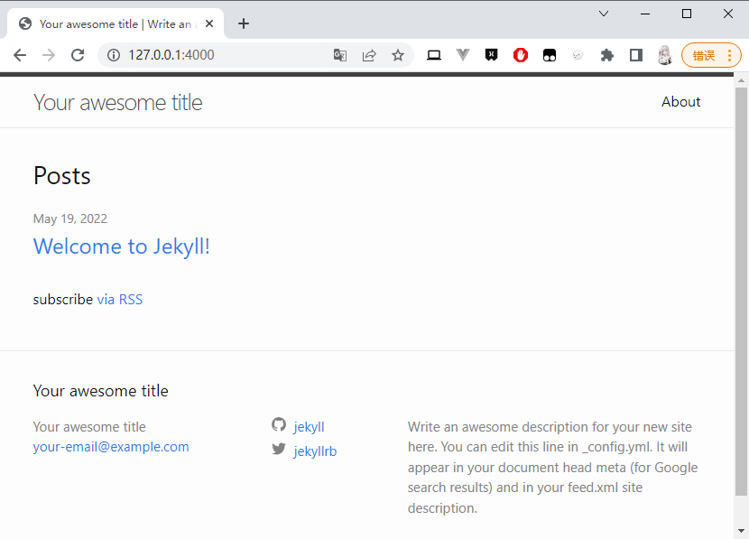

> 官网 jekyll：<https://www.jekyll.com.cn/>
> 
> 官方文档：:star: <https://jekyllrb.com/docs>

Jekyll是一款静态博客生成器，也是github page支持的后台引擎

### 安装

官方文档：<https://jekyllrb.com/docs/installation/>

需要安装

1. ruby - 官方安装指南：<https://www.ruby-lang.org/en/documentation/installation/>
2. RubyGems
3. Bundler - <https://bundler.io/>
4. Jekyll 

#### # 安装（windows）

1. 首先需要安装 ruby ：

    >ruby 是一个面向对象的脚本语言。
    >
    >（jekyll是用ruby写的，所以第一步需要先安装ruby。）

    安装 RubyGems（ruby gems package manager）：

    >RubyGems 是 Ruby 的一个包管理器，它提供一个分发 Ruby 程序和库的标准格式，还提供一个管理程序包安装的工具。

    ruby 安装包下载地址：<https://rubyinstaller.org/downloads/archives/> （选择最新版即可）

    安装过程中会出现下面对话框

    ```bash
    _____       _           _____           _        _ _         ___
    |  __ \     | |         |_   _|         | |      | | |       |__ \
    | |__) |   _| |__  _   _  | |  _ __  ___| |_ __ _| | | ___ _ __ ) |
    |  _  / | | | '_ \| | | | | | | '_ \/ __| __/ _` | | |/ _ \ '__/ /
    | | \ \ |_| | |_) | |_| |_| |_| | | \__ \ || (_| | | |  __/ | / /_
    |_|  \_\__,_|_.__/ \__, |_____|_| |_|___/\__\__,_|_|_|\___|_||____|
                        __/ |           _
                    |___/          _|_ _  __   | | o __  _| _     _
                                    | (_) |    |^| | | |(_|(_)\^/_>

    1 - MSYS2 base installation
    2 - MSYS2 system update (optional)
    3 - MSYS2 and MINGW development toolchain

    Which components shall be installed? If unsure press ENTER [1,2,3]
    ```

    我们需要按顺序执行三个选项

    > 安装MSYS2 toolchain 时，因为他们的默认源比较慢，需要手动改一下源，再执行ridk install安装即可。
    > 
    > 修改源的位置在 `\Ruby26-x64\msys64\etc\pacman.d\` 中的 `mirrorlist.mingw32` `mirrorlist.mingw64` `mirrorlist.msys` 文件中，装文件中的内容改成下面的样子即可。
    >
    >mirrorlist.msys
    >```bash
    >##
    >
    >## MSYS2 repository mirrorlist
    >
    >##
    >
    >## Primary
    >
    >## msys2.org
    >
    >Server = http://mirrors.ustc.edu.cn/msys2/msys/$arch/
    >
    >Server = https://mirrors.tuna.tsinghua.edu.cn/msys2/msys/$arch/
    >
    >Server = http://mirrors.ustc.edu.cn/msys2/msys/$arch/
    >
    >Server = http://mirror.bit.edu.cn/msys2/msys/$arch/
    >
    >Server = http://mirror.bit.edu.cn/msys2/msys/$arch/
    >
    >Server = http://repo.msys2.org/msys/$arch/
    >
    >Server = https://sourceforge.net/projects/msys2/files/REPOS/MSYS2/$arch/
    >
    >Server = https://www2.futureware.at/~nickoe/msys2-mirror/msys/$arch/
    >
    >Server = https://mirror.yandex.ru/mirrors/msys2/msys/$arch/
    >```
    >mirrorlist.mingw64
    >```bash
    >##
    >
    >## 32-bit Mingw-w64 repository mirrorlist
    >
    >##
    >
    >## Primary
    >
    >## msys2.org
    >
    >Server = http://mirrors.ustc.edu.cn/msys2/mingw/i686/
    >
    >Server = https://mirrors.tuna.tsinghua.edu.cn/msys2/mingw/i686/
    >
    >Server = http://mirrors.ustc.edu.cn/msys2/mingw/i686/
    >
    >Server = http://mirror.bit.edu.cn/msys2/mingw/i686/
    >
    >Server = http://repo.msys2.org/mingw/i686/
    >
    >Server = https://sourceforge.net/projects/msys2/files/REPOS/MINGW/i686/
    >
    >Server = https://www2.futureware.at/~nickoe/msys2-mirror/mingw/i686/
    >
    >Server = https://mirror.yandex.ru/mirrors/msys2/mingw/i686/
    >```
    >mirrorlist.mingw32
    >```bash
    >##
    >
    >## 64-bit Mingw-w64 repository mirrorlist
    >
    >##
    >
    >## Primary
    >
    >## msys2.org
    >
    >Server = http://mirrors.ustc.edu.cn/msys2/mingw/x86_64/
    >
    >Server = https://mirrors.tuna.tsinghua.edu.cn/msys2/mingw/x86_64/
    >
    >Server = http://mirrors.ustc.edu.cn/msys2/mingw/x86_64/
    >
    >Server = http://mirror.bit.edu.cn/msys2/mingw/x86_64/
    >
    >Server = http://repo.msys2.org/mingw/x86_64/
    >
    >Server = https://sourceforge.net/projects/msys2/files/REPOS/MINGW/x86_64/
    >
    >Server = https://www2.futureware.at/~nickoe/msys2-mirror/mingw/x86_64/
    >
    >Server = https://mirror.yandex.ru/mirrors/msys2/mingw/x86_64/
    >```
    >修改源后，执行ridk install 后很快就能安装好了。
    >

    安装完成后，可以看到它们的版本号

    ```bash
    C:\Users\lawsssscat>ruby -v
    ruby 3.1.2p20 (2022-04-12 revision 4491bb740a) [x64-mingw-ucrt]

    C:\Users\lawsssscat>gem -v
    3.3.7
    ```

2. 安装 jekyll

    ```bash
    gem install jekyll bundler 
    ```

    >我们建议使用 Bundler 安装和运行 Jekyll。 Bundler 可管理 Ruby gem 依赖项，减少 Jekyll 构建错误和阻止环境相关的漏洞。 要安装 Bundler：

    ```bash
    C:\Users\lawsssscat>jekyll -v
    jekyll 4.2.2
    C:\Users\lawsssscat>bundle -v
    Bundler version 2.3.14
    ```


### 初始化项目

初始化

```bash
jekyll new ga_blog
```

```bash
C:\Users\lawsssscat\Downloads\learn\learn-jekyll>jekyll new ga_blog
Running bundle install in C:/Users/lawsssscat/Downloads/learn/learn-jekyll/ga_blog...
  Bundler: Fetching gem metadata from https://rubygems.org/..........
  Bundler: Resolving dependencies...
  Bundler: Using bundler 2.3.14
  Bundler: Using public_suffix 4.0.7
  Bundler: Using colorator 1.1.0
  Bundler: Using concurrent-ruby 1.1.10
  Bundler: Using eventmachine 1.2.7
  Bundler: Using http_parser.rb 0.8.0
  Bundler: Using ffi 1.15.5 (x64-mingw-ucrt)
  Bundler: Using forwardable-extended 2.6.0
  Bundler: Using rb-fsevent 0.11.1
  Bundler: Using rexml 3.2.5
  Bundler: Using liquid 4.0.3
  Bundler: Using mercenary 0.4.0
  Bundler: Using rouge 3.28.0
  Bundler: Using safe_yaml 1.0.5
  Bundler: Using unicode-display_width 1.8.0
  Bundler: Using addressable 2.8.0
  Bundler: Using i18n 1.10.0
  Bundler: Using terminal-table 2.0.0
  Bundler: Using em-websocket 0.5.3
  Bundler: Using sassc 2.4.0
  Bundler: Using rb-inotify 0.10.1
  Bundler: Using pathutil 0.16.2
  Bundler: Using jekyll-sass-converter 2.2.0
  Bundler: Using kramdown 2.4.0
  Bundler: Using kramdown-parser-gfm 1.1.0
  Bundler: Using listen 3.7.1
  Bundler: Using jekyll-watch 2.2.1
  Bundler: Using jekyll 4.2.2
  Bundler: Fetching jekyll-feed 0.16.0
  Bundler: Fetching jekyll-seo-tag 2.8.0
  Bundler: Installing jekyll-feed 0.16.0
  Bundler: Installing jekyll-seo-tag 2.8.0
  Bundler: Fetching minima 2.5.1
  Bundler: Installing minima 2.5.1
  Bundler: Bundle complete! 7 Gemfile dependencies, 31 gems now installed.
  Bundler: Use `bundle info [gemname]` to see where a bundled gem is installed.
New jekyll site installed in C:/Users/lawsssscat/Downloads/learn/learn-jekyll/ga_blog.
```

>问题：Jekyll 运行的时候提示错误 cannot load such file -- webrick (LoadError)
><http://www.manongjc.com/detail/26-nafjorgurgcyuyr.html>
>```bash
>bundle add webrick
>```

运行

```bash
bundle exec jekyll serve
```

```bash
C:\Users\lawsssscat\Downloads\learn\learn-jekyll\ga_blog>bundle exec jekyll serve
Configuration file: C:/Users/lawsssscat/Downloads/learn/learn-jekyll/ga_blog/_config.yml
            Source: C:/Users/lawsssscat/Downloads/learn/learn-jekyll/ga_blog
       Destination: C:/Users/lawsssscat/Downloads/learn/learn-jekyll/ga_blog/_site
 Incremental build: disabled. Enable with --incremental
      Generating...
       Jekyll Feed: Generating feed for posts
                    done in 0.378 seconds.
  Please add the following to your Gemfile to avoid polling for changes:
    gem 'wdm', '>= 0.1.0' if Gem.win_platform?
 Auto-regeneration: enabled for 'C:/Users/lawsssscat/Downloads/learn/learn-jekyll/ga_blog'
    Server address: http://127.0.0.1:4000/
  Server running... press ctrl-c to stop.


```



### 目录结构

```bash
.
├── _config.yml
├── _data
│   └── members.yml
├── _drafts
│   ├── begin-with-the-crazy-ideas.md
│   └── on-simplicity-in-technology.md
├── _includes
│   ├── footer.html
│   └── header.html
├── _layouts
│   ├── default.html
│   └── post.html
├── _posts
│   ├── 2007-10-29-why-every-programmer-should-play-nethack.md
│   └── 2009-04-26-barcamp-boston-4-roundup.md
├── _sass
│   ├── _base.scss
│   └── _layout.scss
├── _site
├── .jekyll-cache
│   └── Jekyll
│       └── Cache
│           └── [...]
├── .jekyll-metadata
└── index.html # can also be an 'index.md' with valid front matter
```

我们只需要关注几个核心的目录结构如下（可以自己创建）：

+ `_layouts` （存放页面模板，md或html文件的内容会填充模板）
+ `_sass`（存放样式表）
+ `_includes` （可以复用在其它页面被include的html页面）
+ `_posts`（博客文章页面）
+ `assets`（原生的资源文件）
+ `js`
+ `css`
+ `image`
+ `_config.yml` （全局配置文件）
+ `index.html`, `index.md`, `README.md` （首页index.html优先级最高，如果没有index，默认启用README.md文件）

自定义文件和目录

更多更详细的目录结构参看jekyll官网：<https://jekyllrb.com/docs/struc>

### 模板编程语言Liquid的使用

Liquid 是 jekyll的模板编程语言，它可以完成一些基本程序指令

#### # 变量

变量 `{{ variable }}` 被嵌入在页面中，会在静态页面生成的时候被替换成具体的数值。

常用的全局变量对象有：site 和 page。这两个对象有很多默认自带的属性，比如：`{{ site.time }}`，`{{ page.url }}`。

更多的默认值参看：<https://jekyllrb.com/docs/variables>

site对象对应的就是网站范围，自定义变量放在_config.yml中，比如title:自定义标题使用`{{ site.title }}`访问。

page对象对应的是单个页面，自定义变量放在每个页面的最开头，比如：
```bash
---
myNum:100  
myStr:我是字符串
---
```

使用`{{ page.myNum }}` 和 `{{ page.myStr }}` 访问。

#### # 条件判断语句

更多详见：<https://shopify.github.io/liquid/tags/control-flow>

```bash
     
   These shoes are awesome! 
  

     
    Hey Kevin! 
     
    Hey Anonymous! 
     
    Hi Stranger! 

```

#### # 循环迭代

更多详见：<https://shopify.github.io/liquid/tags/iteration>

```bash
    
 {{ product.title }} 

```

#### # 默认函数

可以对变量进行一些处理，比如大小写转化、数学运算、格式化、排序等等，在Liquid中叫做Filters。

比如`{{ "Hello World!" | downcase }}`转换字符串为小写。

更多内置函数详见：<https://jekyllrb.com/docs/liqui>

### 使用_config.yml文件设置jekyll

如果不是fork别人的仓库，就需要自己创建一个这个文件。然后，我们就可以配置一些默认的属性来控制jekyll的编译过程。

更多详细的内置属性详见：<https://jekyllrb.com/docs/configuration/default>

同时我们可以自定变量，会自动绑定到site对象上，比如我们可以把导航配置到_config.yml中：
```bash
nav:
- name: Home
  link: /
- name: About
  link: /about.html

// 以下嵌入页面，page.url以 "/" 开头
<nav>
  
    <a href="{{ item.link }}" 
       style="color: red;" 
    >
      {{ item.name }}
    </a>
  
</nav>
```

当然，我们也可以把一些数据单独放入一个yml文件，然后放在固定的数据文件夹_data下，比如_data/navigation.yml，这样访问这个文件的数据对象就是site.data.navigation。

### _layouts模板配置

_layouts文件夹存放的是页面模板，默认需要一个default.html，什么意思？
就是说，layout提供一个页面的布局框架，这是固定的模式，包括样式、结构、布局、脚本控制等等。然后，我们在用其它md或html文件去动态填充这个框架，这样就形成了一个完整的页面。

比如我的default.html页面如下：
```bash
<!doctype html>
<html lang="{{ page.lang | default: site.lang }}">
  <head>
    <meta charset="utf-8">
    <meta http-equiv="X-UA-Compatible" content="IE=edge">

    

    <link rel="icon" href="https://avatars0.githubusercontent.com/u/1797320" type="image/x-icon" title="scottcgi">
    <link rel="stylesheet" href="{{ '/assets/css/style.css?v=' | append: site.github.build_revision | relative_url }}">
    
    <script src="{{ '/assets/js/scale.fix.js' | relative_url }}"></script>
    <meta name="viewport" content="width=device-width, initial-scale=1, user-scalable=no">

  </head>
  <body>
    <div class="wrapper">
      <header  class="without-description" >
        <h1>{{ site.title | default: site.github.repository_name }}</h1> 
        <p>{{ page.description | default: site.description }}</p>
       
        <ul>
        
          
            <li style="background-color:#069">
              <a href="{{ item.link }}">
                <strong>{{ item.name }}</strong>
              </a>
            </li>
          
            <li><a href="{{ item.link }}">{{ item.name }}</a></li>
          
        
        </ul>
      </header>
      <section>

      {{ content }}

      </section>
    </div>
    
    <footer>
      <p>{{ site.copyright | default: "copyright not found in _config.yml" }}</p>
    </footer>
  </body>
</html>
```

+ `` 是jekyll的一个插件提供的seo优化，详情在这里：<https://github.com/jekyll/jekyll-seo-tag>
+ 核心在于 `{{ content }}` 这个变量是内置的，会用我们的md或html页面填充这部分内容。
+ 其它的，我们看到会大量使用变量和流程控制代码，来填充模板的方方面面。

  于是，填充模板的内容，一方面是来自读取配置文件的变量，一方面是来自 `_includes` 的页面，还有就是来自  `{{ content }}` 对应的页面。

当然，我们也可以不使用 `{{ content }}` 来填充模板，而是使用 `_includes` 的页面来代替`{{ content }}` ，但这样不够灵活，因为使用 `{{ content }}`，我们可以在每个页面单独设置对应的layout模板。

### md和html页面编写

站点内容页面，可以使用markdown或html来编写，但markdown编写的md文件，在浏览器地址访问的时候依然使用html文件后缀。

推荐使用markdown来书写内容，语法参见：[Github md 示例](https://docs.github.com/cn/get-started/writing-on-github/getting-started-with-writing-and-formatting-on-github/basic-writing-and-formatting-syntax)。

比如下面这个About.md页面：

```bash
---
layout: default
title: About
---
# About page

This page tells you a little bit about me.
```

+ `layout: default` 就是告诉jekyll这个页面使用哪个模板，即这个页面会放入哪个模板的`{{ content }}`。当然，我们可以在_layouts文件夹下提供多个不同的模板，然后根据需要不同的页面使用不同的layout。

+ 页面可以放在任意位置和目录，访问的时候从站点域名开始，带上目录名称，再次注意需要使用html结尾。如果想要自定义浏览器的访问路径，可以参看详细设置：[permalinks](https://jekyllrb.com/docs/permalinks/)。


#### md和html页面的区别

md有自己的语法，可以使用少量的html标签，最终会编译成html，侧重于内容编写。

html可以随意使用html标签，可以使用liquid模板语言，侧重于页面模板和功能控制。

至此，我们就可以在github上，新建md文件然后编辑提交，等待几分钟编译生成之后，就可以在浏览器里看到页面内容了。

### 博客文章编写和管理

我们自然可以新建目录，提交文章，然后添加一个文章列表页面。但我们也可以把这些交给jekyll的内置机制来完成，因为它提供了一些方便的内置文章管理功能。

`_posts`文件夹是内置的放置文章的目录，我们可以将固定格式`year-moth-day-name.md` 名称的md文件放到这里。

比如新建一篇md的博客文章放到_posts目录下：

```bash
---
layout: post
--- 

这是一篇博客文章。
```

接下来我们需要添加一个post的模板页面到_layouts文件夹下面。

```bash
---
layout: default
---

<h1>{{ page.title }}</h1>
<p>{{ page.date | date_to_string }} - {{ page.author }}</p>

{{ content }}
```

可见，<font color='red'>模板页面本身也可以使用模板</font>，这里post使用了default模板，而这里`{{ content }}` 就会填充_posts下面编写的页面（如果页面使用了layout: post模板）。

最后，我们还需要编写一个博客文章列表的页面，用来展示所有的文章。比如在根目录新建blog.html页面

```bash
---
layout: default
title: Blog
---

<h1>Latest Posts</h1>

<ul>
  
    <li>
      <h2><a href="{{ post.url }}">{{ post.title }}</a></h2>
      <p>{{ post.excerpt }}</p>
    </li>
  
</ul>
```
+ `site.posts` jekyll会自动生成_posts目录的对象。
+ `post.urljekyll` 会自动会设置在_posts目录下的页面url。
+ `post.title` 默认是md文件名称，但也可以在文章页面自定义title: 我的文章自定义名称。
+ `post.excerpt` 默认是文章第一段的摘要文字。

### Github Pages的限制

Github Pages 并不是无限存储和无限流量的静态站点服务，一些限制如下：

+ 内容存储不能超过1GB。
+ 每个月100GB流量带宽。 
+ 每小时编译构建次数不超过10次。（在线修改重新编译并未发现这个限制）

更多参看官方说明：[usage-limits](https://docs.github.com/cn/pages/getting-started-with-github-pages/about-github-pages#usage-limits)


### 【todo】 可选功能 

参考：<https://blog.csdn.net/weixin_44814196/article/details/118684831>

#### # 评论功能

选择Valine（一款快速、简洁且高效的无后端评论系统）。

第三方评论系统有很多，常见的有以下几个：

+ ~~多说~~
+ ~~网易云跟帖~~
+ ~~畅言~~
+ Disqus
+ 来必力（LiveRe）
+ Valine

首先多说和网易云跟帖已经倒下了，其次畅言需要备案，Disqus和LiveRe都是国外的，加载速度慢。 Valine注册和配置简单，访问速度快。所以选择Valine。

#### #  访问量统计
使用百度统计。

#### #  自定义域名
如果你不愿意使用GitHub Pages的访问地址（例如xxx.github.io），你可以在腾讯云或阿里云上购买自定义域名，并配置域名解析即可。

~~我选择的是腾讯云。~~

参考：[ssl 配置](../Network/ssl_config.md)

#### # SEO

The [Jekyll SEO Tag](https://github.com/jekyll/jekyll-seo-tag) plugin is included by default (no need to run any special installation) to inject SEO and open graph metadata on docs pages. For information on how to configure SEO and open graph metadata visit [the Jekyll SEO Tag usage guide](https://jekyll.github.io/jekyll-seo-tag/usage/).


> 
> 参考：
> + 知乎 《Github Pages + jekyll 全面介绍极简搭建个人网站和博客》 <https://zhuanlan.zhihu.com/p/51240503>