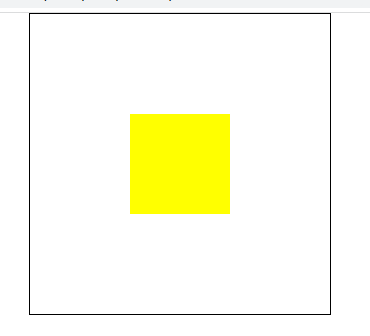

官网：<https://less.bootcss.com/>
视频：<https://www.bilibili.com/video/BV1H341187st?p=1>

Less 是 CSS 预处理器。脚本语言，扩展CSS语法形成可管理、可重用的样式表。

解决CSS存在的问题：
CSS不方便阅读、维护（希望用类似html结构化方式表示）

安装

```bash
# 全局
npm install less -g 
# 开发
npm install less -D
```
编译

```bash
lessc [option] [destination]

e.g. 

lessc stylesheet.less stylesheet.css
# -x 压缩
lessc stylesheet.less stylesheet.css -x
```

浏览器编译

```html
<script src="less.min.js"></script>

<link href="styles.less" rel="stylesheet/less" type="text/css"/>
```

## 尝试

用css实现垂直水平居中



[01-css实现垂直水平居中.html](./test-01/01-tranform%E5%AE%9E%E7%8E%B0%E5%9E%82%E7%9B%B4%E6%B0%B4%E5%B9%B3%E5%B1%85%E4%B8%AD%20copy.html)

上面的功能 `transform` 不兼容老版本浏览器

通过绝对定位实现

[02-绝对定位实现垂直水平居中](./test-01/02-%E7%BB%9D%E5%AF%B9%E5%AE%9A%E4%BD%8D%E5%AE%9E%E7%8E%B0%E5%9E%82%E7%9B%B4%E6%B0%B4%E5%B9%B3%E5%B1%85%E4%B8%AD.html)

下面用less转换成上面代码

方法1. 浏览器编译
[03-lsee-绝对定位实现垂直水平居中](./test-01/03-lsee-%E7%BB%9D%E5%AF%B9%E5%AE%9A%E4%BD%8D%E5%AE%9E%E7%8E%B0%E5%9E%82%E7%9B%B4%E6%B0%B4%E5%B9%B3%E5%B1%85%E4%B8%AD.html)
（运行时编译，慢、耗资源）

方法2： node编译

```bash
cd test-01
lessc 01.less 01.css -x
```
[less](./test-01/01.less)
[04-lsee-绝对定位实现垂直水平居中](./test-01/04-lsee-%E7%BB%9D%E5%AF%B9%E5%AE%9A%E4%BD%8D%E5%AE%9E%E7%8E%B0%E5%9E%82%E7%9B%B4%E6%B0%B4%E5%B9%B3%E5%B1%85%E4%B8%AD.html)

## less 注释

```less
// 单行注释，不会编译到css中
/* 多行注释，会编译到css中 */
```

## less 变量

允许使用 `@` 符号定义变量，用冒号分配 `:`

"`@变量名 : 变量值`"

"`@{选择器变量}`" "`@{样式名变量}`"

“`@{ url }`”

e.g.

作为样式值

```less
// 定义变量 @变量名:值;
@bgcolor: hotpink;

.div1 {
    background: @bgcolor;
}

.div2 {
    background: @bgcolor;
}
```

作为样式名（鸡肋）

```less
@m: margin;

* {
    @{m}: 0; // 加上 {...}
}
```

作为选择器（鸡肋）

```less
@selector: #wrap;

@{select} {
    background: yellow;
}
```

作为URL

```less
@base: "./images/auto-learn-less-20220523202535.png";

.inner {
    background: url("@{base}")
}
```

变量的延迟加载

> 变量范围：在less中，变量只有在定义的`{...}`中有效果

```less
@color: red;

.myclass {
    @color: yellow;
    color: @color;
    @color: green;
}
```

结果是green (块内有用块内，块内多个找最后的)

## less 嵌套规则

### 基本嵌套

略

### `&`的使用

加上 `&` 会把子块视作附着的属性

e.g.

[less](./test-01/02.less)
[05-less-嵌套规则-&](./test-01/05-less-%E5%B5%8C%E5%A5%97%E8%A7%84%E5%88%99-%26.html)
less 编译后

如果不在 `:hover` 前加 `&` 会编译成这样

```css
#wrap .inner :hover {
  background: blue;
}
```

正确应该是这样 （在 `:hover` 前加 `&` 的结果）

```css
#wrap .inner:hover {
  background: blue;
}
```

## less 混合 (重点)

混合（Mix in）类似编程语言中的函数。提高代码复用。

### 普通混合

```less
// 定义混合
.center {
    background: hotpink;
}

.use01 {
    // 调用混合
    .center
}

.use02 {
    .center
}
```

编译结果（问题在于，混合也输出了）

```css
.center {
  background: hotpink;
}
.use01 {
  background: hotpink;
}
.use02 {
  background: hotpink;
}
```

### 不输出混合

希望混合本身不输出到css
```less
// 定义混合
.center() {
    background: hotpink;
}

.use01 {
    // 调用混合
    .center() // 不加 () 也行，但是考虑到下面的操作，最好加上
}

.use02 {
    .center()
}
```

### 带参数混合

```less
// 定义混合
.center(@color) {
    width: 100%;
    background: @color;
}

.use01 {
    // 调用混合
    .center(yellow) //定义了参数，必须传递参数
}

.use02 {
    .center(green)
}
```

### 带参数且有默认值的混合

```less
// 定义混合
.center(@color: red) {
    width: 100%;
    background: @color;
}

.use01 {
    // 调用混合
    .center(yellow) 
}

.use02 {
    .center()
}
```

### 命名参数

```less
// 定义混合
.center(@color: red, @width: 100%) {
    width: @width;
    background: @color;
}

.use01 {
    // 调用混合
    .center(@width: 33%) 
}

.use02 {
    .center(green)
}
```

### 匹配模式

类似于 if

例子： 显示三角形

```css
#wrap .triangle {
width: 0;
    height: 0;
    border-width: 20px;
    border-style: solid;
    border-color: transparent transparent black transparent;
}
```

>但是 `transparent` 这种写法，在 ie 中不兼容
>
>因此例子中写了兼容的写法

e.g. 

[06-匹配模式](./test-01/06-%E5%8C%B9%E9%85%8D%E6%A8%A1%E5%BC%8F.html)

下面用less扩展实现并且功能

[07-less-匹配模式](./test-01/07-less-%E5%8C%B9%E9%85%8D%E6%A8%A1%E5%BC%8F.html)

### 导入

```less
@import "mixin.less";
```

### arguments 变量

```less
.border(@w, @s, @c) {
    // border: @w, @s, @c;
    border: @arguments;
}
```

### 混合守卫

mixin guards

类似匹配模式

#### 比较运算符

`<` `>` `<=` `>=` `=` 五个保护比较运算符

```less
.mixin(@fz) when (@fz >= 20) {
    color: red
}
.mixin(@fz) when (@fz < 20>) {
    color: blue;
}

.mixin(@fz) {
    font-size: @fx
}

.myclass {
    .mixin(20px)
}
```

### 逻辑运算符

`and` `not` `,`(or 的含义)

```less
.mixin(@fz) when (@fz >= 20) and not (@fz < 50%) {
    color: yellow;
}
.mixin(@fz) when (@fz >= 20) and (@fz < 50%) {
    color: red;
}
.mixin(@fz) when (@fz < 20>) {
    color: blue;
}

.mixin(@fz) {
    font-size: @fx
}

.myclass {
    .mixin(20px)
}
```

## 命名空间、访问器

```less
.jeb {
    .setFontSize(@fz) {
        font-size: @fz;
    }
}

.myclass {
    color: green;
    .jeb>.setFontSize(20px);
}
```

## less 运算

脚本语言，因此可以运算，如四则运算

```less
@font-size: 14ps;

.myclass {
    font-size: @font-size + 6;
}
```

## less 避免编译

略 （自行百度）

## less 继承 (重点)

继承和混合是互补的

Extend 是一个 LESS 伪类，它通过使用 `:extend` 选择器在一个选择器中扩展其他选择器样式。

> 能用参数、编译后有代码冗余
> 不能用参数、继承扩展好

e.g. 

```less
.style {
    background: green;
}

h2:extend(.style) {
    font-style: italic;
}

h3:extend(.style) {
    font-style: normal;
}
```

编译结果

```css
.style,
h2,
h3 {
  background: green;
}
h2 {
  font-style: italic;
}
h3 {
  font-style: normal;
}
```
