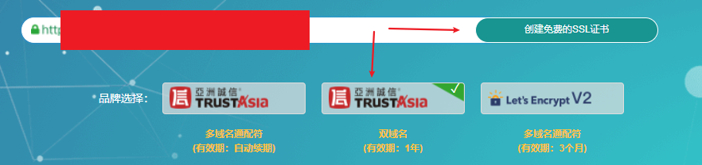
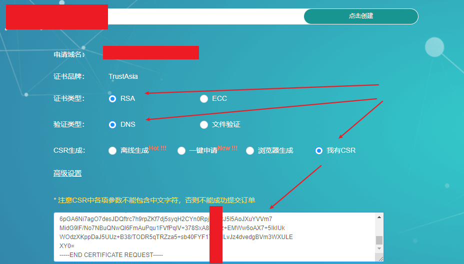
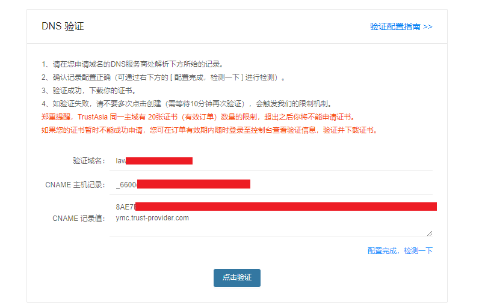
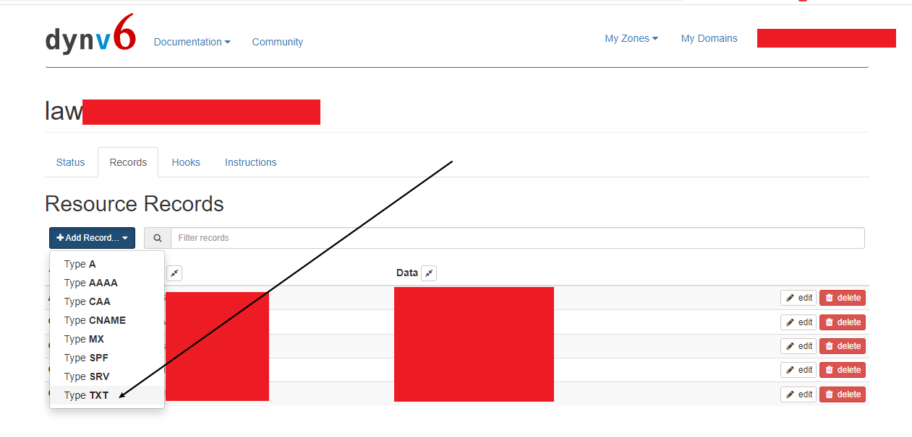
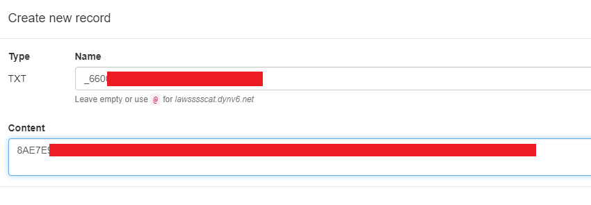
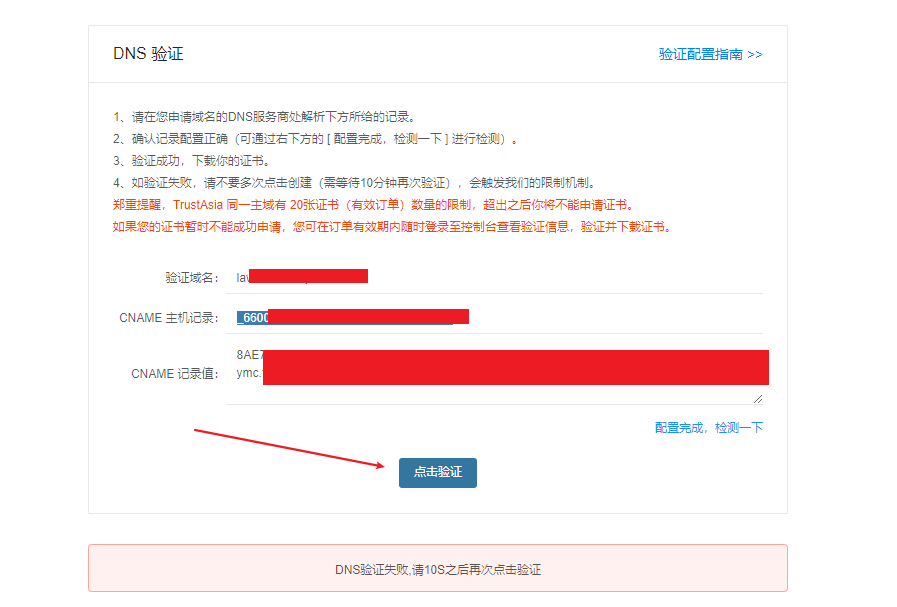
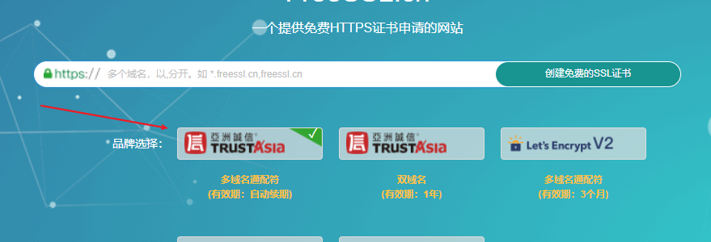

参考：常用的四种免费证书申请方式 <https://blog.csdn.net/weixin_45444133/article/details/120900424>


SSL 检测：<https://myssl.com/>

## # 申请（免费）域名

申请ssl证书首先需要域名

免费域名提供商
+ <https://duckdns.org/>
    
    问题：不支持CNAME
+ <https://dynv6.com/>

    问题：不支持CNAME到其他顶级域名
+ <https://www.dynu.com/>（:star:推荐:star:）
    
    功能全

    ~~问题：必须指定IPV4，无法仅指定IPV6~~（2022年4月11日 可以禁用ipv4）
+ ...

（提供ddns服务的通常都提供免费域名）

选好域名后就是把域名与服务器地址绑定。（搜索：域名绑定、ddns）

上面的步骤弄好就可以生成ssl证书了。

ssl证书分两种：有自签的、服务商提供的。证书如果是自签的一般浏览器都不认（就算加入“根证书信任”都不认，ie除外..），且服务提供商有免费证书提供，所以不推荐使用自签，推荐使用服务商提供的证书。


下面记录两种证书创建流程。

## # 创建（自签）证书


```bash
# 找个地方管理证书
mkdir /root/cert
cd /root/cert

# 建立服务器私钥（过程需要输入密码，请记住这个密码）生成RSA密钥
openssl genrsa -des3 -out sslserver.key 2048  
# 长度改为1024的坑 https://blog.csdn.net/lyndon_li/article/details/114667122

# 需要依次输入国家，地区，组织，email。
# 最重要的是有一个common name，可以写你的名字或者域名。如果为了https申请（不使用自己生成的证书，向CA申请），这个必须和域名吻合，否则会引发浏览器警报。生成的csr文件交给CA签名后形成服务端自己的证书
openssl req -new -key sslserver.key -out sslserver.csr

# 生成不需要密码的key
cp sslserver.key sslserver.key.org
openssl rsa -in sslserver.key.org -out sslserver.key

# 生成crt文件
openssl x509 -req -days 365 -in sslserver.csr -signkey sslserver.key -out sslserver.crt
```

为nginx.conf添加证书位置：
```bash
ssl_certificate /etc/ssl/certs/testcert.crt;
ssl_certificate_key /etc/ssl/certs/testcert.key;
```


## # 创建（免费）证书


免费的ssl证书供应商
+ [freessl.cn](https://freessl.cn/)（1年）（:star:推荐:star:）
+ [letsencrypt.org](letsencrypt.org)（3个月）
+ <https://yundun.console.aliyun.com>（1年）
阿里云（chrome不认的、且限额20个）

以 freessl.cn 为例
（域名提供商使用 dynv6.com）




点击“创建免费的SSL证书”

认证类型选择“DNS”、CSR生成选择“我有CSR”，然后把自签名中的`.csr`文件内容考入文本框




然后点击“点击创建”




到 dynv6.com 后台对应的域名下添加一条TXT记录






回到 freessl.cn 点击 “点击验证” 




通过后会获得证书的下载链接，把证书下下来部署到服务器即可

（这里验证不通过是因为dynv6对CNAME的实现有点反人类。改用dynu.com作为ddns提供商，重新跑一次流程，在那里设置CNAME就没问题了）

> **描述：dynv6对CNAME的实现问题**
>
>会自动在Contant后面加上域名
>
>比方说，我需要填写
>
>CNAME 主机记录： _660aaaaaaaaaaaaaaaaaaaa
>
>记录值： 8AEaaaaaaaaaaaaaa.TTDrp19dx1.trust-provider.com
>
>填写完后是
>
>CNAME 主机记录： _660aaaaaaaaaaaaaaaaaaaa
>
>记录值： 8AEaaaaaaaaaaaaaa.TTDrp19dx1.trust-provider.com.lawsssssssssssss.dynv6.net
>
>然后就没法认证通过


## # 自动续签

以 freessl.cn 为例（免费且可以认证通配域名）



流程同上面的申请证书，申请完后会获得脚本


```bash
acme.sh --issue -d xxxxxxxxxxx.xxx.xxx  --dns dns_dp --server https:xxxxxxxxxxxxxxxxxxxxxxxxxxxx
```


在使用脚本前，需要先配置好脚本 acme.sh 的运行环境。


> 参考：ACME v2证书自动化快速入门
><https://blog.freessl.cn/acme-quick-start/>


### 安装 acme.sh

配置的脚本都写好了，就下面一句代码


```bash
curl  https://get.acme.sh | sh -s email=my@example.com

# 脚本会有如下改动
# 1. 把所有需要的文件放入 ~/.acme.sh/
# 2. alias acme.sh=~/.acme.sh/acme.sh
# 3. 自动为你创建 cronjob, 每天 0:00 点自动检测所有的证书, 如果快过期了, 需要更新, 则会自动更新证书.
```

自动构建的定时脚本（如果是root用户，位置在 /etc/crontab/root）

```bash
48 0 * * * "/root/.acme.sh"/acme.sh --cron --home "/root/.acme.sh" > /dev/null

#   --cron                   Run cron job to renew all the certs.
#   --home <directory>                Specifies the home dir for acme.sh.
```


### 生成证书

acme.sh 实现了 acme 协议支持的所有验证协议，运行下面脚本就能完成 dns 验证.


```bash
acme.sh --issue -d xxxxxxxxxxx.xxx.xxx  --dns dns_dp --server https:xxxxxxxxxxxxxxxxxxxxxxxxxxxx

#  --issue                  Issue a cert.
#  -d, --domain <domain.tld>         Specifies a domain, used to issue, renew or revoke etc.
#  --dns [dns_hook]                  Use dns manual mode or dns api. Defaults to manual mode when argument is omitted.
#                                    See: https://github.com/acmesh-official/acme.sh/wiki/dnsapi
```

下面是脚本日志

```bash

# 创建key

[Mon Apr 11 20:00:57 CST 2022] Using CA: https://acme.freessl.cn/xxxxxxxxxxxxxxxxxxxxxxxxxxxxxxxxxxxxrw
[Mon Apr 11 20:00:59 CST 2022] Create account key ok.
[Mon Apr 11 20:01:01 CST 2022] Registering account: https://acme.freessl.cn/xxxxxxxxxxxxxxxxxxxxxxxxxxxxxxrw
[Mon Apr 11 20:01:04 CST 2022] Registered
[Mon Apr 11 20:01:05 CST 2022] ACCOUNT_THUMBPRINT='xxxxxxxxxxxxxxxxxxxxxxxxxxx7w'
[Mon Apr 11 20:01:05 CST 2022] Creating domain key
[Mon Apr 11 20:01:07 CST 2022] The domain key is here: /root/.acme.sh/*.xxxxxxxxxxxxxxxxxxxx.com/*.xxxxxxxxxxxxxxxxxx.com.key

# 完成DNS认证

[Mon Apr 11 20:01:07 CST 2022] Multi domain='DNS:*.xxxxxxxxxxxxxxxx.com,DNS:xxxxxxxxxxxxxxxxxx.com'
[Mon Apr 11 20:01:07 CST 2022] Getting domain auth token for each domain
[Mon Apr 11 20:01:48 CST 2022] Getting webroot for domain='*.xxxxxxxxxxxxxxxxxxx.com'
[Mon Apr 11 20:01:48 CST 2022] Getting webroot for domain='xxxxxxxxxxxxxxx.com'
[Mon Apr 11 20:01:48 CST 2022] *.xxxxxxxxxxxxxxxxxxx.com is already verified, skip dns-01.
[Mon Apr 11 20:01:48 CST 2022] xxxxxxxxxxxxxxxxxxxx.com is already verified, skip dns-01.
[Mon Apr 11 20:01:48 CST 2022] Verify finished, start to sign.

# 申请获得证书

[Mon Apr 11 20:01:48 CST 2022] Lets finalize the order.
[Mon Apr 11 20:01:48 CST 2022] Le_OrderFinalize='https://acme.freessl.cn/v2/xxxxxxxxxxxxxxxxxxxxxxx'
[Mon Apr 11 20:01:50 CST 2022] Order status is processing, lets sleep and retry.
[Mon Apr 11 20:01:54 CST 2022] Polling order status: https://acme.freessl.cn/xxxxxxxxxxxxxxxxxxx
[Mon Apr 11 20:02:10 CST 2022] Order status is processing, lets sleep and retry.
[Mon Apr 11 20:02:13 CST 2022] Polling order status: https://acme.freessl.cn/xxxxxxxxxxxxxxxxxxxxxxxxx
[Mon Apr 11 20:02:29 CST 2022] Order status is processing, lets sleep and retry.
[Mon Apr 11 20:02:32 CST 2022] Polling order status: https://acme.freessl.cn/xxxxxxxxxxxxxxxxxxxxxxxxxxxx

# 下载证书

[Mon Apr 11 20:02:45 CST 2022] Downloading cert.
[Mon Apr 11 20:02:45 CST 2022] Le_LinkCert='https://acme.freessl.cn/xxxxxxxxxxxxxxxxxxxxx'
[Mon Apr 11 20:02:48 CST 2022] Cert success.
-----BEGIN CERTIFICATE-----
MIIGHDCCBISgAwIBAgIRAPbbbbbbbbbbbbbbbbbbbcNAQEMBQAw
WTELMAkGxxxxxxxxxxxxxxxxxxxbyIMdu/4u8RVU
gyNPegaaaaaaaaaaaaaaaaaaaaaaNA/VlZPiv5VdWJtDecd3
dUj0ZHvY56PoLpsssssssssssssssssssssssssssssssssssssssssBpH3eq
PmpY3sssssssssssssssssssssssrQ=
-----END CERTIFICATE-----
[Mon Apr 11 20:02:48 CST 2022] Your cert is in: /root/.acme.sh/*.aaaaaaaaaaaaaaaaaaaaa.com/*.aaaaaaaaaaa.com.cer
[Mon Apr 11 20:02:48 CST 2022] Your cert key is in: /root/.acme.sh/*.aaaaaaaaaaaaaaa.com/*.aaaaaaaaaaaa.com.key
[Mon Apr 11 20:02:48 CST 2022] The intermediate CA cert is in: /root/.acme.sh/*.aaaaaaaaaaaaaaaaaaaaaa.com/ca.cer
[Mon Apr 11 20:02:48 CST 2022] And the full chain certs is there: /root/.acme.sh/*.aaaaaaaaaaaaaaaaaaa.com/fullchain.cer
```

### 安装（copy）证书


前面证书生成以后, 接下来需要把证书 copy 到真正需要用它的地方.

注意, 默认生成的证书都放在安装目录下: ~/.acme.sh/, <font color='red'>**请不要直接使用此目录下的文件**</font>, 例如: 不要直接让 nginx/apache 的配置文件使用这下面的文件. 这里面的文件都是内部使用, 而且目录结构可能会变化.

正确的使用方法是使用 --install-cert 命令,并指定目标位置, 然后证书文件会被copy到相应的位置, 例如:

Nginx example:
```bash
acme.sh --install-cert -d example.com \
--key-file       /path/to/keyfile/in/nginx/key.pem  \
--fullchain-file /path/to/fullchain/nginx/cert.pem \
--reloadcmd     "service nginx force-reload"


#  -i, --install-cert       Install the issued cert to apache/nginx or any other server.
# --install-cert命令可以携带很多参数, 来指定目标文件. 并且可以指定 reloadcmd, 当证书更新以后, reloadcmd会被自动调用,让服务器生效.
#
# 问题：
# 1. 据测试, reload 并不会重新加载证书, 所以用的 force-reload)
# 2. ssl_certificate 使用 /etc/nginx/ssl/fullchain.cer 
#    而非 /etc/nginx/ssl/<domain>.cer 
#    否则 SSL Labs 的测试会报 Chain issues Incomplete 错误
# 3. 详细参数请参考: 
#    https://github.com/Neilpang/acme.sh#3-install-the-issued-cert-to-apachenginx-etc
```
值得注意的是, 这里指定的所有参数都会被自动记录下来, 并在将来证书自动更新以后, 被再次自动调用.


---
问题：openwrt报错 "/root/.acme.sh/acme.sh: line 5785: service: command not found"

参考：<https://github.com/acmesh-official/acme.sh/issues/4031>

```bash
acme.sh --install-cert -d example.com \
--key-file       /path/to/keyfile/in/nginx/key.pem  \
--fullchain-file /path/to/fullchain/nginx/cert.pem \
--reloadcmd     "/etc/init.d/nginx reload"
--debug 2 | logger
```


