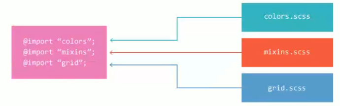

视频：<https://www.bilibili.com/video/BV1H341187st?p=36>

## 介绍

SASS（syntactically awesome stylesheet）

**SASS的官方文档非常完整，建议一切查文档**

### less、sass、stylus 区别

less 语法属于 css 风格

sass、stylus 相比之下激进，利用缩进、空格和换行来减少要输入的字符

（sass 历史最久、融合了其他的优点（有更完整的规则），但是 sass 比较麻烦的是依赖 Ruby 语言）

### css、sass、scss 区别

+ css
+ sass 扩展css。不使用花括号和分号（就很不受欢迎）
+ scss 是 sass 3 引入新的语法，使用严格的缩进规范并且有花括号和分号。（就变受欢迎了）（2022年5月24日 如今使用的）

### 安装

Ruby 环境

略（官网下载推荐版本，傻瓜式安装，弹出命令行输入3（出现错误不管，让它继续跑））

更换 gem 源

```bash
# 切换源到中科大

#列出默认源
gem sources  
#移除默认源（国外）
gem sources --remove https://rubygems.org/  
#添加科大源
gem sources -a https://mirrors.ustc.edu.cn/rubygems/  
#或者添加 ruby-china
gem sources -a https://gems.ruby-china.com/

gem sources -u
```

安装 sass

```bash
gem install sass compass

# 测试 
sass -v 
compass -v 
```

### 编译（命令行）

```bash
sass input.scss output.css

# 监听
sass --watch input.scss:output.css
sass --watch app/sass:public/stylesheets
```

`.map` 文件用途

map就是两个文件的对应关系表，用于检察问题


#### 四种编译排版格式

```bash
# 几种排版
--style nested # 嵌套 (不做格式优化，不方便观看)
        expanded # 展开
        compact # 压缩
        compressed # 精简
# 添加调试map
--sourcemap
#
--debug-info
```

### vscode插件

+ [ ] live sass - 实时编译
+ [x] live sass compiler - 依赖 live server

+ [ ] easy sass - 轻量、但是不支持生成 `.map`

## 注释

```scss
// 不生成在编译输出中

/*生成在编译输出中*/
```

另外 `/*...*/` 写在一些不该出现的地方，也不会出现在编译输出中

## 变量

使用 `$` 符号标识变量（老版本 `!`，可能与未来语法冲突，因此不用）

### 变量声明

```scss
// 变量推荐用 - 风格单词
$highlight-color: #F90;
// 一个变量存储多个值，用空格隔开（或者用 , 隔开）
$basic-border: 1px solid black;
$basic-border: 1px,solid,black;
```

```scss
// 变量中可以引用变量
$highlight-color: #F90;
$highlight-border: 1px solid $hight-color;
.selected {
    border: $highlight-border;
}
```

### 默认变量值

一般情况下，多个同名变量，只会生效最后一个

```scss
$link-color: blue;
$link-color: red;
a {
    color: $link-color;
}
```

可以 `!default` 让属性值不覆盖

```scss
$link-color: blue ;
$link-color: pink !default;
a {
    color: $link-color;
}
$link-color: red ;
b { 
    color: $link-color;
}
```

```css
/*生成结果*/
a {
  color: blue; }
b {
  color: red; }
```

## 嵌套规则

基本与 less 一致。

### 常规嵌套

```scss
// 常规嵌套
#content {
    article {
        h1 {
            color: #333;
        }

        p {
            margin-bottom: 1.4em;
        }
    }

    aside {
        background-color: #EEE;
    }
}
```

### 父选择器标识符 `&`

```scss
// 父选择器标识符 & 
article a {
    color: blue;
    &:hover {
        color: red;
    }
}
```

例子，当用户使用ie浏览器，有js代码在 `<body>` 添加类名 `id`

```scss
#content aside {
    color: red;
    body.ie & {
        color: green
    }
}
```

```css
/*编译后*/
#content aside {color: red}
body.ie #content aside {color: green}
```

### 群组选择器

当遇到群组选择器（z a,b,c ），也能完美处理

```scss
.container {
    h1, h2, h3 {
        margin-bottom: .8em
    }
}
```

```css
/*编译后*/
.container h1, .container h2, .container h3 { margin-bottom: .8em }
```

### 子组合选择器和同层组合选择器：`>`、`+`、`~`

```scss
article {
    ~ article { border-top: 1px dashed #ccc }
    > section { background: #eee }
    dl > {
        dt { color: #333 }
        dd { color: #555 }
    }
    nav + & { margin-top: 0 }
}
```

```css
/*编译后*/
article ~ article {
  border-top: 1px dashed #ccc; }
article > section {
  background: #eee; }
article dl > dt {
  color: #333; }
article dl > dd {
  color: #555; }
nav + article {
  margin-top: 0; }
```

### 嵌套属性

```scss
nav {
    border: {
        style: solid;
        width: 1px;
        color: #ccc;
        right: none;
        left: none;
    }
}
```


```css
nav {
  border-style: solid;
  border-width: 1px;
  border-color: #ccc;
  border-right: none;
  border-left: none; 
}
```

## 导入SASS文件

```scss
@import "grid"
```

如果不想编译导入的文件，可以在文件名前加 `_` 如 `_grid.scss`




也可以嵌套导入

如
```scss
d {
    @import "./test-01";
}

/*文件 test-01*/
b {
    border: 0ch;
}
```

```scss
/*生成*/
d b {
  border: 0ch; }
```

## 混合

```scss
@mixin rounded-corners {
    border-radius: 5px;
}

notice {
    border: 2px solid #00aa00;
    @include rounded-corners;
}
```

传参

```scss
@mixin link-color($normal, $hover:red, $baba: yellow) {
    color: $normal;
    &:hover {
        color: $hover;
    }
}

aa {
    @include link-color(blue, red);
}

bb {
    @include link-color(blue, $baba: red);
}
```

## 继承

```scss
.dd {
    border: 1px;
}

.cc {
    @extend .dd;
    background: red;
}
```

```css
/*生成结果*/
.dd, .cc {
  border: 1px; }

.cc {
  background: red; }
```