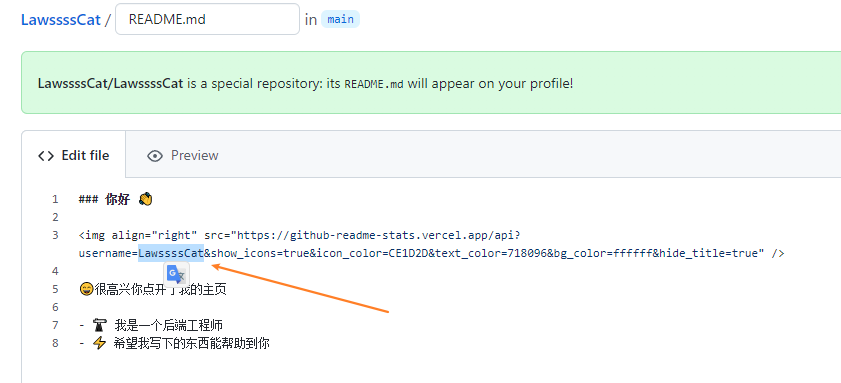
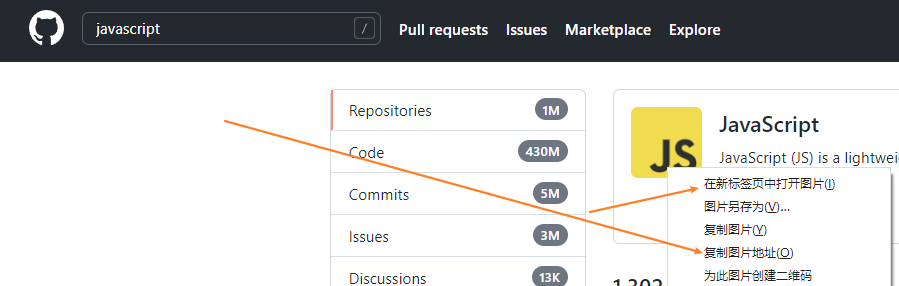

> + [github官方文档——About your profile](https://docs.github.com/en/account-and-profile/setting-up-and-managing-your-github-profile/customizing-your-profile/about-your-profile)
> + [视频：UPDATE: Next Level GitHub Profile README (NEW) | GitHub Actions | Vercel | Spotify
](https://www.youtube.com/watch?v=n6d4KHSKqGk&t=107s&ab_channel=codeSTACKr) - [anuraghazra 大神](https://github.com/anuraghazra) 的分享
> 

### 简单例子

瞎逛看到了别人的github主页，感觉挺好看的


点开源文件，长这样

```bash
### 你好 👋


😄很高兴你点开了我的主页

- 🔭 我是一个后端工程师
- 🌱 开源了两个仓库：austin和athena
- 👯 维护了两个公众号：Java3y和对线面试官
- 📫 你可以通过微信搜**Java3y**联系我
- ⚡ 希望我写下的东西能帮助到你
```

很明显，右侧那个小动画一样展示自己github统计情况的，就直接是上面的src改成自己的github用户名即可

#### 添加步骤

1.  创建一个和你github用户名一样的repository

    （确保这个repo是public的，同时勾选Add a README.md文件）

    

2. 然后编辑 README.md 即可（修改的内容会反映到profile中）

    （记得把链接中的名字改成你自己的，否则显示的是别人的记录）

    


### 资源

#### icons

通常是使用CDN

1. 使用 github  找CDN

    

1. 通过网站：<https://simpleicons.org/> 找CDN

    在上面网站找到icon后，把名字复制下载替换到下面CDN的名字中

    <https://github.com/simple-icons/simple-icons#cdn-usage>

    ```html
    
    ```


#### 徽标（shields）

>:star: shields 官网：<https://shields.io/>

details see post   ['github api'](./github_api.md)

#####  模板 for badge

<https://github.com/alexandresanlim/Badges4-README.md-Profile>


#### github activity

It can regularly your activity into you profile.

<https://github.com/marketplace/actions/github-activity-readme>


#### github stats

you can see dynamic stats of you github in you profile by using below method.

<https://github.com/anuraghazra/github-readme-stats>

另一个是

<https://github.com/marketplace/actions/profile-readme-development-stats>

它要 walk a time api

#### spotify playing now

search

+ nate moore 
    
    <https://github.com/natemoo-re/natemoo-re>

    <https://github.com/novatorem/novatorem>

+ andre novac 
+ jesse hall


#### github profile readme generator 

<https://github.com/rahuldkjain/github-profile-readme-generator>

#### github provile example list 

awesome github profile readme 

<https://github.com/abhisheknaiidu/awesome-github-profile-readme>