>资料：
>1. :star: <https://ichdata.com>
>
>视频：<https://www.bilibili.com/video/BV1bW411s7Q2>

# Google Analytics

+ 2005年 收购Urchin（收费）
+ 2006年 免费形式发布GA
+ 2008年4月，发布Urchin 6
+ 2009年2月，发布Urchin 6.5
+ 2010年9月，发布Urchin 7
+ 2012年3月，宣布关闭Urchin（转GA云）

Google Analytics Solutions 产品线

+ Google analytics
+ Google Tag Manager
+ Google Analytics 360 （收费）
+ Google Optimize
+ Data Studio
+ Audience Center
+ Surveys
+ Attribution
+ Others

其他产品对比

+ Firebase - 后端强大
+ Facebook - 优秀的广告投放、但是对用户隐私保护强
+ Flurry - 响应慢、资料英文
+ Mixpanel - 付费
+ Umeng
+ Talkingdata
+ 百度统计
+ 腾讯统计
+ 诸葛IO
+ 神策

> 很多巨头做这个，为了转型人工智能、大数据，因此需要通过这个收集数据，用以训练

GA 原理

+ 服务器端收集
+ 页面嵌入代码（GA） - 有丢包问题（尤其国内访问google）

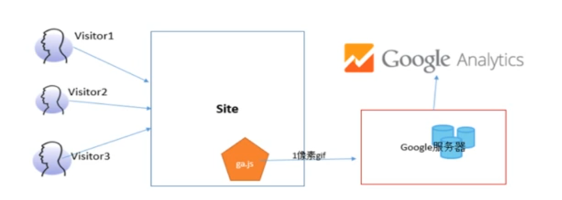

当用户访问网站，把（映像树形式）信息发给GA服务器

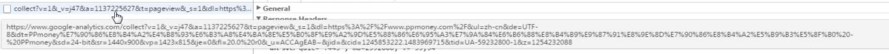

交互层级（从高到下，层级递减）

1. Users 用户层级
2. sessions 会话层级 - 可以用于统计访问时长
3. Hits 交互层级

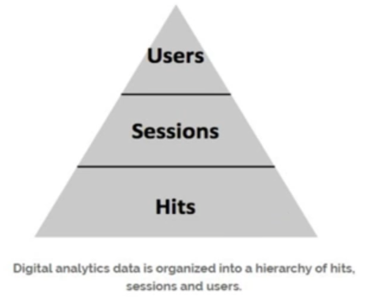

### GA 部署

1. 直接部署
    
    找到要嵌入的代码

    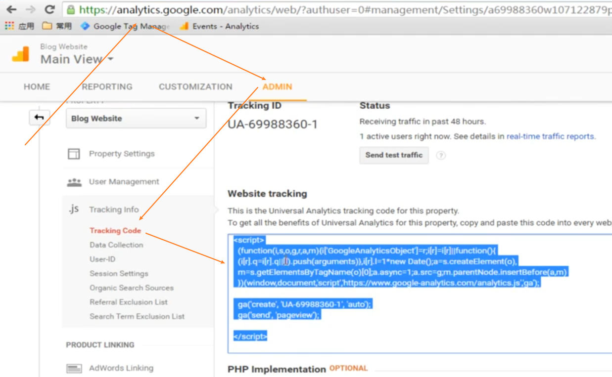

    在所有页面 head 前加上下面代码

    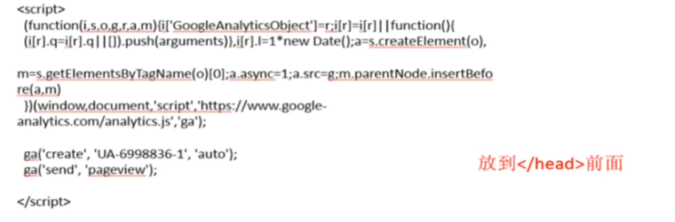

1. GTM部署方法1

    Google Tag Manager 中新建 Tag

    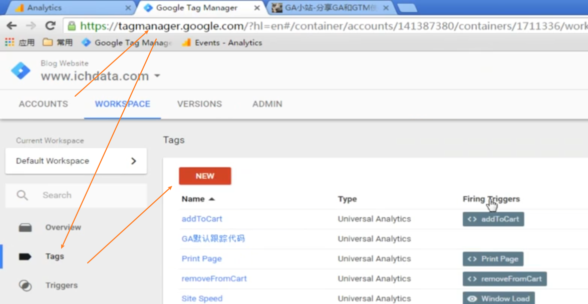

    tag 配置中添加 自定义html

    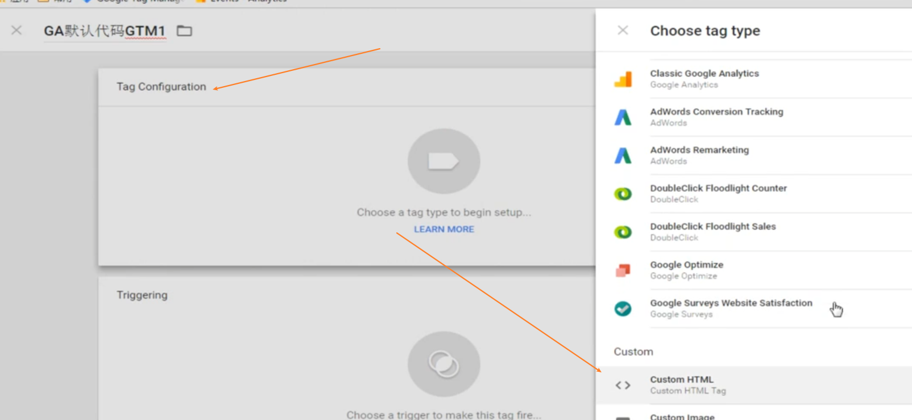

    贴上GA代码，且选择触发器 “所有页面”

    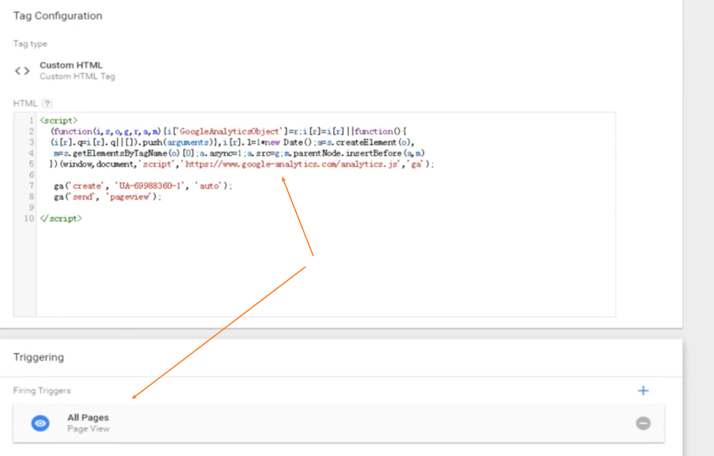

    保存、发布即可

1. GTM部署方法2（推荐：更多的参数自定义）

    在GA中获取Tracking ID

    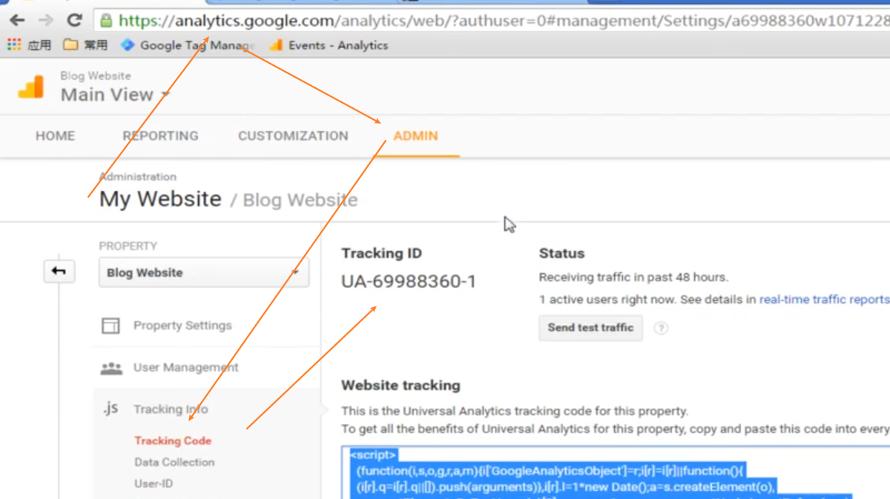

    Google Tag Manager 中新建 Tag，配置类型选择 Universal Analytics 

    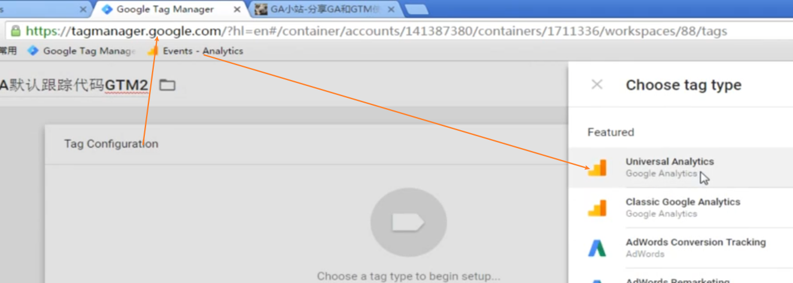

    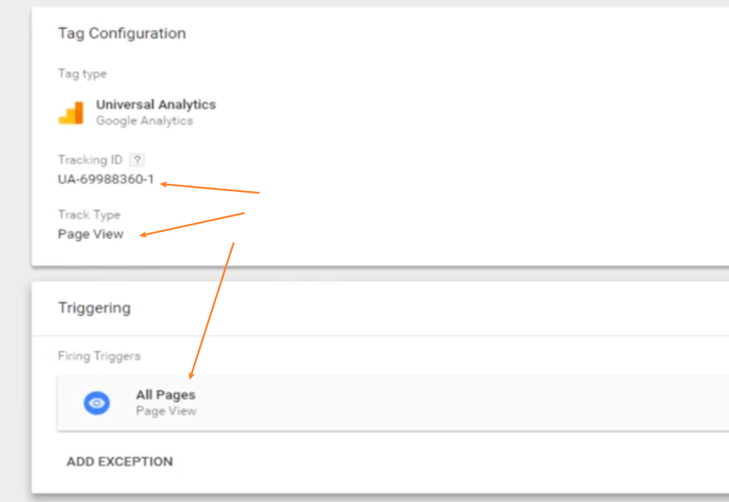

1. 测试、参数配置与调优

    使用 Tag Assistant

    过程略