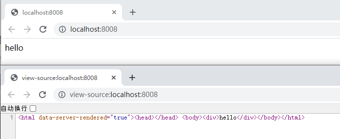

视频：<https://www.bilibili.com/video/BV13Z4y1T74J>

### 服务端渲染

+ 客户端渲染 CSR - 不便于搜索引擎SEO爬取
+ 服务端渲染 SSR - 对服务端性能需求高，不利于前后端分离

实际开发中，CSR、SSR结合开发

test-01-ssr

```bash
npm init -y 
npm i vue@2.6.11 vue-server-renderer
```

1. 测试 renderer
    ```js
    ....\learn-index\docs\Nuxtjs\test-01-ssr>node ./server01.js
    <div data-server-rendered="true">hello</div>
    ```

2. 运行服务器
    ```bash
    # 服务器
    npm i nodemon -g
    npm i express 
    ```
    ```bash
    learn-index\docs\Nuxtjs\test-01-ssr>nodemon ./server02.js
    [nodemon] 2.0.16
    [nodemon] to restart at any time, enter `rs`
    [nodemon] watching path(s): *.*
    [nodemon] watching extensions: js,mjs,json
    [nodemon] starting `node ./server02.js`
    http://localhost:8008
    ```
    访问浏览器 http://localhost:8008

    

### Nuxt 搭建

test-02-nuxt

```bash
vue init nuxt-community/starter-template .
# 或者
npx create-nuxt-app . 
```

```bash
C:\Users\lawsssscat\Downloads\learn\learn-index\docs\Nuxtjs\test-02-nuxt>npx create-nuxt-app .

create-nuxt-app v4.0.0
✨  Generating Nuxt.js project in .
? Project name: test-02-nuxt
? Programming language: JavaScript
? Package manager: Npm
# ui框架
? UI framework: None
? Nuxt.js modules: (Press <space> to select, <a> to toggle all, <i> to invert selection)
? Linting tools: (Press <space> to select, <a> to toggle all, <i> to invert selection)
# 测试框架
? Testing framework: None
# 渲染模式
? Rendering mode: Universal (SSR / SSG)
? Deployment target: Server (Node.js hosting)
# 开发工具高亮
? Development tools: jsconfig.json (Recommended for VS Code if you're not using typescript)
? What is your GitHub username? lawsssscat
? Version control system: None
```

运行

    npm run dev

打包

    npm run build
    npm run start

    打包后，在dist中能找到client、server两端的内容

    用 start 命令运行的就是打包后的代码

#### 目录结构

```bash
assets css、js、图片...资源
components vue通用组件（不支持服务端钩子）
layouts 布局
middleware 中间件

pages 存放nuxt希望路由跳转的页面（1级、2级子页面）
    通常被layout安排布局，且会在components复用

plugins 插件
server node接口、配置代码（如果有自己的服务端可以不用）

static 静态文件
store vue状态树

nuxt.config.js 配置nuxt个性化

.editorconfig 工具高亮配置
```