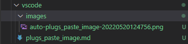

修改的设置：

```bash
{
    "pasteImage.defaultName": "YMMDDHHmmss",
    "pasteImage.namePrefix": "./images/auto-${currentFileNameWithoutExt}-",
    "pasteImage.insertPattern": ""
}
```

在粘贴的文章位置同一级目录下创建 `images` 目录，将文件以 `auto-文章名-日期.png` 名字存储，且以 `` 格式粘贴进文章

